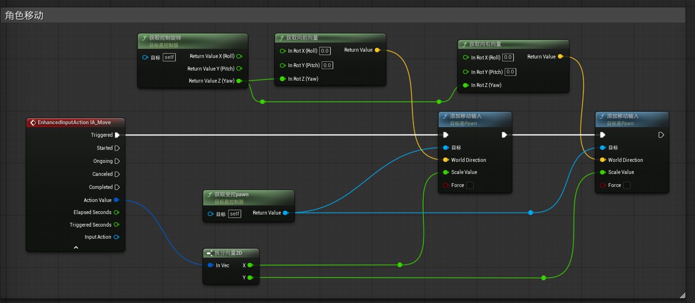
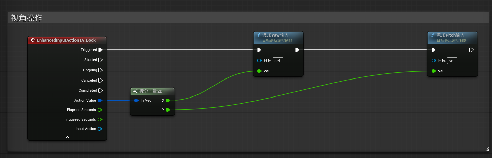

### 一、增强输入与输入映射上下文

1.创建IA_Move和IA_Look，都是二维向量

2.创建IMC_GAS，s加取反，d加拌合输入轴值，a加取反和拌合输入轴值

3.鼠标XY2D要给绕Y轴旋转取反，取消垂直视角反转

------

### 二、在BP_PlayerController中实现移动与视角操作

- 使用**获取受控pawn(Get Controlled Pawn)**取得角色蓝图的Pawn引用；由于**Add Movement Input**是Pawn类的函数，所以不需要Cast to
- **获取控制旋转**并将他绕z轴的角度传给**获取向前向量**和**获取向右向量**

------

### 三、在角色蓝图中应用角色控制器

1.在游戏模式中设置Pawn，PlayerController以绑定角色与角色控制器

2.取消角色蓝图类默认值中的**使用控制旋转Yaw**(包括其他两个旋转也要取消)

3.在弹簧臂细节面板中打开使用**Pawn控制旋转和三个继承**

4.在角色蓝图类默认值中打开**将旋转朝向运动**

------

### 四、编写视角锁定函数

​	在释放某些技能时（比如动感光波），角色的视角会被锁定，此时我们鼠标的水平移动会改变角色的施法方向（即角色的水平朝向），并且角色的朝向被绑定在鼠标上，不再受移动方向影响。

**函数内容：**

1. 输入一个bool值，判断进入锁定状态还是非锁定状态。
2. 视角锁定时，打开角色类默认值的**使用控制器旋转Yaw**，关闭**将旋转朝向运动**，关闭弹簧臂的**使用Pawn控制旋转**；这样一来，鼠标会控制角色的旋转，角色的朝向也会与鼠标绑定。
3. 调整摄像机的位置：我们需要把摄像机拉高一些，使得在释放技能时拥有更广阔的视野；所以我们要在进入锁定时把摄像机拉高，关闭锁定时再回到原位。
   ==调整摄像机位置一定要使用相对位置和相对旋转，这是摄像机相对于其父组件弹簧臂的相对位置==