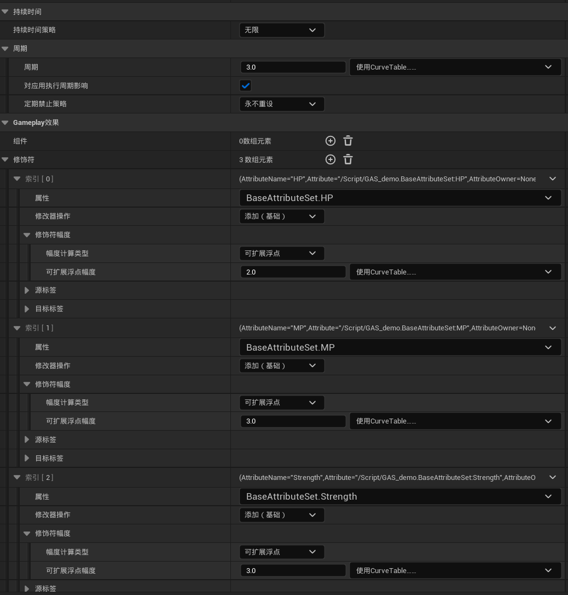
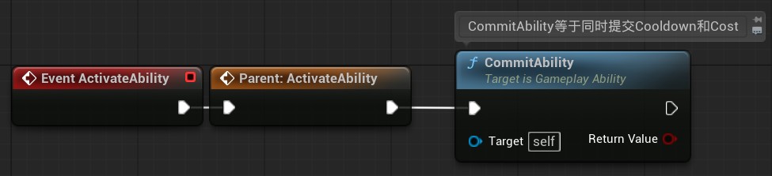
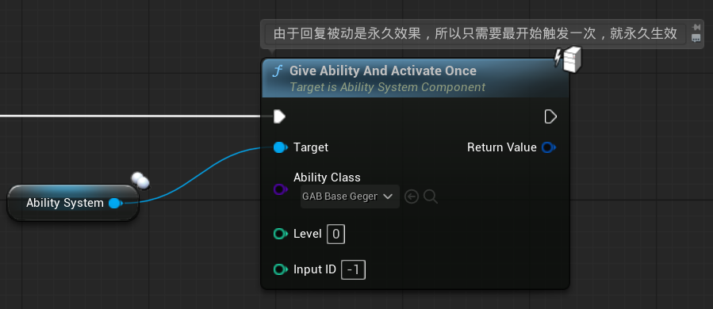

### 一、创建技能蓝图

以BP_BaseAbility为父类创建技能蓝图GAB_BaseGegen

------

### 二、创建Cost技能效果

创建GE_BaseRegen

持续时间无限，因为这个被动技能是常驻的

周期为3秒，每3秒触发一次

添加三个修饰符，分别修改HP，MP和Strength，数值都为2

最终效果为每过3秒，恢复三种属性各2点

------

### 三、提交技能效果

CommitAbility相当于同时触发了CommitAbilityCooldown和CommitAbilityCost

------

### 四、将技能赋予主角

**Give Ability**只是赋予主角技能，但不触发；比如主动技能，赋予主角后，由其他操作来触发

**Give Ability And Activate Once**是赋予主角技能的同时触发一次；比如自动回复这种永久生效的被动技能，只需要在赋予时触发一次，后面就不需要再管了

