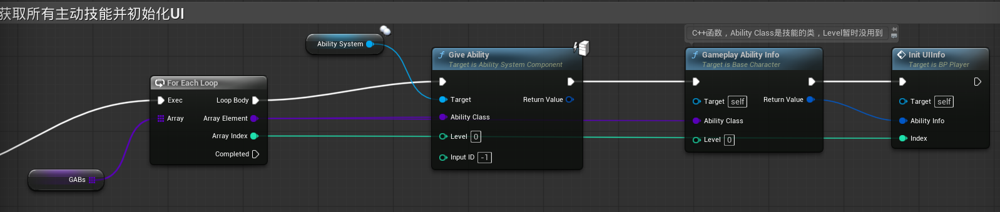

> [!WARNING]
>
> 这一部分内容较**复杂**，下面按照代码执行的步骤来描述这个过程

### 一、`BP_Player`的`Event BeginPlay`



1. GABs是一个`BaseGamePlayAbility`的类引用数组，里面的内容是GAB_Regen，GAB_Dash等等，需要自己手动输入

2. 将数组中的所有技能全部Give到`BP_Player`的技能组件上

3. 调用`BaseCharacter`中的C++函数，将GAB_Regen和level（此处level还未用到，使用默认值0）传入参数

   ```c++
   FGameplayAbilityInfo GameplayAbilityInfo(TSubclassOf<UBaseGameplayAbility>AbilityClass, int level);
   ```

------

### 二、进入`GameplayAbilityInfo`的函数内部

```c++
FGameplayAbilityInfo ABaseCharacter::GameplayAbilityInfo(TSubclassOf<UBaseGameplayAbility> AbilityClass, int level)
{
	//获取角色身上的技能组件
	//FindComponentByClass返回的是指针
	UAbilitySystemComponent* MyAbilitySystemComponent = this->FindComponentByClass<UAbilitySystemComponent>();
	
	//获取技能
	//在TSubclassOf模板类中重载了->，这里其实是调用了UClass类中的GetDefaultObject，获取了这个技能在蓝图中的默认对象（也就是GAB_Regen，GAB_Dash等）
	UBaseGameplayAbility* AbilityInstance = AbilityClass->GetDefaultObject<UBaseGameplayAbility>();
	
	//如果技能组件和技能都存在
	//如果技能组件或者技能不存在的话，会返回空指针nullptr，所以可以用if来判断两者是否真实存在
	if (MyAbilitySystemComponent && AbilityInstance)
	{
		return AbilityInstance->GetAbilityInfo(level);
	}
		
		
	return FGameplayAbilityInfo(); 
}
```

1. 获取`BP_Player`的技能组件
2. 利用`GetDefaultObject`获取`GAB_Regen`
3. 如果技能组件和技能都存在，则返回`GAB_Regen`调用`GetAbilityInfo`的返回值，否则返回一个默认初始化的`FGameplayAbilityInfo结构体`

------

### 三、进入`GetAbilityInfo`函数内部

```c++
FGameplayAbilityInfo UBaseGameplayAbility::GetAbilityInfo(int level)
{
	UGameplayEffect* CDEffect = GetCooldownGameplayEffect();
	UGameplayEffect* CostEffect = GetCostGameplayEffect();
	float CD = 0;
	float CostValue = 0;
	ECostType CostType = ECostType::MP;
	if (CDEffect && CostEffect)
	{
		CDEffect->DurationMagnitude.GetStaticMagnitudeIfPossible(level, CD);
		if (CostEffect->Modifiers.Num() > 0)
		{
			//获取花费的是哪一个类型
			FGameplayModifierInfo CostEffectModifierInfo = CostEffect->Modifiers[0];
			CostEffectModifierInfo.ModifierMagnitude.GetStaticMagnitudeIfPossible(level, CostValue);
			FString CostTypeName = CostEffectModifierInfo.Attribute.AttributeName;
			
			if (CostTypeName == "HP")
			{
				CostType = ECostType::HP;
			}
			if (CostTypeName == "MP")
			{
				CostType = ECostType::MP;
			}
			if (CostTypeName == "Strength")
			{
				CostType = ECostType::Strength;
			}
			
			return FGameplayAbilityInfo(CD, CostType, CostValue, IconMaterial, GetClass());
		}
		
	}
	
	return FGameplayAbilityInfo();
}
```

