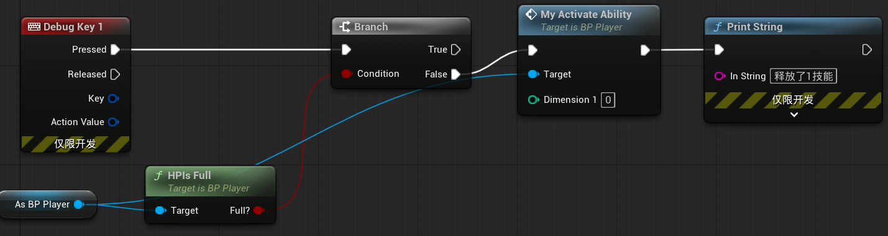
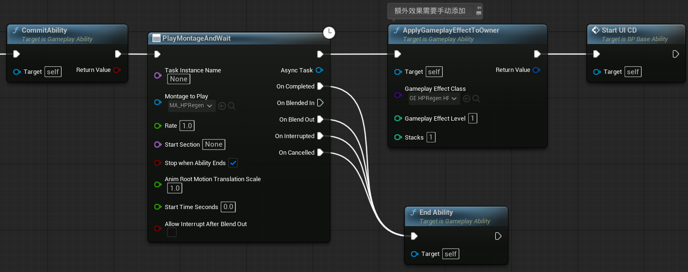
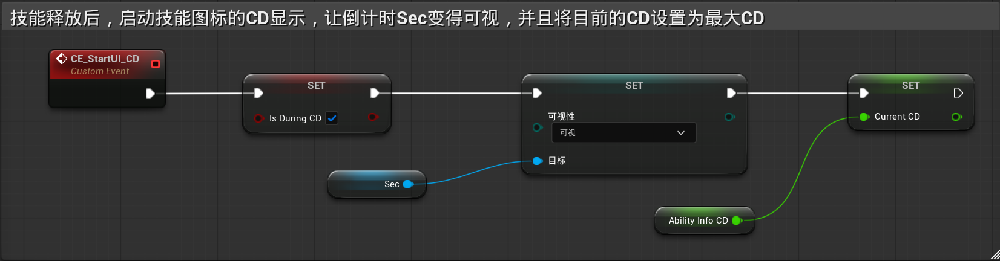

> [!IMPORTANT]
>
> 还是按照整体的执行顺序来描述

### 一、玩家按下1，触发技能

1. 回血技能在满血时无法释放，所以需要有前置判定条件（如果后续敌人拥有控制类的技能的话，也会使技能无法释放，也是同样的逻辑）
2. 如果此时玩家不是满血，则释放回血技能

------

### 二、BP_Player释放指定的技能

------

### 三、触发技能蓝图GAB_HPRegen

1. 施加所有技能效果
2. 播放蒙太奇
3. 让对应的UMG开始显示技能CD

------

### 四、UMG开始显示CD效果

将Sec变为可视，并且将目前的CD设置为最大CD

------

### 五、技能效果--瞬间回复血量

这个很简单，写一个GE，增加血量，然后放在GAB里面就可以了