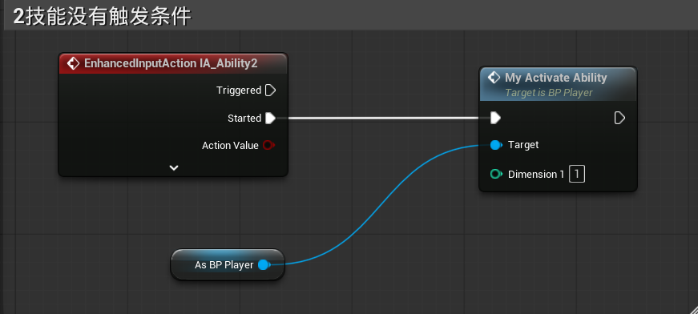
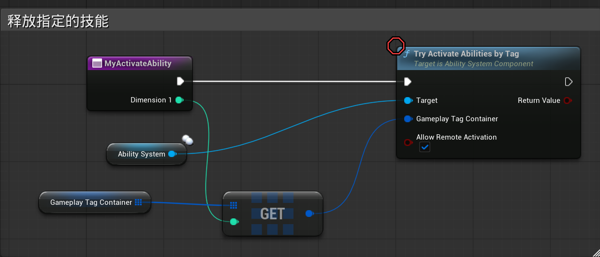
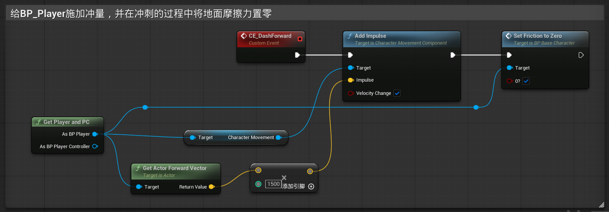
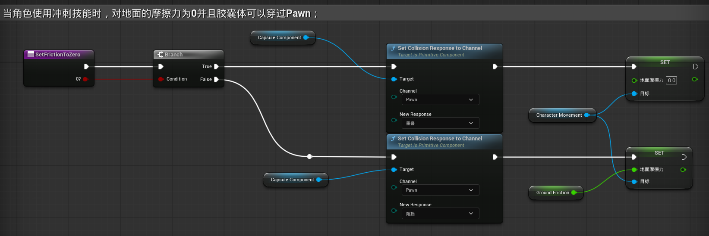
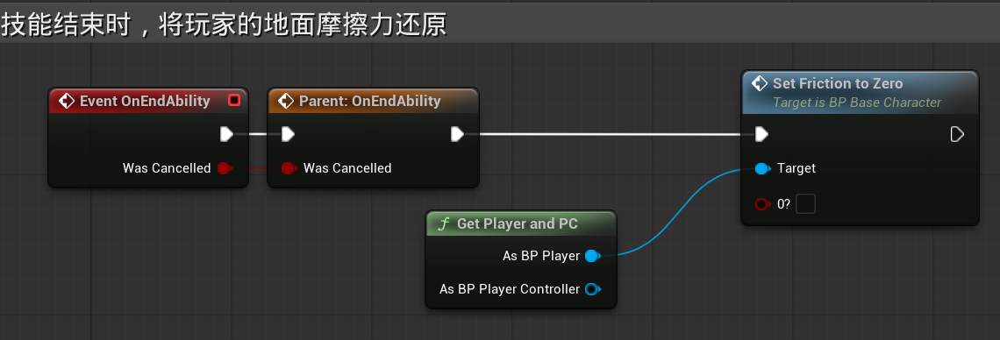
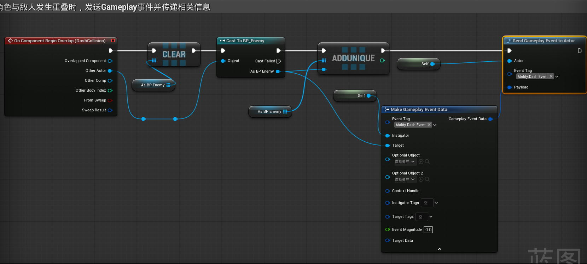
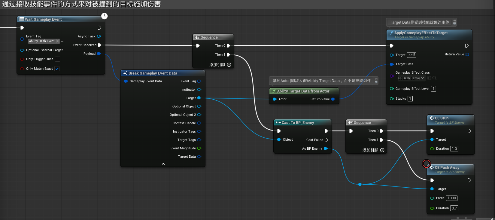
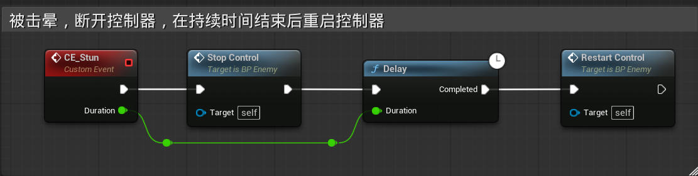
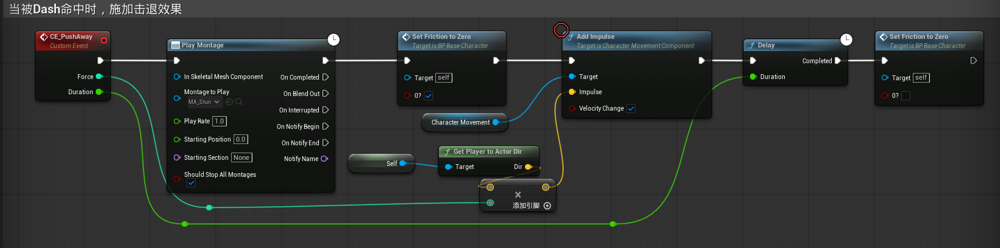

### 一、玩家按下2，尝试触发技能

由于冲刺的Cost是体力，所以在体力不足时，会自动被Cost阻止，并不需要额外设置触发条件

------

### 二、BP_Player释放指定的技能

------

### 三、触发技能蓝图并开启CD

------

### 四、技能效果--角色向前冲刺

1. 给角色施加冲量，方向为角色面朝的方向
2. 将角色的地面摩擦力设置为0，使角色可以正常冲出去

**设置地面摩擦力函数：**

除了设置摩擦力以外，还让角色胶囊体在冲刺的过程中失去碰撞，可以穿过敌人

**技能结束后，恢复地面摩擦力：**

------

### 五、技能效果--对途中经过的敌人造成伤害，晕眩，击退

#### 1.通过技能事件来触发技能效果

给`BP_Player`添加一个新的碰撞体，并让他只监听Pawn的重叠

当重叠开始时，发送GameplayEvent，在GAB_Dash结束之前，都会一直监听这个事件

在GAB_Dash结束前，会持续监听这个事件

#### 2.对敌人造成伤害

写一个技能效果GE_Dash_Damage，效果是减少HP;当重叠时间触发时，对目标施加技能效果

#### 3.对敌人施加晕眩

在`BP_Enemy`中写事件

晕眩的时候断开敌人的控制器，晕眩事件由输入参数决定

在GAB_Dash中触发敌人的晕眩事件并传入晕眩时间

#### 4.将敌人击退

在`BP_Enemy`中写事件

击退时播放蒙太奇，设置地面摩擦力为0并施加冲量，在击退持续时间结束后恢复地面摩擦力

击退的力量和时间由输入参数决定

在GAB_Dash中触发敌人的击退时间并传入冲量力度和击退时间