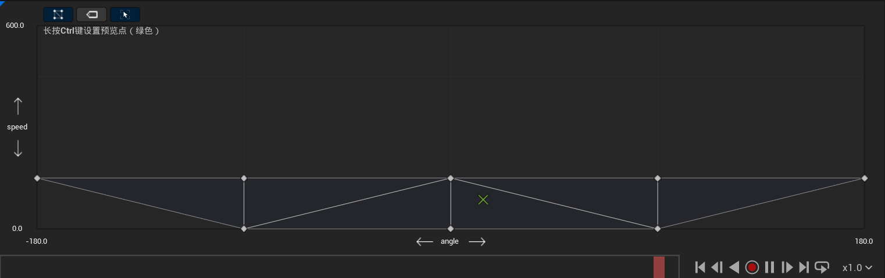
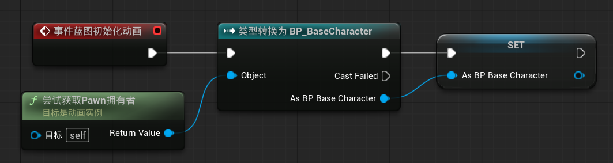
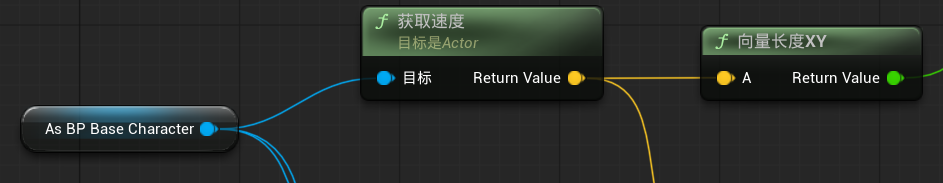
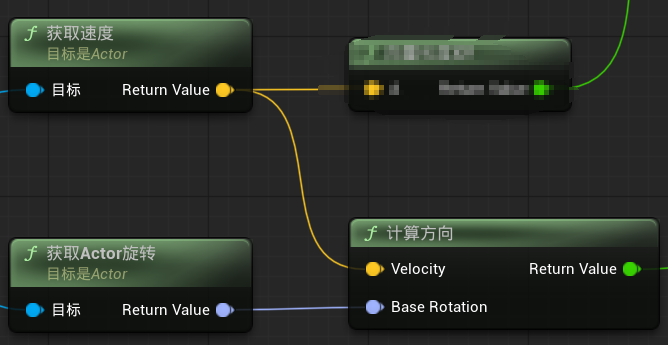

### 一、Walk动画混合空间

1. ***横轴--角度angle***
   这个角度是**角色的速度方向与角色朝向的夹角**，这个夹角决定了角色是在往前走，还是往左/右/后走；当角度为0-90度时，角色往右前方移动；90-180度时，角色往右后方移动，以此类推。
2. ***纵轴--速度speed***
   这个速度为角色速度的绝对值，代表了角色的绝对速度。

​	从左到右分别是向后，向左，向前，向右，向后，站立，站立，站立。

------

### 二、动画蓝图的数据初始化

在动画蓝图初始化时，我们需要获得当前蓝图的拥有者Pawn，并cast为一个BaseCharacter引用。

***解释:***
	由于动画蓝图不止会给玩家使用，还可能给敌人ai使用，所以cast to的并不是BP_Player。
	由于动画蓝图需要多次用到角色蓝图中的信息，所以在初始化时获得一个角色蓝图的引用，可以避免后续多次cast，cast是很费性能的。

### 三、实时获取角色蓝图的数据

​	不像角色蓝图引用一旦初始化就不会改变，大多数的数据都是需要实时获取的，这就是需要用到Event Blueprint Update Animation。
​	通常在游戏运行时，只要这个 Skeletal Mesh 正在使用对应的 Anim Blueprint，并且动画还在更新，它就会每帧触发。

***实时获取的数据：***

1. **Speed**，角色的速度绝对值，用于混合空间
   
   **Get Velocity**是Actor类的函数，可以直接调用，**向量长度XY**是不包括z分量的向量长度，代表角色的水平方向速度
2. **Angle**，角色速度与角色朝向的夹角，用于混合空间
   
   **计算方向（Calculate Direction）**是专用于计算角色速度与角色朝向夹角的函数，他输出(-180°, 180°)范围内的角度
3. **InAir**，角色是否在空中，用于状态机中的跳跃切换
   **isfalling**是角色移动组件中的函数，所以需要先获取角色的移动组件