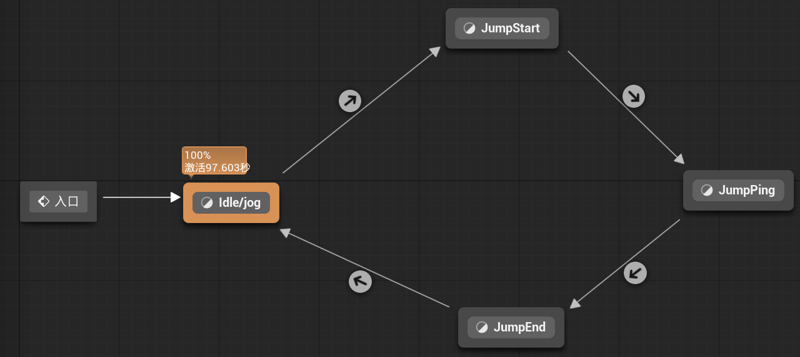
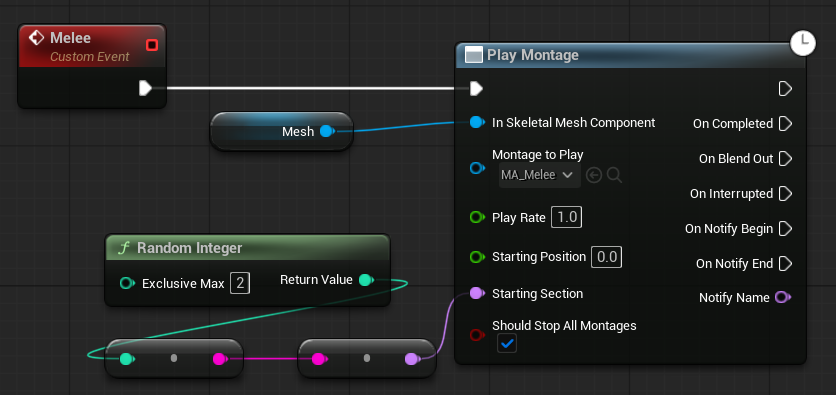
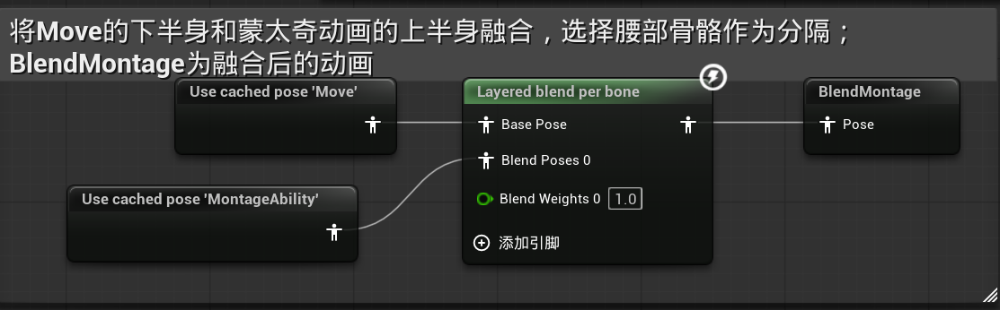
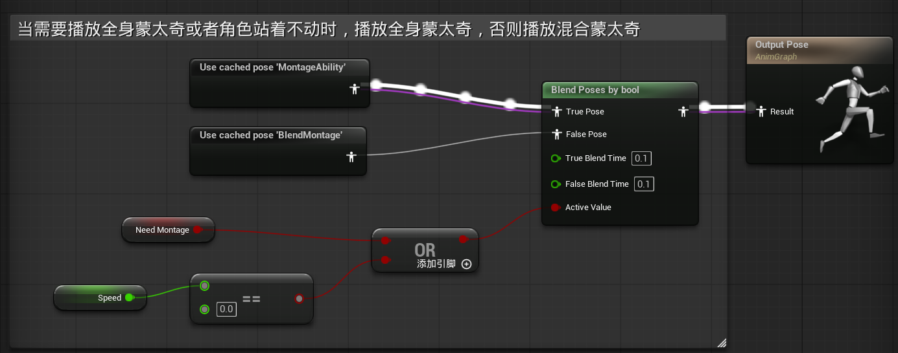

### 一、混合空间--Walk动画

1. ***横轴--角度angle***
   这个角度是**角色的速度方向与角色朝向的夹角**，这个夹角决定了角色是在往前走，还是往左/右/后走；当角度为0-90度时，角色往右前方移动；90-180度时，角色往右后方移动，以此类推。
2. ***纵轴--速度speed***
   这个速度为角色速度的绝对值，代表了角色的绝对速度。

​	从左到右分别是向后，向左，向前，向右，向后，站立，站立，站立。

------

### 二、动画蓝图的数据初始化

在动画蓝图初始化时，我们需要获得当前蓝图的拥有者Pawn，并cast为一个BaseCharacter引用。

***解释:***
	由于动画蓝图不止会给玩家使用，还可能给敌人ai使用，所以cast to的并不是BP_Player。
	由于动画蓝图需要多次用到角色蓝图中的信息，所以在初始化时获得一个角色蓝图的引用，可以避免后续多次cast，cast是很费性能的。

### 三、实时获取角色蓝图的数据

​	不像角色蓝图引用一旦初始化就不会改变，大多数的数据都是需要实时获取的，这就是需要用到Event Blueprint Update Animation。
​	通常在游戏运行时，只要这个 Skeletal Mesh 正在使用对应的 Anim Blueprint，并且动画还在更新，它就会每帧触发。

***实时获取的数据：***

1. **Speed**，角色的速度绝对值，用于混合空间
   
   **Get Velocity**是Actor类的函数，可以直接调用，**向量长度XY**是不包括z分量的向量长度，代表角色的水平方向速度
2. **Angle**，角色速度与角色朝向的夹角，用于混合空间
   
   **计算方向（Calculate Direction）**是专用于计算角色速度与角色朝向夹角的函数，他输出(-180°, 180°)范围内的角度
3. **InAir**，角色是否在空中，用于状态机中的跳跃切换
   **isfalling**是角色移动组件中的函数，所以需要先获取角色的移动组件

------

### 四、状态机--Move

Move状态机用于实现**移动和跳跃的动画切换**

**一般分为四个状态：**

1. 站立不动/奔跑：这个状态播放混合空间BS_Walk
2. 跳跃开始：播放跳跃开始动画
3. 跳跃中：播放跳跃中动画
4. 跳跃结束：播放跳跃结束动画

**状态过渡：**

1->2：只要isfalling为真，就切换
2->3：只要跳跃开始动画只剩不到0.1秒，就切换
3->4：只要isfalling为假，就切换
4->1：只要结束动画只剩不到0.1秒，就切换

------

### 五、蒙太奇--攻击动画

在轴上放两种攻击动画，并且新建两个片段，片段0包括第一个动画，片段1包括第二个动画，插槽为DefaultGroup.DefaultSlot；在ABP中使用该插槽，就可以应用插槽对应的蒙太奇动画

------

### 六、攻击操作逻辑

**在BP_BaseCharacter蓝图中，创建近战攻击事件Melee**：

当近战事件被触发时，从0和1里面随机触发一个蒙太奇片段，让人物的骨骼网格体执行这个蒙太奇动画

**在BP_PlayerController蓝图中，创建近战攻击输入**：

​	IA_Melee在Started时，触发BP_BaseCharacter中的Melee事件，播放蒙太奇动画；蒙太奇动画通过Slot影响ABP中的MontageAbility，最终通过判断之后，输出实际动画。

------

### 七、动画融合

在角色边移动边攻击时，上半身需要播放蒙太奇，下半身则正常播放Move状态机

------

### 八、最终动画输出

并不能任何时候都播放混合蒙太奇，如果人物在移动的时候播放混合蒙太奇，上半身的转身挥砍动作会和下半身产生冲突

**不需要播放混合蒙太奇的情况：**

1. 人物攻击动画正在进行转身挥砍时
2. 人物静止不动时

通过在MA中设置通知的方式来手动触发混合蒙太奇