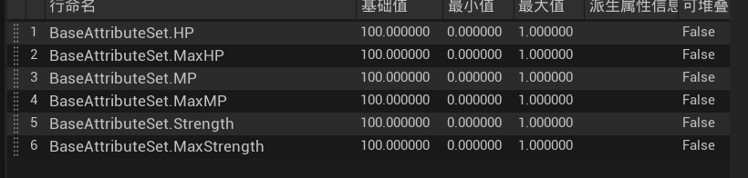
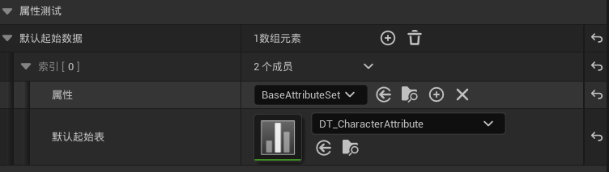

### 一、新建C++类

新建BaseAttributeSet并以**AttributeSet**作为父类

```c++
//AttributeSet.h

// Fill out your copyright notice in the Description page of Project Settings.

#pragma once

#include "CoreMinimal.h"
#include "AttributeSet.h"
#include "AbilitySystemComponent.h"
#include "BaseAttributeSet.generated.h"
/**
 * 
 * 
 */
//带参数的宏定义，相当于把define ATTRIBUTE_ACCESSORS(ClassName, PropertyName)换成下面的几行；而下面的几行也是宏，他们也会自动展开为函数
#define ATTRIBUTE_ACCESSORS(ClassName, PropertyName) \
 	GAMEPLAYATTRIBUTE_PROPERTY_GETTER(ClassName, PropertyName) \
 	GAMEPLAYATTRIBUTE_VALUE_GETTER(PropertyName) \
 	GAMEPLAYATTRIBUTE_VALUE_SETTER(PropertyName) \
 	GAMEPLAYATTRIBUTE_VALUE_INITTER(PropertyName)

UCLASS()
class GAS_DEMO_API UBaseAttributeSet : public UAttributeSet
{
	GENERATED_BODY()

public:
	//可编辑，被蓝图可读可写，被分在BaseAttributeSet类别下
	UPROPERTY(EditAnywhere, BlueprintReadWrite, Category = "BaseAttributeSet")
	FGameplayAttributeData HP;
    //宏自动展开为四个宏，四个宏再展开为四个函数，这样就自动获得了对所有属性的四种操作函数，不需要我们自己写了
	ATTRIBUTE_ACCESSORS(UBaseAttributeSet, HP)
	UPROPERTY(EditAnywhere, BlueprintReadWrite, Category = "BaseAttributeSet")
	FGameplayAttributeData MaxHP;
	ATTRIBUTE_ACCESSORS(UBaseAttributeSet, MaxHP)

	UPROPERTY(EditAnywhere, BlueprintReadWrite, Category = "BaseAttributeSet")
	FGameplayAttributeData MP;
	ATTRIBUTE_ACCESSORS(UBaseAttributeSet, MP)
	
	UPROPERTY(EditAnywhere, BlueprintReadWrite, Category = "BaseAttributeSet")
	FGameplayAttributeData MaxMP;
	ATTRIBUTE_ACCESSORS(UBaseAttributeSet, MaxMP)
	

	UPROPERTY(EditAnywhere, BlueprintReadWrite, Category = "BaseAttributeSet")
	FGameplayAttributeData Strength;
	ATTRIBUTE_ACCESSORS(UBaseAttributeSet, Strength)
	
	UPROPERTY(EditAnywhere, BlueprintReadWrite, Category = "BaseAttributeSet")
	FGameplayAttributeData MaxStrength;
	ATTRIBUTE_ACCESSORS(UBaseAttributeSet, MaxStrength)
};
```

------

### 二、创建数据表格



------

### 三、将数据表格应用到角色的AbilitySystem上


