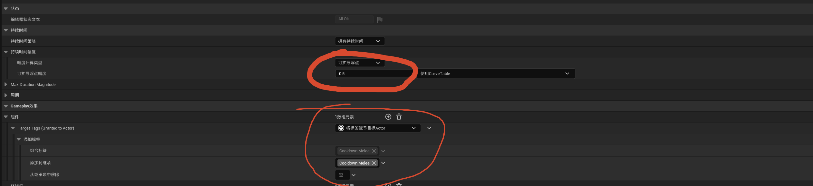
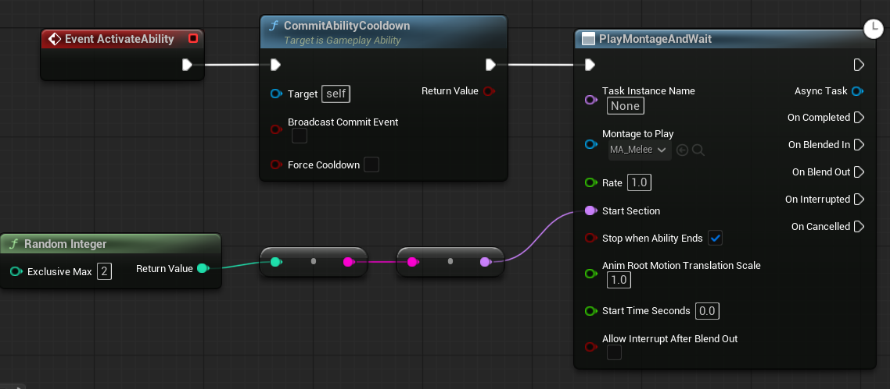
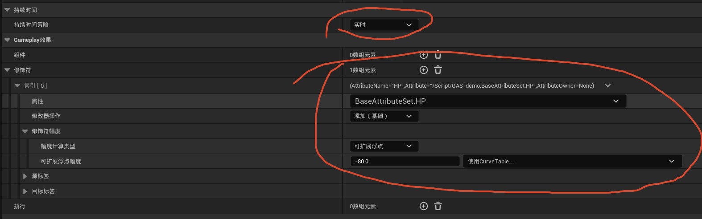
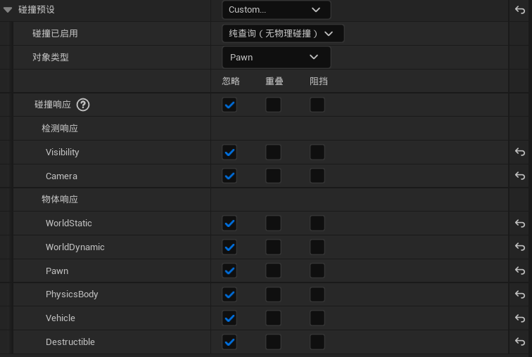
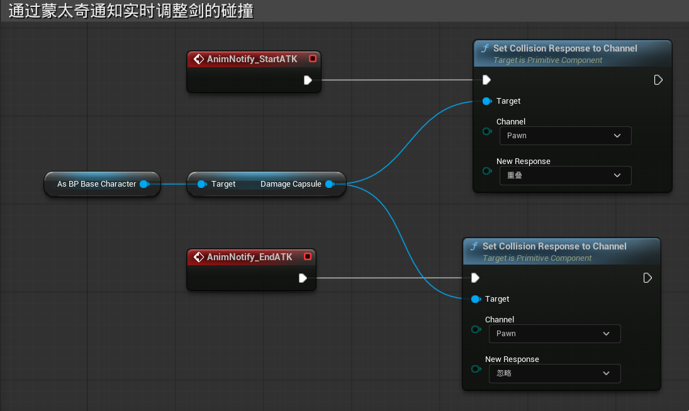
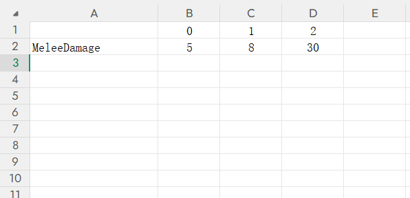
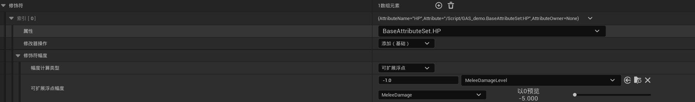
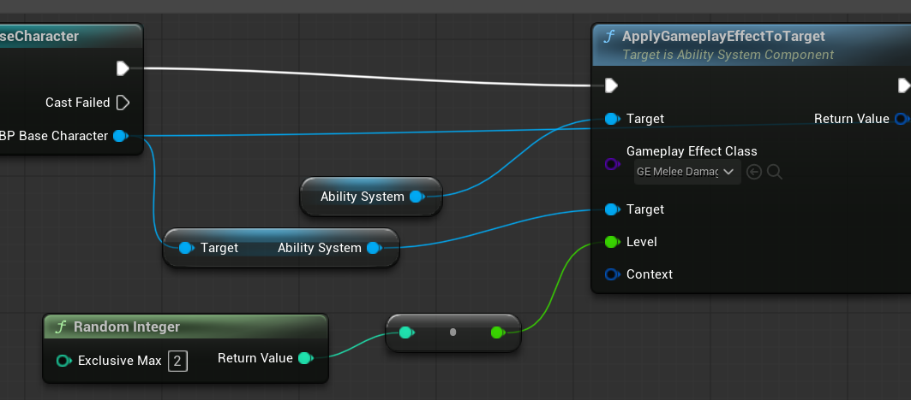

### 一、技能蓝图

新建BP_BaseAbility并以**Gameplay技能蓝图**作为父类，再以BP_BaseAbility作为父类创建GAB_Melee

设置GAB_Melee的资产标签为Ability.Melee，这样就可以用标签获取技能，在角色蓝图中就可以通过标签定位技能

#### 1.技能的动画

将技能动画写在GAB_Melee中，当按下左键释放技能时，将蒙太奇插到动画蓝图的Slot中

#### 2.技能的CD效果

创建GE_MeleeCD，继承于父类GameplayEffect



在技能蓝图中应用CD效果



#### 3.技能的伤害效果

创建GE_MeleeDamage，继承父类GameplayEffect



------

### 二、技能的伤害判定

- 通过碰撞判断的方式来进行技能的伤害判定

#### 1.给剑添加碰撞胶囊体

#### 2.限制碰撞时间

- 剑不能时时刻刻都能触发碰撞事件，只能在按下左键，进行攻击时，才能触发碰撞事件

**通过蒙太奇通知实时改变胶囊碰撞体的碰撞属性**：

​	关闭碰撞体的所有碰撞响应，将其设置为仅对Pawn查询



​	在动画蓝图中，调用蒙太奇的通知，在StartATK触发时，将碰撞体的碰撞效果改为对Pawn重叠，此时碰撞体就可以与Pawn触发重叠事件；在EndATK触发时，关闭碰撞体的碰撞

<!--由于StartATK与EndATK之间间隔时间极短，所以平A的伤害判定时间是很短的-->



### 三、重叠事件

胶囊体在发生对Pawn的重叠事件时，需要进行以下判定：

1. 胶囊体不是与自己发生了碰撞，避免剑碰到自己的身体的时候也触发碰撞
2. 胶囊体碰撞的对象不是自己的同类，敌人A的剑砍到敌人B，不应该造成技能效果。<!--如果游戏中需要存在友伤，那么这一条就不适用-->

在判定通过后，攻击者的**AbilitySystem**对被碰撞的目标的**AbilitySystem**造成伤害效果

### 四、锁定属性的范围

通过AttributeSet.h头文件中UAttributeSet类中的PostGameplayEffectExecute函数（对技能效果的后处理）来限制属性的范围

```c++
#include "BaseAttributeSet.h"
#include "GameplayEffectExtension.h"

void UBaseAttributeSet::PostGameplayEffectExecute(const struct FGameplayEffectModCallbackData& Data)
{
	//Super代表该类的父类，这里UBaseAttributeSet的父类是UAttributeSet
	Super::PostGameplayEffectExecute(Data);
	
	//GetHPAttribute就是在头文件中用宏自动定义的函数
	if (Data.EvaluatedData.Attribute == GetHPAttribute())
	{
        //我们设置了MaxHP是100，所以相当于(0, 100)
		SetHP(FMath::Clamp(GetHP(), 0.0, GetMaxHP()));
	}
	
	if (Data.EvaluatedData.Attribute == GetMPAttribute())
	{
		SetMP(FMath::Clamp(GetMP(), 0.0, GetMaxMP()));
	}
	
	if (Data.EvaluatedData.Attribute == GetStrengthAttribute())
	{
		SetStrength(FMath::Clamp(GetStrength(), 0.0, GetMaxStrength()));
	}
}

```

在一次属性变化后，如果属性的数值超出了(0, max)的范围，则，将其锁定在该范围

### 五、伤害配表

在上面的设置中，攻击的伤害是一个固定值；我们可以通过配表的方式让伤害拥有多个Level

#### 1.创建csv表格



#### 2.添加表格

将表格拖进内容侧滑菜单，选择曲线表格和常量

#### 3.将伤害表格应用到伤害效果中



实际的伤害数值会是表格中的数值乘以-1

#### 4.在施加伤害效果时选择Level



Level从0和1中随机选择，伤害就会从5和8中随机选择，可以将8视为暴击伤害