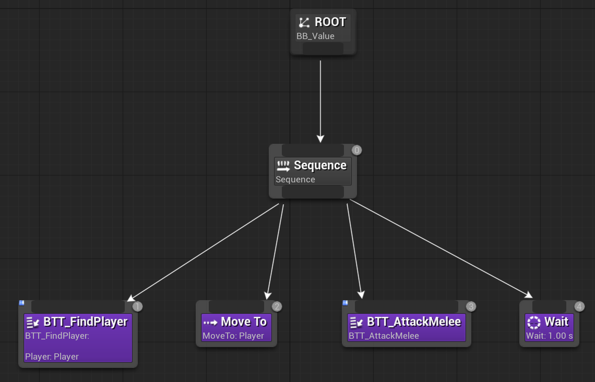
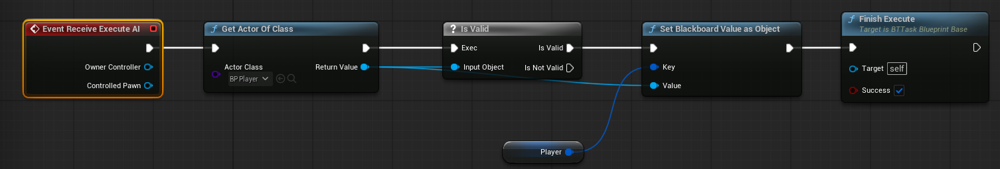
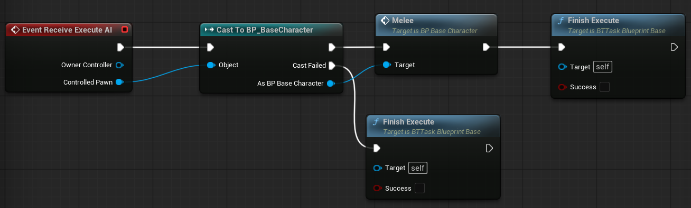
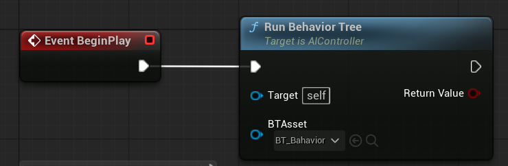
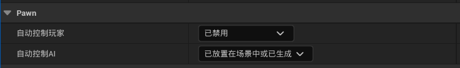

### 一、使用行为树搭建框架

先不要管每个任务是如何实现的，先把逻辑搭好

------

### 二、任务--寻找玩家

1. 重载Receive Execute AI
2. 无条件寻找场景中有没有玩家（这种寻找玩家的方式简单粗暴）
3. 如果有玩家，直接把玩家对象写进黑板，然后Finish Execute

------

### 三、任务--攻击

直接执行BP_BaseCharacter中的Melee事件即可

------

### 四、绑定AI控制器

添加AI控制器并执行行为树

在BP_Enemy的细节中选择AI控制器

将细节中的**自动控制AI**设置为“已放置在场景中或已生成”，这样当新的敌人生成时，就会自动绑定AI控制器

