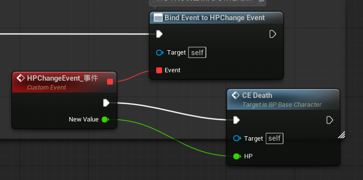
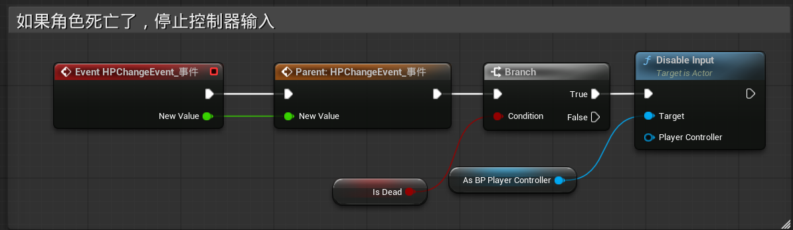

### 一、写c++

纯c++操作，看代码

------

### 二、调用广播事件

和事件分发器用法完全相同，使用绑定事件触发

------

### 三、收到生命改变广播后需要执行的操作

#### 1.基类BP_BaseCharacter

触发死亡判断

#### 2.子类BP_Player

在基类的基础上，附加控制器断开判断，当角色IsDead时，停止玩家控制器输入

#### 3.子类BP_Enemy

在基类的基础上，附加血条变化和控制器断开判断

------

### 四、MP和Strength改变时广播

将HP广播的代码按同样的方式再写一遍就可以实现MP和Strength的广播