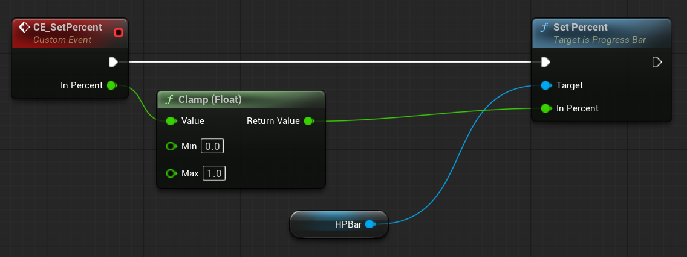
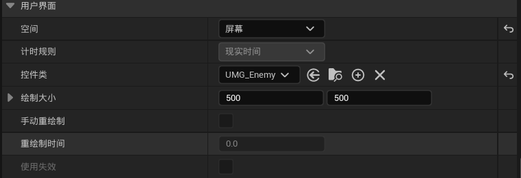
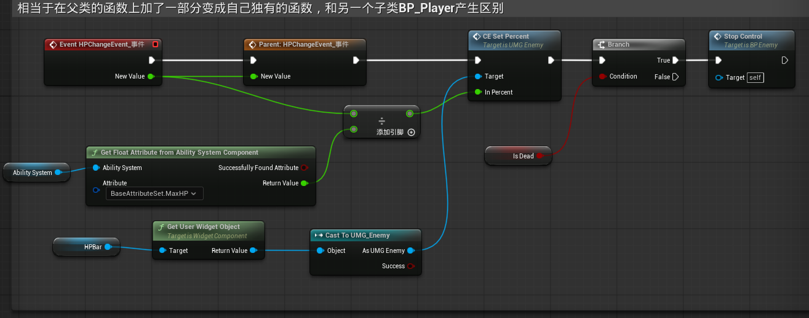

### 一、控件蓝图

添加画布画板，然后添加进度条，设置颜色为红色

在事件图表中添加设置血条百分比事件，输入为百分比

### 二、敌人角色蓝图

**1.添加控件组件并选择我们创建的控件UMG_Enemy，将其摆放至模型头顶**

场景空间的血条是三维的，受透视影响，而屏幕空间不会

**2.当血量变化事件触发时，调用控件蓝图中的CE_SetPercent事件并传入当前生命值百分比**

**给血条传值的两种途径**：

1.在UMG中给百分比设置绑定，每帧获取敌人的血量百分比

2.在敌人蓝图中，每次血量变化事件触发时，更新血条的百分比

==为什么第二种要更好？==

​	如果采用第一种，需要每帧监控敌人的血量百分比；为了获取BP_Enemy的数值，还需要用到cast，导致每帧都会执行cast，消耗性能

​	而第二种只会在血量发生变化时才会触发，效率高

