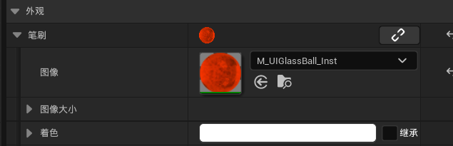
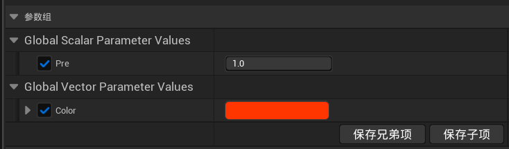
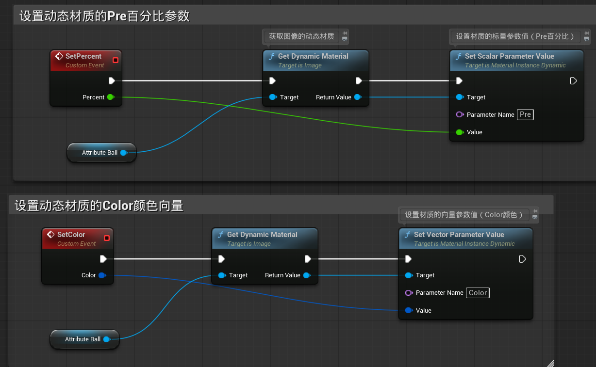
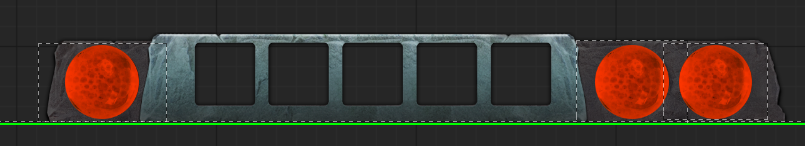
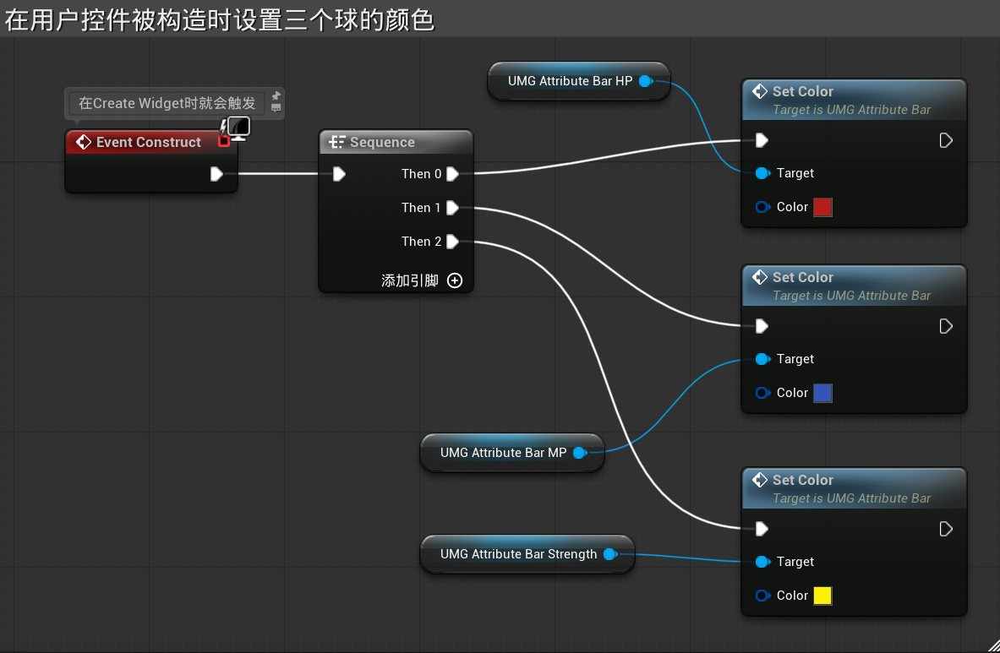
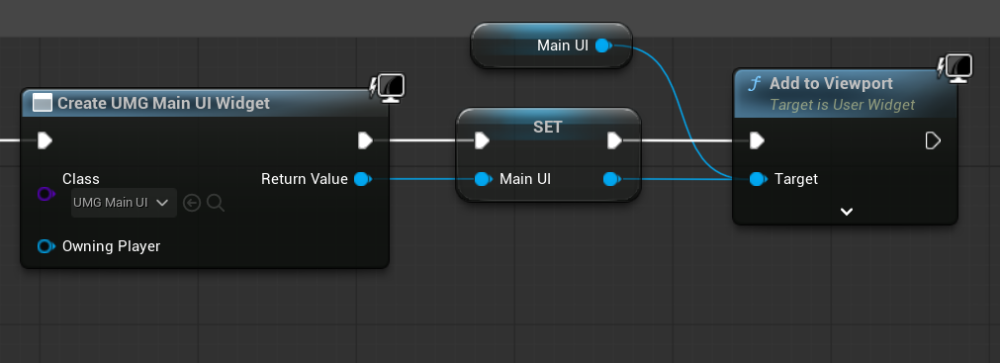
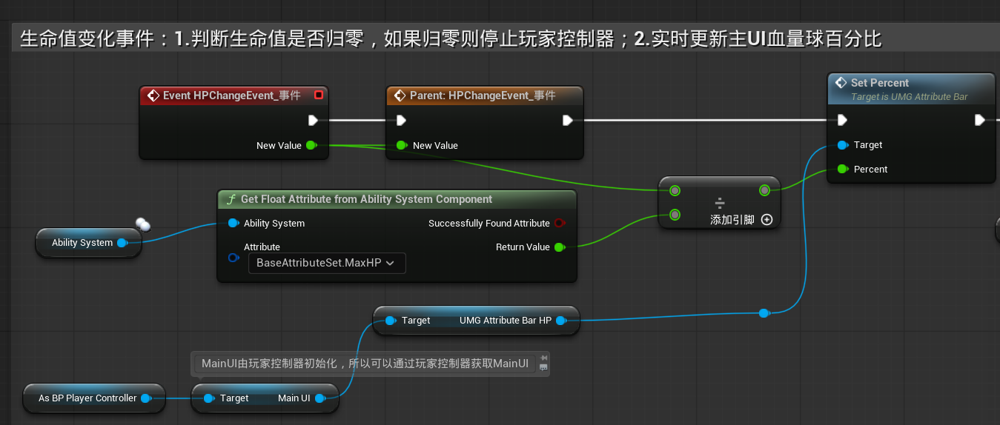

### 一、创建动态属性条

#### 1.设置动态材质

创建UMG_AttributeBar，添加画布面板，然后添加一个图像，为图像选择如图的动态材质

这个材质有两个参数，百分比Pre和颜色Color

通过设置颜色，我们可以把属性条用作血条（红），蓝条（蓝），耐力条（黄）；通过设置百分比就可以改变球的值

#### 2.设置Pre和设置Color的事件

------

### 二、创建主UI

#### 1.设置外观

创建UMG_MainUI，将三个属性球放到指定的位置，并且分别命名为血量球，蓝量球，耐力球

#### 2.初始化三个球的颜色

Event Construct会在构件被Create Widget时执行，可以用于初始化

------

### 三、添加主UI到视口

在**BP_PlayerController**中创建主UI并添加到视口

------

### 四、实时改变血量球的值

在BP_Player的血量变化事件中，设置UMG_MainUI中的UMG_AttributeBar_HP的动态材质的Pre

