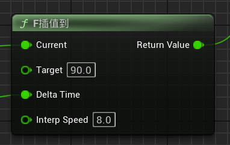
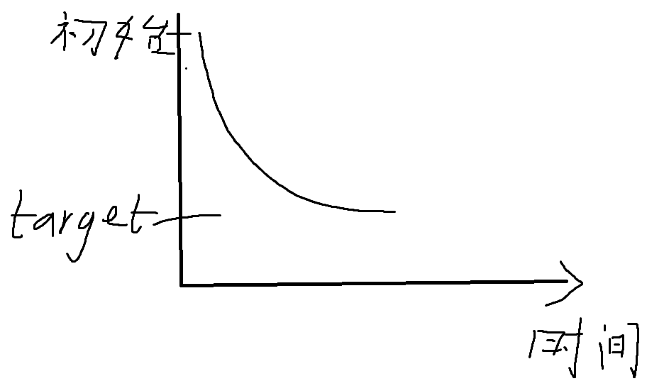

#### FInterp To

FInterp To可以产生**非均匀的，带有惯性**的过渡效果，可以用在缩放，移动，血条变化等等领域，**他的变化速度是先快后慢的**

$$Current_{new} = Current + (Target - Current) \times Speed \times DeltaTime$$

随着事件推移，target会逐渐接近current，而target-current变小就会导致每一帧的速度变化变小，也就是说速度的减小速度会越来越慢

1. **current**代表了当前速度，将变化量的当前值传进来，这样一来current每一帧都是动态变化的
2. **Target**代表了目标量，为一个常量
3. **Delta Time**就是delta seconds
4. **Interp Speed**是一个无单位系数，仅仅代表数值变化的速度