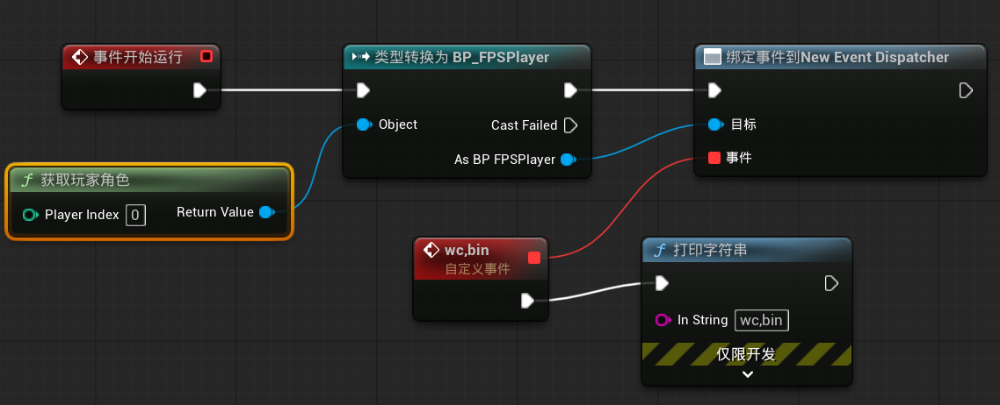

- 事件分发器分为**广播**和**监听**两部分

#### 第一步：创建广播

在需要发送广播的蓝图中新建事件发生器，并将其**调用**在某个事件后面，当这个事件执行时，就会发送一次广播

#### 第二步：监听广播

1.想要监听广播，首先需要获取发送广播的蓝图的引用

2.从引用中**绑定**事件分发器，并将一个自定义事件绑在事件分发器上（只需要绑定一次，永久生效，所以一般用**Event BeginPlay**来绑定

3.只要收到一次广播，与事件分发器绑在一起的事件就会触发一次

