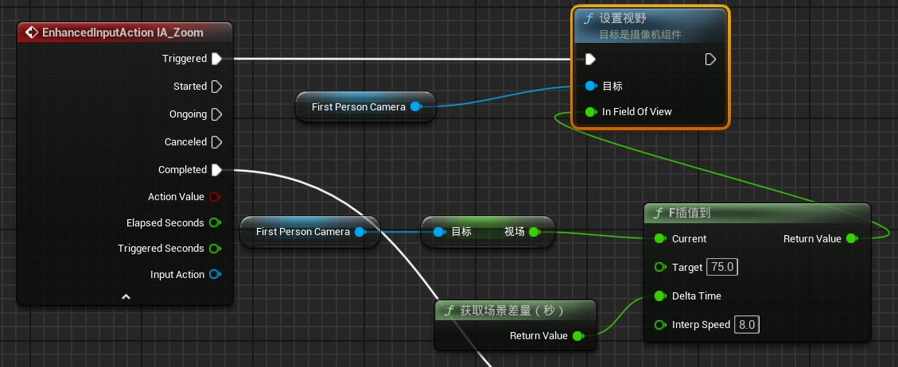
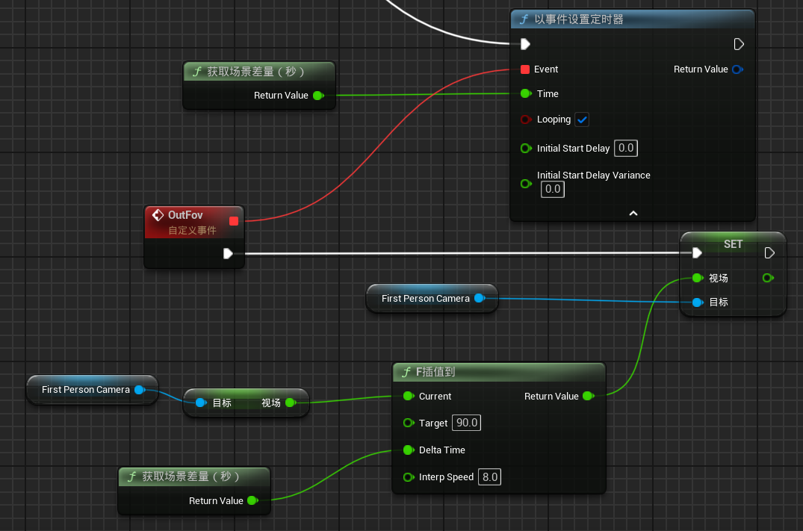
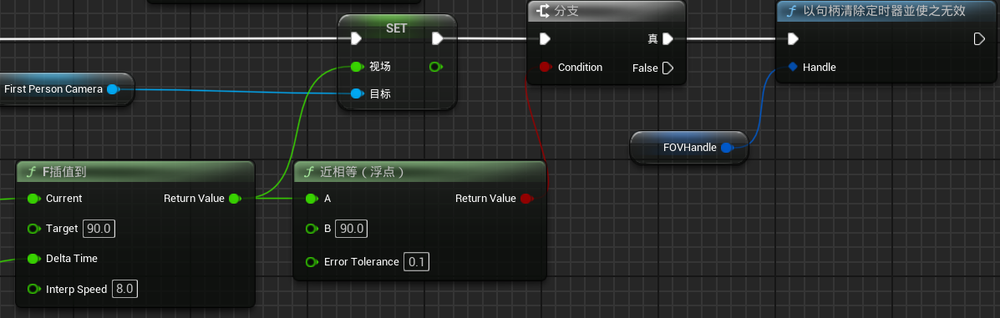

#### 第一步.设置增强输入（很简单跳过了）

#### 第二步.按住右键视野逐渐变小

1. 从**摄像机组件**中调用函数**“设置视野”**
2. 使用**F插值到**来实现数值的平滑过渡，将当前视野传给Current，设置目标视野Target

- 当我们按住鼠标右键时，Triggerd每帧触发一次事件，**“F插值到”**每帧计算新的视野值赋给**“设置视野”**
- 如果我们在视野过渡的过程中松开右键，过渡将会结束，并且停留在当前的状态（比如100--75，停在了85）；再次按住右键，过渡会从中断点继续

------

#### 第三步.松开右键，视野从松开时的状态开始恢复到原状态

- **“以事件设置定时器”**的输入引脚连在**“增强输入事件”**的Completed引脚上

------

==为什么要使用“以事件设置定时器”==？

就像按下右键时一样，视野的变化是以帧为单位的，也就是说，我们要每帧都触发一次事件，而**completed事件仅会在右键松开后触发一次**；为了在鼠标松开后还能够每次都触发一次事件，必须要使用到**定时器**

------

1. 鼠标右键松开触发定时器，定时器在Loop状态下每帧触发一次自定义Event
2. 自定义Event每帧更新一次视野，和第二步同理

------

#### 第四步.设置定时器停止条件

- 如果不设置定时器停止条件，那么在第一次松开右键后，定时器就会永久触发

**有两个条件可以使得定时器停止：**

1. 松开右键后，视野恢复到原状态90时
2. 无论何时按下右键，计时器立刻停止

当视野恢复到接近90时，关闭定时器

