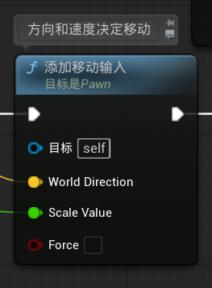
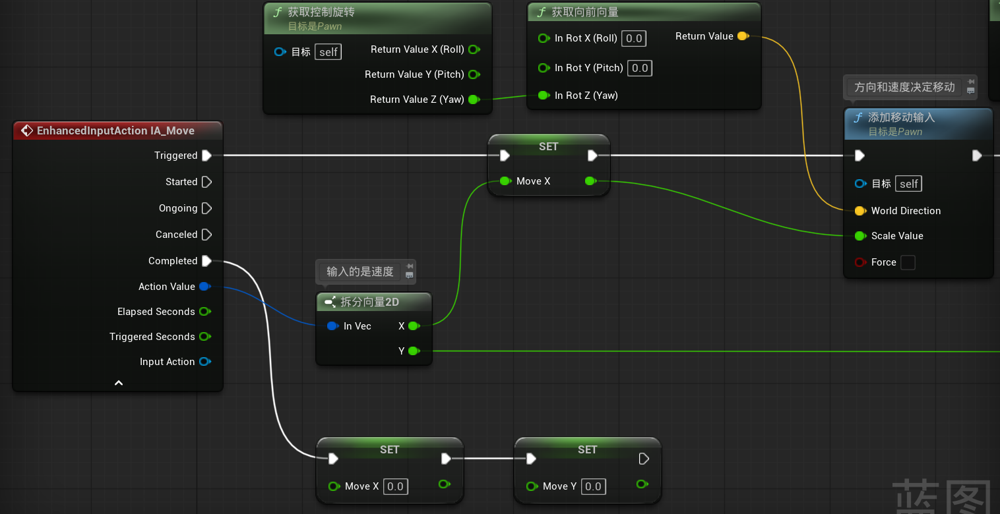
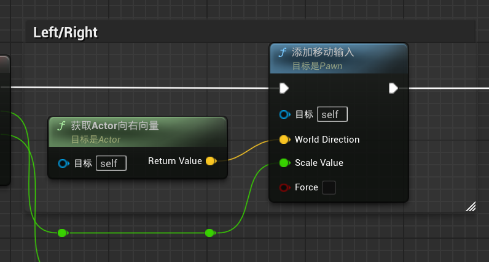
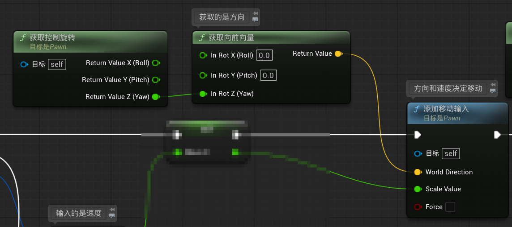

### “添加移动输入”函数

- **目标**，哪个actor进行移动，这里的self即pawn
- **World Direction**，移动的世界方向
- **Scale Value**，速度比例，值为（-1，1）即从倒着走到正着走；速度，加速度等相关参数在**角色移动组件**中设置

------

------

### 移动的方向

1. 我们可以选择**获取actor的方向**`获取actor向右向量``获取actor向前向量`来指定前方向和右方向，由于角色蓝图的根是胶囊体，而胶囊体的朝向永远都是水平的，所以无论我们的视角朝向哪里，拿到的都是水平的方向，可以直接传给`添加移动输入`

   

2. 还可以**获取控制器旋转**`获取控制旋转（get controller rotation）`来获取控制器的旋转角度，但是控制器的朝向是全面的，如果我们的视角不是水平的，那么他给的角度就也不是水平，这会导致我们的角色的移动方向不水平；如果我们是walk模式，那么视角越不水平，角色的移动就会越慢；所以我们不能直接获取控制器的旋转，而是只获得他在绕z轴的旋转（yaw），通过z轴的旋转角度来计算向前与向右向量

