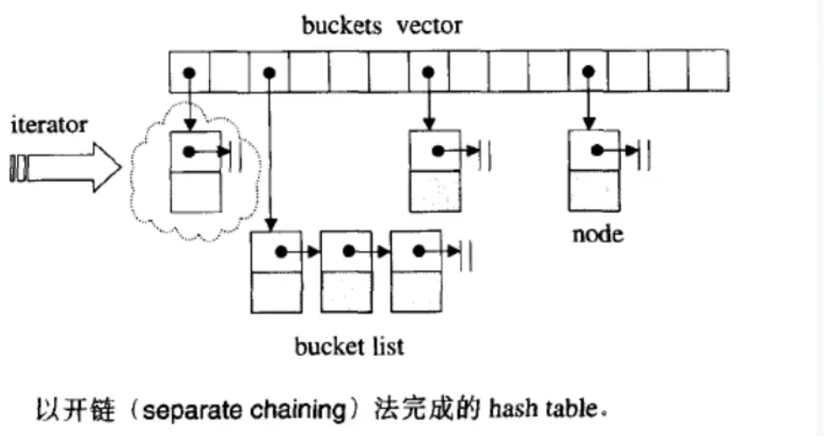

### 迭代器失效

**迭代器失效（Iterator Invalidation）** 是 C++ STL（标准模板库）中一个非常重要且隐蔽的陷阱。简单来说，它是指：**由于对容器进行了某些操作（如插入、删除或扩容），原本指向容器中某个元素的迭代器突然变得非法，无法再安全地使用。**

如果强行使用失效的迭代器，会导致程序崩溃、死机或产生难以预料的逻辑错误。

------

**1. 为什么会失效？底层逻辑是什么**

迭代器本质上是一个**封装了指针的对象**。它失效通常有两种根本原因：

1. **内存地址变了**：容器为了增加元素，申请了新的内存块并将旧数据搬过去（比如 `vector` 扩容），旧地址处的迭代器就指向了被销毁的废墟。
2. **元素被销毁了**：即使内存没搬家，但你删除了迭代器指向的那个元素，该位置已经不再属于原数据，迭代器自然就“断了联系”。

------

**2. 不同容器的失效规则**

不同的底层结构，其失效的触发条件大不相同：

**A. 序列式容器（如 `vector`, `deque`）**

- **插入操作**：
  - 如果引起了**扩容（Capacity 增加）**，所有迭代器全部失效（因为内存整体搬迁）。
  - 如果没有扩容，插入点之后的迭代器全部失效（因为后面的元素都往后挪了位）。
- **删除操作**：
  - 被删除元素及其之后的所有迭代器全部失效。

**B. 关联式容器（如 `map`, `set`, `unordered_map`）**

- **规则**：插入和删除操作**只会使指向被删除元素的迭代器失效**，其他迭代器依然有效。
- **原因**：因为它们的底层是红黑树或哈希表（拉链法），元素之间是通过指针链接的，增加或删除一个节点不会导致其他节点的内存地址发生改变。

**C. 链表容器（`list`）**

- **规则**：与 `map` 类似，极度稳定。只有被删除的那个迭代器会失效。

------

**3. 最经典的错误案例：边遍历边删除**

这是新手最容易写的 Bug：

C++

```c++
std::vector<int> v = {1, 2, 3, 4};
for (auto it = v.begin(); it != v.end(); ++it) {
    if (*it == 2) {
        v.erase(it); // ❌ 错误：erase 之后 it 就失效了，++it 会崩溃
    }
}
```

**正确写法：利用 `erase` 的返回值**

`erase` 函数会返回指向“下一个有效元素”的迭代器：

C++

```c++
for (auto it = v.begin(); it != v.end(); ) {
    if (*it == 2) {
        it = v.erase(it); // ✅ 正确：更新 it 为下一个有效位置
    } else {
        ++it; 
    }
}
```

------

**4. 总结对比表**

| **容器**                    | **插入导致失效**                       | **删除导致失效** |
| --------------------------- | -------------------------------------- | ---------------- |
| **`vector`**                | 扩容则全失效；否则插入点后失效         | 删除点后全失效   |
| **`deque`**                 | 几乎全失效（除了头尾操作可能保留部分） | 几乎全失效       |
| **`list` / `forward_list`** | **不失效**                             | 仅被删元素失效   |
| **`map` / `set`**           | **不失效**                             | 仅被删元素失效   |
| **`unordered_map`**         | 触发 rehash 则全失效                   | 仅被删元素失效   |

------

**5. 避坑指南**

1. **不要缓存 `end()` 迭代器**：在循环中如果涉及插入删除，每次都应该重新调用 `v.end()`，因为末尾位置可能随时在变。
2. **善用返回值**：处理 `vector` 或 `deque` 时，始终记得用 `it = container.erase(it)`。
3. **预留空间**：如果你知道要插入很多数据，先调用 `reserve()`，这样可以避免中途扩容导致的集体失效。

------

### unordered_map的底层结构

unordered_map是一个**哈希桶数组**



- 每个哈希桶对应一个链表，这个链表中存储了所以计算哈希值后为这个哈希值的键值对

==例==：有两个键值对{"apple", 100}, {"banana", 200}，apple和banana计算哈希后一个等于17，一个等于33，但是哈希桶数组只有1-16号桶，所以对17和33取余，结果都等于1，那他们俩对应的就都是1号桶，都存在1号桶的链表中

- 如果两个key计算得到的哈希桶的序号相同，那么他们就发生了**哈希冲突**

------

### deque的底层结构

deque的底层结构很复杂，但是可以用一种简单的方式来解释

**1. 核心架构：中控器与缓冲区**

- **中控器 (Map / Directory)**：

  这是一个连续的内存块（通常是一个指针数组）。它的作用就像是一本“目录”，里面存放的不是真实的数据，而是指向各个“数据块”的指针。

- **缓冲区 (Buffer / Chunk)**：

  这才是真正存放数据的内存块。每一个缓冲区都是一段定长、连续的内存（例如默认 512 字节或依类型而定）。

当你在 `deque` 中存储数据时，数据实际上是被分散存放在这些彼此独立的缓冲区中的。而中控器负责将这些碎片化的缓冲区在逻辑上“拼接”成一个连续的整体。

**2. 核心操作是如何实现的？**

**A. 两端极速插入 (`push_back` / `push_front`)**

- **向后插入**：如果最后一个缓冲区还有空间，直接放进去。如果满了，底层会向操作系统申请一个新的缓冲区（Chunk），然后把这个新缓冲区的指针记录到“中控器”的尾部。
- **向前插入**：同理，如果第一个缓冲区没有前方空间了，就申请一个新的缓冲区，并把指针记录到“中控器”的头部。
- **优势**：它完全避免了像 `std::vector` 那样在头部插入数据时需要把所有元素往后挪动的巨大开销（$O(N)$），实现了真正的头部和尾部 $O(1)$ 插入。

**B. 高效的随机访问 (`operator[]`)**

`deque` 支持像数组一样用 `[i]` 访问元素，并且时间复杂度是 $O(1)$。它是怎么在“分段”的内存里做到这点的？

底层通过简单的数学运算（除法和取模）来定位元素：

1. **定位缓冲区**：`目标缓冲区索引 = 元素下标 / 缓冲区大小`

2. **定位偏移量**：`缓冲区内偏移量 = 元素下标 % 缓冲区大小`

   通过这两步，底层的迭代器可以瞬间算出目标元素在内存中的绝对地址。