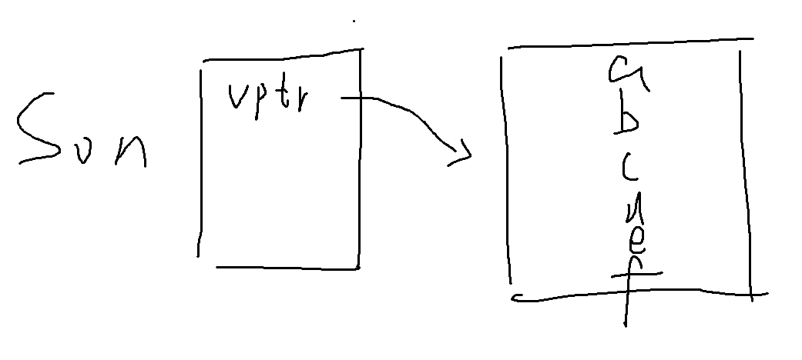
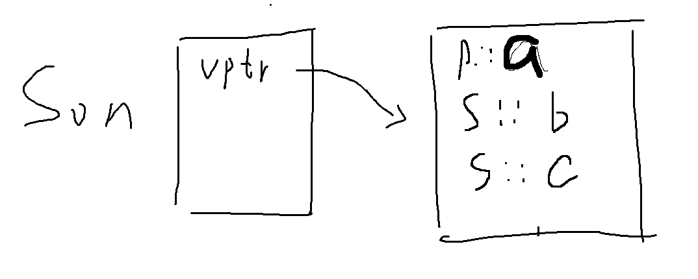
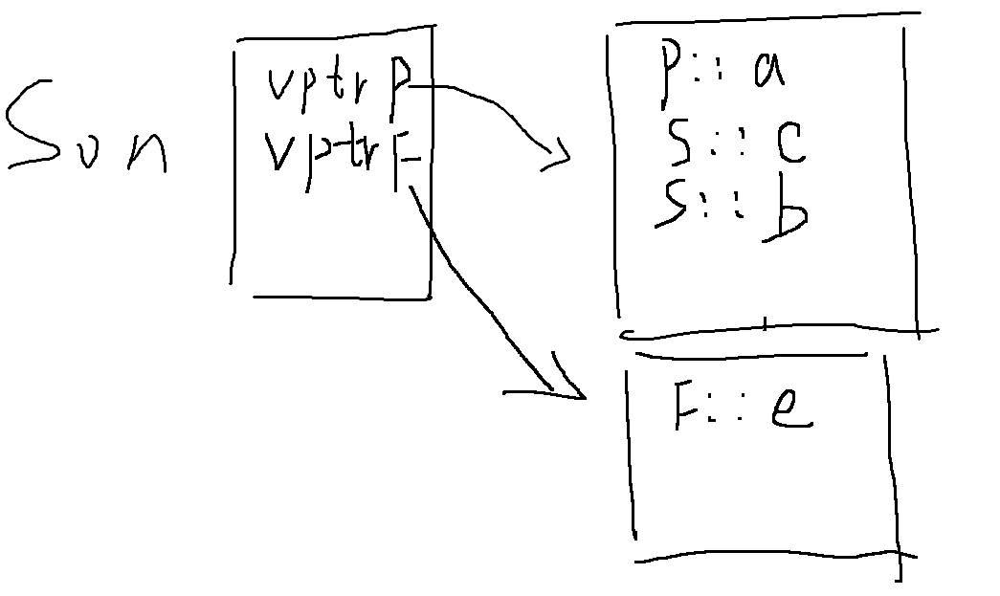

#### 不使用虚函数的话

父类指针指向子类对象，无法调用子类对象自己独有的函数

```c++
class Person {
public:

    void func2() {
        cout << "Person" << endl;
    }
};

class Son : public Person {
public:

    void func() {
        cout << "Son" << endl;
    }
};

int main() {
    Person* p = new Son();   //由于类型是Person*，所以只能访问Person里面的内容

    p->func();    //报错
    
    return 0;
}
```

如果子类用同名函数隐藏父类函数

```c++
class Person {
public:

    void func2() {
        cout << "Person" << endl;
    }
};

class Son : public Person {
public:

    void func2() {
        cout << "Son" << endl;
    }
};

int main() {
    Person* p = new Son();   

    p->func2();     //调用的是父类的
    
    Son* s = new Son();
    
    s->func2();     //调用的是子类的，父类的func2()当然继承给子类了，但是子类会把他隐藏起来，无法调用

    return 0;
}
```

------

#### 使用虚函数

**父类和子类拥有名字不同的虚函数**



```c++
class Person {
public:

    virtual void a() {
        
    }
};

class Son : public Person {
public:

    virtual void b() {
        
    }
};
```

很明显，Son已经继承了父类的函数，所以可以调用父类的函数

```c++
Son s1;
Son* p = &s1;
p->a();
s1.a();
```

**重写父类的虚函数**

C被重写了，所以子对象的虚函数表里面已经没有父类的C了



```c++
class Person {
public:

    virtual void a() {

    }
    
    virtual void c() {
        
    }
};

class Son : public Person {
public:

    virtual void b() {

    }
    
    void c() override {
        
    }
};
```

**父类指针指向子类对象**

```c++
Person* p = new Son();
p->a();         //Person* 可以调用父类的函数
p->b();         //报错，Person类没有b，所以不能调用
p->c();         //Person*调用父类C，发现C被重写了，被重定向到Son::c()，从而调用了子类的C
```

------

#### 多继承

一个对象不一定只包含一个vptr，在多继承的情况下，完全可能有多个vptr

如果某个父类的继承包含了虚函数（不管子类有没有重写），都会导致子类内存中出现这个父类的虚表指针

此时用sizeof(Son)计算子类的内存大小，会发现输出是16，也就是两个虚表指针的大小



```c++
class Person {
public:

    virtual void a() {

    }

    virtual void c() {

    }
};

class Father {
public:
    virtual void e() {

    }
};

class Son : public Person, public Father {
public:

    virtual void b() {

    }

    void c() override {

    }
};
```