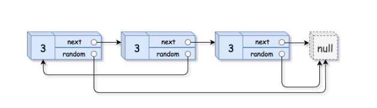
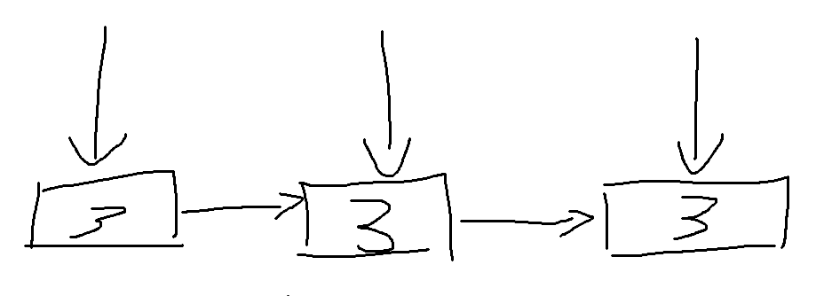

#### 让旧链表和新链表的结点产生映射关系





在第一趟遍历中，让新链表和旧链表映射

第二趟遍历旧链表，旧节点访问到对应的新节点，然后新节点的random接到旧节点的random对应的新节点身上

```c++
class Solution {
public:
    Node* copyRandomList(Node* head) {
        unordered_map<Node*, Node*> m;

        Node* dummy = new Node(0);
        Node* curr = dummy;

        Node* pre = head;

        while(pre){
            curr->next = new Node(pre->val);
            m[pre] = curr->next;
            curr = curr->next;
            pre = pre->next;
        } 

        pre = head;
        while(pre){
            m[pre]->random = m[pre->random];
            pre = pre->next;
        }

        return dummy->next;
    }
};
```

