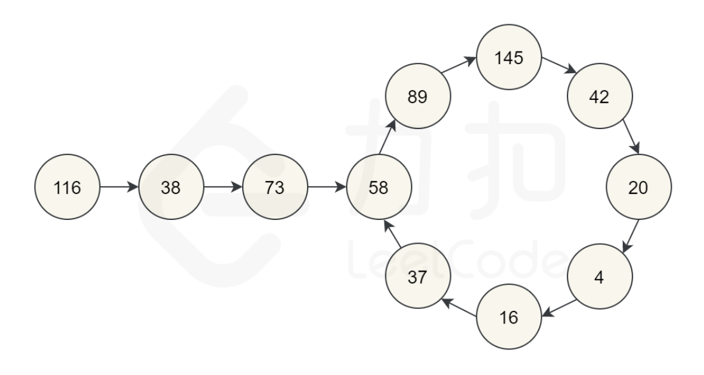

可能会出现如下图所示的循环，所以我们不能假设他的循环过程一定会经过起点



#### 弗洛伊德判圈算法

​	既然出现可能循环的情况，就可以用弗洛伊德判圈算法来判断他是否真的有个圈

​	slow从第一个位置开始，fast从第二个位置开始，如果fast到达了1，就是true，如果fast遇到了slow，那就说明有圈，返回false

**用函数来模拟链表**

​	链表是用next来指向下一个，我们用getNext函数来指向下一个，本质上都是一种函数映射

```c++
class Solution {
public:
    int getNext(int n){
        int sum = 0;

        while(n != 0){
            sum += (n % 10) * (n % 10);
            n = n / 10;
        }

        return sum;
    }

    bool isHappy(int n) {
        int slow = n;
        int fast = getNext(n);

        while(fast != 1 && slow != fast){
            slow = getNext(slow);
            fast = getNext(getNext(fast));
        }

        if(fast == 1){
            return true;
        }
        else{
            return false;
        }
    }
};
```

