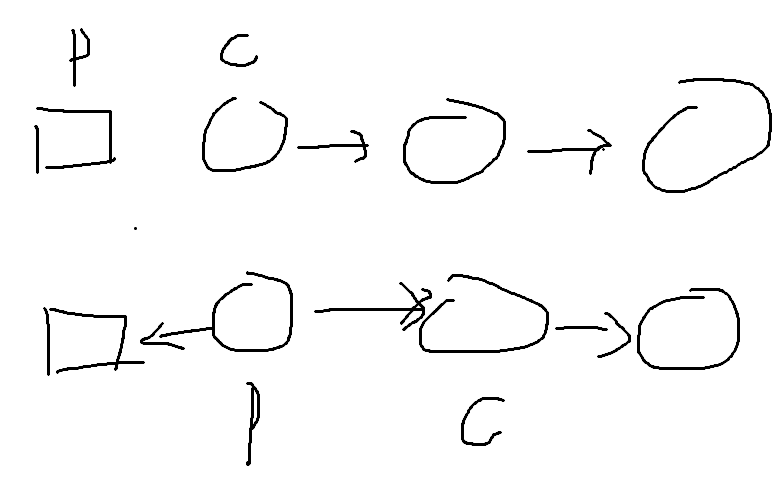

#### 其实有点想复杂了

为什么需要三个指针？



众所周知，我们试图把上面的变成下面的，但是有一个问题，**Curr如何走到下一个Curr?**

我们发现想要让Curr走到下一个Curr，就必须把Curr->next给存起来，当一个中间变量，所以第三个指针nextNode就应运而生了

每一步只是让pre和curr的朝向反过来，并不去做nextNode和Curr的朝向

```c++
class Solution {
public:
    ListNode* reverseList(ListNode* head) {
        ListNode* pre = nullptr;
        ListNode* curr = head;
        
        while(curr){
            //第三个指针用于保存Curr->next
            ListNode* nextNode = curr->next;
            curr->next = pre;
            pre = curr;
            curr = nextNode;
        }

        //由于最后链表完全倒过来了，所以要返回链表最右边的那个节点而不是head
        return pre;
    }
};
```

#### 从反转链表Ⅱ偷来的穿针引线法

​	过程比较复杂，可以看力扣的题解

​	基本思路是，pre固定是需要反转的链表的前一个节点（在反转链表1里面自然就指的是哑节点），curr从第一个节点开始，每一次执行一系列操作，目的是把nextNode搬到链表的最左边，并维持其他的正常链表关系

​	和反转链表1不一样的是，这里nextNode不仅是个用来记录下一个节点的变量，而是每一步操作都要操作的变量

```c++
class Solution {
public:
    ListNode* reverseList(ListNode* head) {
        ListNode* dummy = new ListNode(0);
        dummy->next = head;
        ListNode* pre = dummy;

        ListNode* curr = pre->next;
        if(curr == nullptr){
            return head;
        }

        ListNode* nextNode;

        while(curr->next){
            nextNode = curr->next;
            curr->next = nextNode->next;
            nextNode->next = pre->next;
            pre->next = nextNode;
        }

        return dummy->next;
    }
};
```

