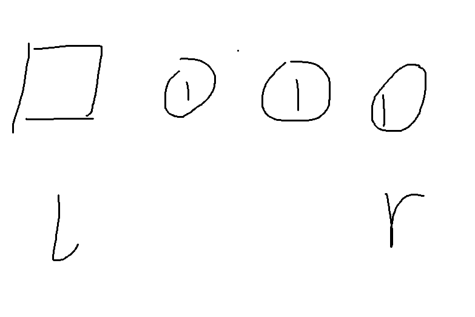

#### 左边界带有边界



​	left处于需要判断的元素的左边，right通过循环到达最右边

​	如果left->next == right，说明要判断的元素并没有重复，left = right，并继续判断下一个

​	如果left->next != right，说明这组元素有重复，直接跳过

```c++
class Solution {
public:
    ListNode* deleteDuplicates(ListNode* head) {
        ListNode* dummy = new ListNode(0);
        dummy->next = head;

        ListNode* left = dummy;

        while (left->next) {
            ListNode* right = left->next;

            // 找到这一组相同元素的最后一个
            while (right->next &&
                   right->next->val == right->val) {
                right = right->next;
            }

            // right != left->next
            // 说明这一组至少有两个节点
            if (right != left->next) {
                left->next = right->next;
            }
            else {
                // 当前节点没有重复，可以保留
                left = left->next;
            }
        }

        return dummy->next;
    }
```

