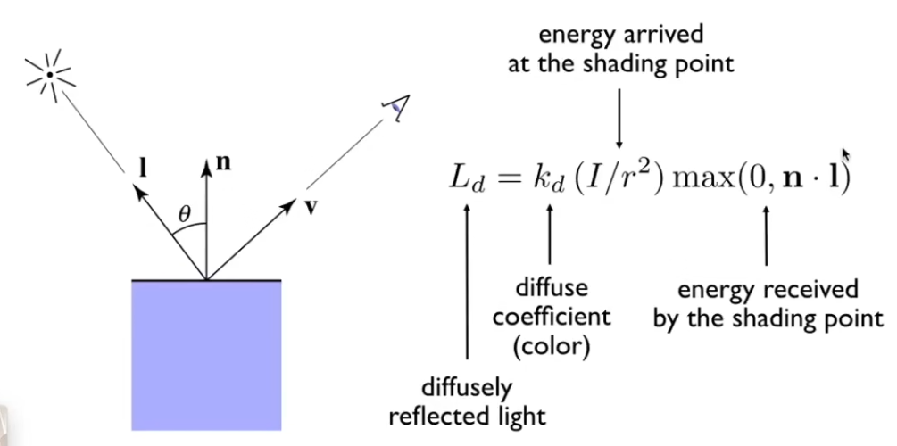
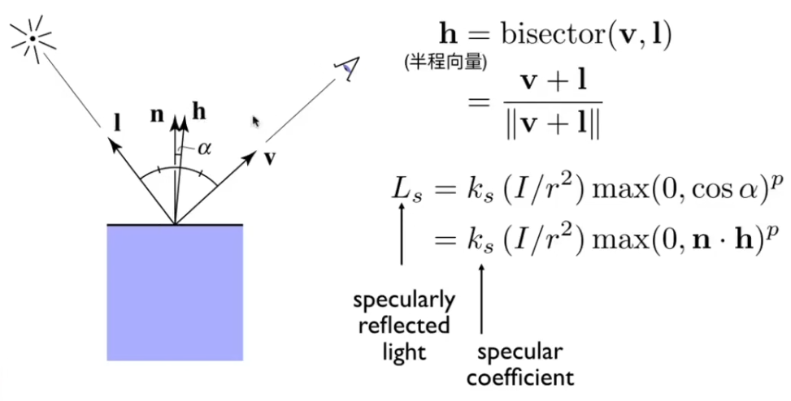
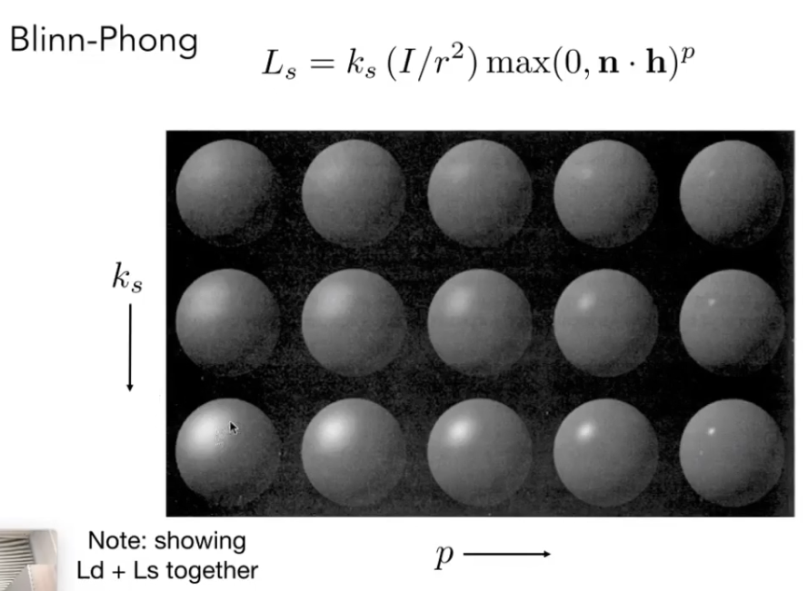
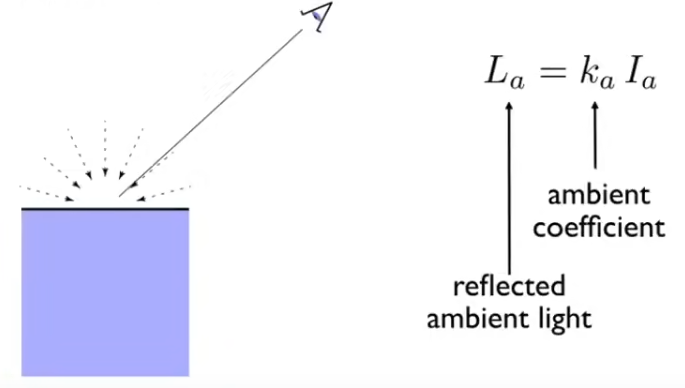
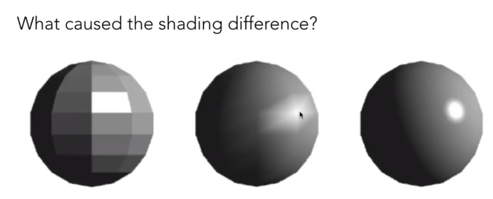
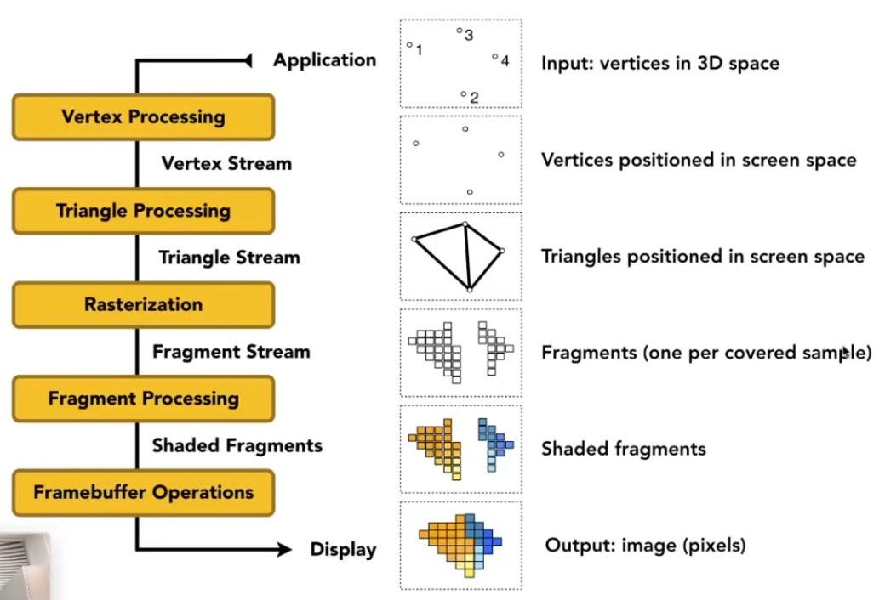
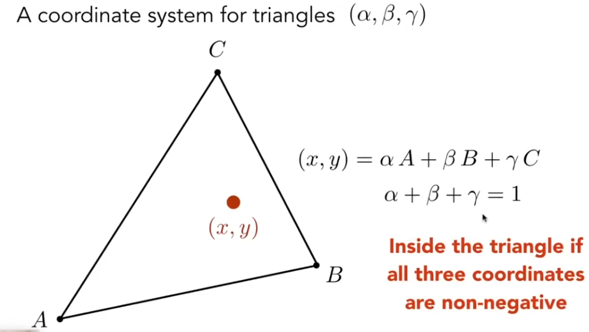

### 反射

#### 漫反射（lambertian Shading，diffuse ）

- 漫反射不考虑观察方向，仅与光线的入射方向有关，看起来很粗糙

- kd是漫反射系数，由点的材质（颜色）决定，I/r2是光照强度I除以半径r的平方，nl就是入射角点乘，不能为负

------

#### phong模型（Specular）

- phong模型由于要计算光的反射方向，所以计算量很大，而且视线与反射光夹角超过90°时，高光会直接消失

Phong 在 Lambert 的基础上增加了**镜面反射（Specular）**，引入了“高光”的概念。

- **视觉特征**：表面有明显的亮斑。高光的位置会随着**观察者角度**的变化而移动。

- **核心逻辑**：认为高光最亮的地方应该是“反射光线”与“视线”完全重合的方向。

- **数学公式**：

  $$I_{specular} = K_s \cdot I_L \cdot (\max(0, R \cdot V))^n$$

  （$R$ 为反射光矢量，$V$ 为视线矢量，$n$ 为高光指数/反光度）

- **缺点**：

  - **计算量大**：每一帧都要计算反射矢量 $R = 2N(N \cdot L) - L$，涉及较多向量运算。
  - **高光失真**：当视线与反射光夹角超过 $90^\circ$ 时，高光会突然消失，边缘过渡不自然。

------

#### Bling-Phong高光模型

- Bling-Phong调整了Phong对于**高光**的计算方式，不再需要计算光的**反射方向**，大幅降低了计算量
- 当n与h重合时，反射光R正好和v重合，也就是说v和R的角度差，可以近似的转换为n和h的角度差

- ------

  cosα必然是小于1的数，其幂p越大，结果就越小，**p代表了高光的扩散面积**

1. 当p非常大时，幂值无穷小，无论v在哪里看到的Ls都非常的小
2. 当p非常小时，幂值非常大，无论v在哪里都能看到很亮的Ls，也就代表着高光的扩散范围很大

- 从图中可以看出，随着p增大，高光的扩散范围越来越小

------

#### 环境光（Ambient Term）

- 环境光并不真实存在于场景中，只是单纯为了给一个统一的底光（避免有的地方完全为黑，看不到），与光的方向，距离均无关系；环境光是一个**常数**

------

#### 完整的反射模型——Bling-Phong反射模型

- 将环境光，漫反射和高光加在一起后，就得到了完整的Bling-Phong反射模型

------

### 着色频率

- 在上面的内容我们知道，着色的单位是点，那么给我们一个物体，我们应该如何选择着色的频率？

1. 第一个球，我们对其一个面上的一个点进行着色，然后其他点跳过着色步骤，直接设置为相同的颜色（有多少个**面**，就要进行多少次着色）。<u>==【逐三角形着色，flat shading】==</u>
2. 第二个球，我们对其所有顶点进行着色，面的内容通过**重心坐标插值**判断颜色（有多少**顶点**，就要计算多少着色）。==【逐顶点着色，Gouraud shading】==
3. 第三个球，**顶点着色器**不直接进行着色，而是传递法线，在**像素着色器**中，利用**重心坐标插值**出所有像素的法线，再利用法线对每个像素计算一次光照公式（有多少**像素**，就要计算多少次着色）==【逐像素着色，Phong shading】==
4. 很明显，三种着色方式的**效果越来越好**，计算着色的**次数越来越多**
5. 对于面数越少的模型，三种着色的效果差距就越大，反过来说，如果模型的面数非常夸张，那么就算用flat shading，和另外两个也不会有什么大的差距

------

### 实时渲染管线

- 可以发现管线里面没有着色，这是因为如果只考虑顶点着色和像素着色的话，顶点着色在Vertex Processing之后就可以执行，而像素着色要在Fragment Processing中执行
- 由此可以看出着色是**灵活的，可编程的**，可操作和修改的程度很高，所以在实时渲染管线中，主要研究的就是**着色**，由此衍生了出了着色器编程这个大领域，和**着色器语言GLSL**
- 如果着色器是逐顶点着色的，那么就叫**顶点着色器**（Vertex shader），如果是逐像素的，就叫**像素着色器/片段着色器**（Fragment shader）

------

### 材质（Material）

- 材质决定了**光线如何与物体表面交互**， 材质 = 着色器代码 (Shader) + 参数设置 (Uniforms) + 纹理引用 (Textures)。
- **反射公式中的参数ks,kd,ka都是由材质决定的**，在PBR中，这些参数会被再次细化。

------

### 纹理（Texture）

- 纹理的作用是**将一种“属性信号”从参数空间（UV 空间）映射到几何空间**。

- 纹理通常是**图片文件**，但是他不止包含颜色值，而是可以包含很多**属性。**

在现代渲染（包括你可能正在研究的 PBR）中，纹理（Texture）被视为一个**通用的数据查找表（Look-up Table）**。它传递的属性多种多样：

- **法线贴图 (Normal Map)**：传递的是**法线方向**（向量），用来模拟表面的凹凸细节，而不是颜色。
- **高光贴图 (Specular Map)**：传递的是**反射强度**（标量），控制哪里亮、哪里暗。
- **粗糙度贴图 (Roughness Map)**：传递的是**材质的物理属性**。
- **位移贴图 (Displacement Map)**：传递的是**几何偏移量**，直接改变顶点的实际位置。

------

### 插值的核心——重心坐标Barycentric Coordinates

- 如果点P在三角形内，那么他的重心坐标的**三个值都不能为负**

------

#### 重心坐标的几何意义

- 重心坐标是三角形**有向面积**的比值

$$\alpha = \frac{Area(PBC)}{Area(ABC)}, \quad \beta = \frac{Area(PAC)}{Area(ABC)}, \quad \gamma = \frac{Area(PAB)}{Area(ABC)}$$

------

##### 有向面积