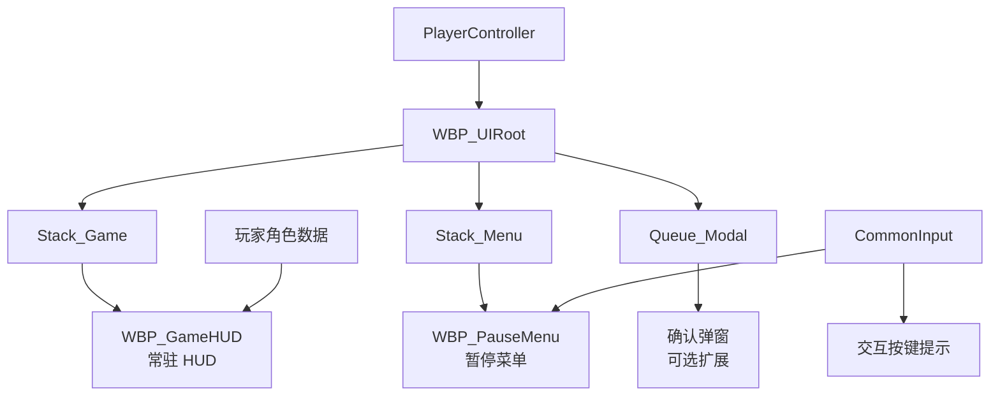
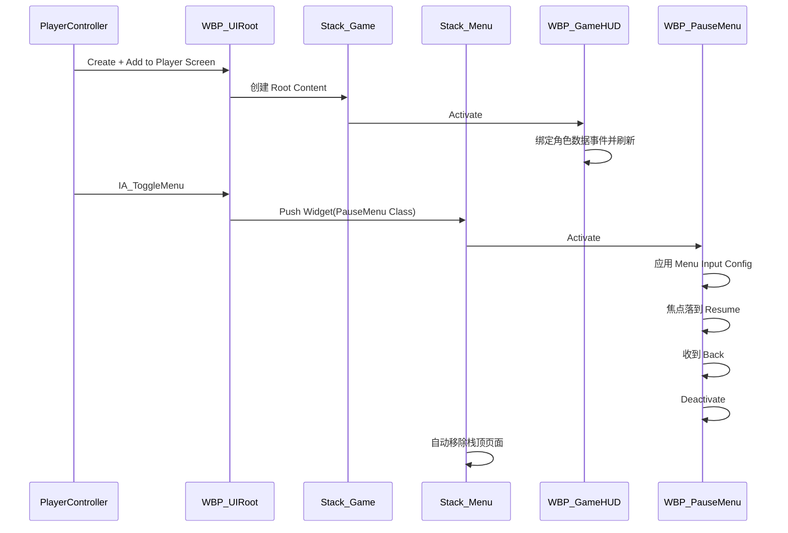

# 使用 CommonUI 搭建一个简单 HUD：入门实践

> 适用读者：已经会创建 Widget Blueprint，希望第一次完整实践 CommonUI 的 UE5 初学者  
> 实现方式：以蓝图为主，不依赖 Lyra、CommonGame 或任何具体业务框架  
> 最终效果：常驻战斗 HUD + 跨设备交互提示 + 可用键盘/手柄关闭的暂停菜单

本文中的类型名、资产名、目录名和数值均为教学示例，不对应任何实际项目。

如果还不熟悉 Activatable Widget、Stack、CommonInput 等概念，可以先阅读 [CommonUI 入门指南](./CommonUI_入门指南.md)。

---

## 1. 这次要做什么

我们将搭建一个最小但结构完整的 HUD：

- 左下角显示生命值和体力；
- 屏幕中央显示准星；
- 右下角显示弹药；
- 靠近交互物时显示“按键图标 + 交互”；
- 按下暂停键打开菜单；
- 暂停菜单打开后，游戏输入让位给 UI；
- 按 `Esc` 或手柄返回键关闭菜单；
- 键鼠与手柄切换时，交互提示自动更换按键图标。

这个练习主要学习四件事：

1. 如何只创建一次 UI 根布局；
2. 如何把常驻 HUD、菜单和弹窗分层；
3. 如何让 `UCommonActivatableWidgetStack` 管理菜单生命周期；
4. 如何使用 CommonInput 显示跨设备按键提示。

完成后的逻辑结构如下：



---

## 2. 为什么 HUD 也要分层

HUD 中的不同内容，生命周期并不相同。

| 内容 | 特点 | 推荐容器 |
|---|---|---|
| 生命值、准星、弹药 | 进入游戏后长期存在，不获取菜单焦点 | Game Stack 的 Root Content |
| 暂停菜单、背包、地图 | 打开时获得输入和焦点，支持逐级返回 | `UCommonActivatableWidgetStack` |
| 确认框、奖励提示 | 可能连续出现，需要一个一个处理 | `UCommonActivatableWidgetQueue` |

如果把所有内容都直接 `Add to Viewport`，很快会遇到这些问题：

- 不知道当前哪个菜单应该处理返回键；
- 手柄焦点留在已关闭页面；
- 打开菜单后角色仍然移动；
- 同一个菜单被重复创建；
- 多个弹窗互相遮挡；
- 输入设备切换后提示图标无法统一刷新。

本实践采用三个并列容器。它们只是一种简单的分层方式，不依赖 Gameplay Tag 或额外 UI 框架。

```text
WBP_UIRoot
└── Overlay_Root
    ├── Stack_Game       常驻 HUD
    ├── Stack_Menu       菜单页面
    └── Queue_Modal      模态弹窗
```

Overlay 中越靠后的子控件绘制层级越高，因此顺序应保持为 Game、Menu、Modal。

---

## 3. 准备工作

### 3.1 启用插件

在 `Edit -> Plugins` 中确认启用：

- Common UI；
- Enhanced Input。

修改插件状态后重启编辑器。

### 3.2 设置 Viewport Client

在 `Project Settings -> Engine -> General Settings` 中，将 Game Viewport Client Class 设置为：

```text
CommonGameViewportClient
```

也可以使用继承自 `UCommonGameViewportClient` 的自定义类。

这个 Viewport Client 会让输入先经过 CommonUI 的路由。若没有配置，页面可能正常显示，但 Back、UI Action 等输入行为可能不符合预期。

### 3.3 准备 Common Input Data

创建一个 `CommonUIInputData` 蓝图子类：

```text
BP_CommonInputData
```

至少配置：

- Default Click Action；
- Default Back Action；
- 如果启用 Enhanced Input 支持，则配置 Enhanced Input Click Action；
- 如果启用 Enhanced Input 支持，则配置 Enhanced Input Back Action。

然后在 `Project Settings -> Game -> Common Input Settings` 中：

1. 将 Input Data 指向 `BP_CommonInputData`；
2. 开启 Enhanced Input Support；
3. 重启编辑器，使配置完整生效。

如果团队已经采用 CommonUI DataTable Row 描述 UI Action，也可以继续使用 DataTable 方案。本实践只选择 Enhanced Input 方案，避免同一个操作被两套 Action 重复绑定。

### 3.4 准备输入资产

创建以下 Enhanced Input 资产：

| 资产 | 示例映射 | 用途 |
|---|---|---|
| `IA_ToggleMenu` | `Esc`、Gamepad Special Right | 从游戏中打开暂停菜单 |
| `IA_UI_Back` | `Esc`、Gamepad Face Button Right | CommonUI 的默认返回操作 |
| `IA_Interact` | `E`、Gamepad Face Button Bottom | 交互逻辑和按键图标 |

把这三个 Input Action 都加入当前 LocalPlayer 已激活的 Input Mapping Context。CommonUI 会通过 Enhanced Input Local Player Subsystem 查询 Action 对应的按键；如果 Action 没有处于有效映射中，Back 和按键图标都可能找不到按键。

`IA_UI_Back` 作为 CommonUI 的 Back Action 使用。不同项目可以让 `IA_ToggleMenu` 和 `IA_UI_Back` 复用同一个 Input Action，但初学练习中分开更容易观察职责：

- `IA_ToggleMenu` 由游戏侧打开菜单；
- 菜单打开后由 CommonUI Back 关闭菜单。

### 3.5 准备 Controller Data

为了显示按键图标，需要为目标设备准备 `CommonInputBaseControllerData` 子类，例如：

```text
BP_ControllerData_Keyboard
BP_ControllerData_Gamepad
```

在 Controller Data 中配置 Input Brush Data Map，确保至少包含：

- `E`；
- `Escape`；
- Gamepad Face Button Bottom；
- Gamepad Face Button Right；
- Gamepad Special Right。

再在目标平台的 Common Input Platform Settings 中加入这些 Controller Data。

没有图标素材时，可以先使用简单的方框和文字占位。这里的重点是验证图标能够随输入设备改变。

---

## 4. 创建通用按钮

`UCommonButtonBase` 是抽象类，通常先做一个可复用的蓝图子类。

创建：

```text
WBP_CommonButton : CommonButtonBase
```

建议的控件树：

```text
WBP_CommonButton
└── SizeBox
    └── Overlay
        ├── Border_Background
        └── CommonTextBlock_Label
```

为按钮增加一个 `Text` 变量，在 Pre Construct 或自定义刷新函数中把它设置到 `CommonTextBlock_Label`。

建议同时创建：

```text
BP_ButtonStyle_Default : CommonButtonStyle
BP_TextStyle_Button    : CommonTextStyle
```

在按钮 Class Defaults 中配置 Style。Style 至少区分：

- Normal；
- Hovered；
- Pressed；
- Disabled；
- Selected。

这样暂停菜单中的所有按钮可以共享同一套视觉状态。

---

## 5. 创建常驻游戏 HUD

### 5.1 创建页面

创建：

```text
WBP_GameHUD : CommonActivatableWidget
```

Class Defaults 推荐配置：

| 属性 | 值 | 原因 |
|---|---|---|
| Auto Activate | False | 交给 Stack 管理激活状态 |
| Is Back Handler | False | HUD 不处理菜单返回 |
| Supports Activation Focus | False | 常驻 HUD 不应该抢手柄焦点 |
| Is Modal | False | 不阻断其他 UI 输入 |

不要为常驻 HUD 实现 Menu 类型的 Desired Input Config。游戏角色的输入模式仍由游戏侧保持。

### 5.2 搭建控件树

可以使用下面的最小布局：

```text
WBP_GameHUD
└── CanvasPanel_Root
    ├── Overlay_Vitals              左下角
    │   ├── ProgressBar_Health
    │   ├── CommonTextBlock_Health
    │   └── ProgressBar_Stamina
    ├── Image_Crosshair             屏幕中央
    ├── CommonNumericTextBlock_Ammo 右下角
    └── HorizontalBox_Interact      中下方
        ├── CommonActionWidget_Interact
        └── CommonTextBlock_Interact
```

推荐做一些基本的响应式设置：

- 使用 Anchor 把控件固定到对应屏幕区域；
- 不要完全依赖固定像素位置；
- 给边缘信息留出 Safe Zone；
- 准星锚点设为屏幕中央，Alignment 设为 `(0.5, 0.5)`；
- 使用 DPI Scaling 测试不同分辨率。

### 5.3 设置交互按键图标

选中 `CommonActionWidget_Interact`，把 Enhanced Input Action 设置为：

```text
IA_Interact
```

把 `CommonTextBlock_Interact` 的文本设置为“交互”。

运行时按下手柄键后，CommonInput 会把当前输入类型切到 Gamepad，`CommonActionWidget` 应自动显示手柄图标；移动鼠标或按键盘键后，再切回键盘图标。

### 5.4 添加 HUD 更新函数

在 `WBP_GameHUD` 中创建三个函数：

```text
UpdateHealth(CurrentHealth, MaxHealth)
UpdateStamina(CurrentStamina, MaxStamina)
UpdateAmmo(CurrentAmmo)
```

生命值百分比计算：

```text
SafeMaxHealth = Max(MaxHealth, 1.0)
Percent = Clamp(CurrentHealth / SafeMaxHealth, 0.0, 1.0)
ProgressBar_Health.SetPercent(Percent)
CommonTextBlock_Health.SetText("CurrentHealth / MaxHealth")
```

不要直接用 `CurrentHealth / MaxHealth` 而不检查分母，否则初始化阶段的零值可能产生非法结果。

### 5.5 使用事件刷新，不使用 Tick 轮询

为了练习，可以在示例角色中创建 Event Dispatcher：

```text
OnHealthChanged(CurrentHealth, MaxHealth)
OnStaminaChanged(CurrentStamina, MaxStamina)
OnAmmoChanged(CurrentAmmo)
OnInteractableChanged(bCanInteract)
```

`WBP_GameHUD` 的简化流程：

```text
Event On Activated
  -> Get Owning Player Pawn
  -> Cast to BP_DemoCharacter
  -> 保存角色引用，并在每次使用前检查有效性
  -> Bind OnHealthChanged
  -> Bind OnStaminaChanged
  -> Bind OnAmmoChanged
  -> Bind OnInteractableChanged
  -> 主动读取一次当前值并刷新全部控件

Event On Deactivated
  -> Unbind 上述 Dispatcher
  -> 清空角色引用
```

交互提示显隐：

```text
OnInteractableChanged(true)
  -> HorizontalBox_Interact = HitTestInvisible

OnInteractableChanged(false)
  -> HorizontalBox_Interact = Collapsed
```

对只负责显示的 HUD，`HitTestInvisible` 通常比 `Visible` 更合适，因为它不会拦截鼠标命中。

生产项目中还要处理角色重生、重新 Possess 和 LocalPlayer 切换。本练习先保证单玩家流程正确，但仍应坚持事件驱动，避免每帧 Cast 和读取属性。

---

## 6. 创建暂停菜单

### 6.1 创建页面和布局

创建：

```text
WBP_PauseMenu : CommonActivatableWidget
```

控件树示例：

```text
WBP_PauseMenu
└── Overlay_Root
    ├── Border_DimBackground
    └── VerticalBox_Menu
        ├── CommonTextBlock_Title
        ├── WBP_CommonButton_Resume
        ├── WBP_CommonButton_Settings
        └── WBP_CommonButton_Quit
```

Class Defaults 推荐配置：

| 属性 | 值 | 作用 |
|---|---|---|
| Auto Activate | False | 由 Menu Stack 激活 |
| Is Back Handler | True | 接收默认 Back Action |
| Is Back Action Displayed in Action Bar | 可选 True | 若以后增加 Action Bar，可显示返回提示 |
| Supports Activation Focus | True | 允许页面提供默认焦点 |
| Auto Restore Focus | True | 从子页面返回时恢复之前焦点 |
| Is Modal | True | 暂停菜单优先处理 UI 输入 |

### 6.2 指定输入模式

实现 `Get Desired Input Config`：

```text
Input Mode        = Menu
Mouse Capture     = No Capture
Mouse Lock        = Do Not Lock
Ignore Move Input = True
Ignore Look Input = True
```

这一步决定菜单打开后输入如何从游戏转交给 UI。

只调用 `Show Mouse Cursor` 并不能代替 Input Config。鼠标可见、角色移动输入、视角输入和 UI Action 路由是不同问题。

### 6.3 指定默认焦点

实现 `Get Desired Focus Target`：

```text
Return WBP_CommonButton_Resume
```

这样页面激活时，手柄和键盘焦点会落到“继续游戏”按钮。

确认三个按钮都是可聚焦的，并检查 UMG Navigation：

```text
Resume
  ↓
Settings
  ↓
Quit
```

### 6.4 关闭菜单

“继续游戏”按钮点击时：

```text
OnClicked
  -> Deactivate Widget
```

因为页面在 `UCommonActivatableWidgetStack` 中，栈顶页面 Deactivate 后会自动从栈中移除。

`Is Back Handler` 开启后，默认 Back 行为也是 Deactivate 页面，因此 `Esc` 和手柄返回键不需要再各写一套关闭逻辑。

只有需要“有未保存内容时先确认”的场景，才实现 `On Handle Back Action` 并覆盖默认行为。

### 6.5 是否真的暂停游戏世界

可选地在页面激活/停用时调用：

```text
On Activated   -> Set Game Paused(true)
On Deactivated -> Set Game Paused(false)
```

但要注意：

- 单机游戏通常可以真正 Pause；
- 网络游戏一般不能由某个客户端暂停整个世界；
- 网络游戏更常见的做法是只屏蔽本地角色输入并显示菜单；
- 需要在暂停状态继续执行的普通输入事件，要检查 Execute When Paused；
- CommonUI 的 Back 输入应通过正确的 Viewport 和 Action Router 配置验证。

本练习可以先不暂停世界，只验证 UI 输入切换。

---

## 7. 创建 UI 根布局

### 7.1 创建根 Widget

创建：

```text
WBP_UIRoot : CommonUserWidget
```

根布局不需要成为可激活页面。它的职责是长期持有各层容器。

控件树：

```text
WBP_UIRoot
└── Overlay_Root
    ├── CommonActivatableWidgetStack Stack_Game
    ├── CommonActivatableWidgetStack Stack_Menu
    └── CommonActivatableWidgetQueue Queue_Modal
```

把三个容器都设为变量。

### 7.2 配置 Game Stack

选中 `Stack_Game`，把 Root Content Widget Class 设置为：

```text
WBP_GameHUD
```

Stack 创建后会生成、显示并激活 Root Content。Root Content 不会因为自身 Deactivate 而从栈中永久移除，适合常驻 HUD。

### 7.3 创建打开菜单函数

在 `WBP_UIRoot` 中创建：

```text
OpenPauseMenu()
```

蓝图流程：

```text
Stack_Menu.GetActiveWidget
  -> Is Valid?
      True  -> 不重复打开
      False -> Stack_Menu.Push Widget(WBP_PauseMenu Class)
```

这里应传入 Widget Class，让 Stack 创建和管理实例。不要先 `Create Widget`，再把同一个实例手动加入多个位置。

### 7.4 创建关闭顶层菜单函数

可选地创建：

```text
CloseTopMenu()
```

流程：

```text
ActiveWidget = Stack_Menu.GetActiveWidget
If Valid
  -> ActiveWidget.DeactivateWidget
```

正常返回仍应优先依赖 CommonUI Back。这个函数主要方便系统事件强制收起菜单，例如玩家进入过场动画。

---

## 8. 只创建一次根布局

在自定义 PlayerController 中保存变量：

```text
UIRoot : WBP_UIRoot Reference
```

本地玩家初始化完成后执行：

```text
Event BeginPlay
  -> Is Local Controller
  -> Create Widget(WBP_UIRoot, Owning Player = Self)
  -> Add to Player Screen
  -> 保存到 UIRoot
```

推荐使用 `Add to Player Screen`，因为它会考虑本地多人对应的玩家区域。单人游戏中它和 Add to Viewport 看起来可能没有区别，但前者的所有权意图更明确。

创建前要检查：

- 当前 Controller 是否为本地控制器；
- `UIRoot` 是否已经有效；
- Owning Player 是否正确传入。

不要在角色每次重生时重新创建整个 UI Root。Root 属于 LocalPlayer/PlayerController 级别，角色只是它的数据来源之一。

---

## 9. 打开暂停菜单

在 PlayerController 或专门的输入组件中处理 `IA_ToggleMenu`：

```text
IA_ToggleMenu Triggered
  -> Is Valid(UIRoot)
  -> UIRoot.OpenPauseMenu
```

菜单已经打开后，不建议继续依赖游戏侧 `IA_ToggleMenu` 关闭它，因为 Menu Input Mode 可能不再把这个 Action 交给 PlayerController。

推荐的职责是：

```text
关闭状态：游戏侧 IA_ToggleMenu 打开菜单
打开状态：CommonUI Back 关闭菜单
```

这样键盘、不同手柄和将来的平台返回键都能走同一套关闭流程。

---

## 10. 完整运行流程



需要注意：暂停菜单和 Game HUD 位于两个不同的容器中，所以菜单打开时 HUD 仍然可以显示在背景中。菜单层绘制在 HUD 层上方，并通过 Modal 和 Input Config 获得输入优先权。

---

## 11. 测试步骤

### 11.1 启动测试

进入 PIE 后确认：

- HUD 只创建一次；
- 生命值、体力和弹药初始值正确；
- 准星在不同分辨率下仍位于中央；
- 没有交互目标时提示为 Collapsed。

### 11.2 数据测试

给示例角色添加临时测试按键：

```text
F1 -> Health - 10
F2 -> Stamina - 10
F3 -> Ammo - 1
F4 -> Toggle CanInteract
```

确认只有数据变化时 UI 才刷新，而不是依赖 Tick。

### 11.3 菜单测试

按下菜单键后确认：

- 暂停菜单只出现一个实例；
- “继续游戏”自动获得焦点；
- 方向键和手柄可以在按钮之间移动；
- 鼠标可以正常点击；
- 角色不再响应移动和视角输入；
- `Esc` 和手柄返回键都能关闭菜单；
- 关闭后游戏输入恢复。

### 11.4 输入设备切换测试

反复进行：

```text
按键盘 E -> 查看键盘交互图标
按手柄任意键 -> 查看手柄交互图标
移动鼠标 -> 确认重新显示键鼠图标
```

如果有多种手柄 Controller Data，还应检查 Xbox 和 PlayStation 图标是否对应正确。

### 11.5 生命周期测试

连续打开和关闭菜单十次，确认：

- 没有一次按键触发多次回调；
- 关闭页面后没有残留焦点；
- 菜单实例没有无限增加；
- HUD 的数据 Dispatcher 没有重复绑定；
- 切换地图或结束游戏时没有访问无效对象的报错。

---

## 12. 常见错误

### 12.1 页面显示了，但 Back 无效

检查：

- 页面是否继承 `CommonActivatableWidget`；
- 页面是否由 Stack Push 并处于 Activated 状态；
- `Is Back Handler` 是否开启；
- Common Input Data 是否配置默认 Back；
- Viewport Client 是否使用 `CommonGameViewportClient` 或其子类；
- 是否有其他 Modal 页面占用输入。

### 12.2 手柄不能选择按钮

检查：

- 按钮是否可聚焦；
- `Get Desired Focus Target` 是否返回有效控件；
- 页面是否支持 Activation Focus；
- Vertical Box 中的 Widget Navigation 是否合理；
- 焦点目标是否处于 Collapsed、Hidden 或 Disabled 状态。

### 12.3 菜单打开后角色仍然移动

检查暂停菜单的 Desired Input Config，而不是只检查鼠标光标：

- Input Mode 是否为 Menu；
- Ignore Move Input 是否为 True；
- Ignore Look Input 是否为 True；
- 暂停菜单是否为当前活跃页面；
- 游戏侧是否还有不经过 PlayerController IgnoreMoveInput 的自定义输入通路。

### 12.4 按键图标为空

检查：

- `CommonActionWidget` 是否设置了 `IA_Interact`；
- Common Input Settings 是否启用了 Enhanced Input Support；
- 修改设置后是否重启编辑器；
- 当前平台是否引用了 Controller Data；
- Controller Data 中是否配置了对应 Key 的 Brush；
- Input Mapping Context 中是否真的映射了这个 Action。

### 12.5 菜单被创建多次

打开前检查 `Stack_Menu.GetActiveWidget`，或者在根布局中维护明确的打开状态。不要让 PlayerController、角色和关卡蓝图同时各自创建菜单。

### 12.6 HUD 数据不更新或重复更新

检查绑定和解绑是否成对：

```text
On Activated   -> Bind
On Deactivated -> Unbind
```

还要在绑定完成后主动刷新一次初始值，因为 Dispatcher 只通知未来变化，不会自动补发历史状态。

### 12.7 HUD 挡住鼠标点击

纯展示控件应使用 `HitTestInvisible` 或 `SelfHitTestInvisible`。不要让一个全屏透明 Canvas 以 Visible 状态拦截菜单层的鼠标事件。

---

## 13. 可以继续扩展什么

完成最小版本后，可以按以下顺序扩展。

### 13.1 设置子页面

点击暂停菜单中的“设置”：

```text
Stack_Menu.Push Widget(WBP_Settings Class)
```

设置页 Back 后会回到暂停菜单，这正是 Stack 的后进先出行为。

### 13.2 确认退出弹窗

点击“退出游戏”时，不立即退出，而是把确认页加入 `Queue_Modal`。

确认页关闭后，Queue 会继续显示下一个等待弹窗。若希望确认框永远覆盖并阻断下方页面，应把它配置为 Modal，并提供 Menu Input Config 和默认焦点。

### 13.3 操作提示栏

在菜单层添加 `UCommonBoundActionBar`，让它根据当前有效的 UI Action Binding 自动显示：

```text
[Esc / B] 返回    [Enter / A] 确认
```

页面切换后，Action Bar 会随当前 Binding 自动刷新。

### 13.4 HUD 状态切换

给 HUD 增加统一状态，而不是在各个子控件中到处 Set Visibility：

```text
Gameplay
Spectating
Dead
Cinematic
```

由 HUD 根页面根据状态统一决定哪些区域显示。这样比多个系统分别修改同一个 Widget 更容易维护。

### 13.5 异步资源

头像或物品图标使用 `UCommonLazyImage` 加载软引用；加载较大页面时，可以使用软类引用和异步 Push，避免打开菜单时产生明显卡顿。

---

## 14. 实践完成检查表

- [ ] Common UI 与 Enhanced Input 插件已启用
- [ ] Viewport Client 支持 CommonUI 输入重路由
- [ ] Common Input Data 已配置 Click 和 Back
- [ ] 键鼠与手柄 Controller Data 已配置
- [ ] `WBP_GameHUD` 不抢菜单焦点
- [ ] `WBP_PauseMenu` 使用 Menu Input Config
- [ ] 暂停菜单实现 Desired Focus Target
- [ ] 暂停菜单启用了 Back Handler 和 Modal
- [ ] `WBP_UIRoot` 只创建一次
- [ ] 常驻 HUD、Menu、Modal 使用独立容器
- [ ] 菜单通过 Stack 的 Push Widget 打开
- [ ] 关闭页面使用 Deactivate Widget
- [ ] HUD 数据通过事件刷新，不使用 Tick 轮询
- [ ] Dispatcher 的绑定和解绑成对
- [ ] CommonActionWidget 能随输入设备切换图标
- [ ] 键盘、鼠标、手柄均完成测试
- [ ] 连续打开关闭菜单不会重复实例化或重复回调

---

## 15. 本实践最重要的结论

常驻 HUD 和交互菜单虽然都属于游戏 UI，但职责不同：

- 常驻 HUD 负责显示状态，通常不应该抢焦点；
- 菜单页面负责交互，应该由 Activatable Widget 和 Stack 管理；
- 根布局负责长期持有不同 UI 层，而不是承载具体业务；
- CommonInput 负责当前设备和按键图标；
- Action Router 负责把输入交给当前活跃页面；
- 数据更新应由事件驱动，不要每帧轮询。

可以把整个练习记成一句话：

> **Root 只创建一次，HUD 常驻显示，菜单按需入栈，返回通过 Deactivate，输入图标交给 CommonInput。**
