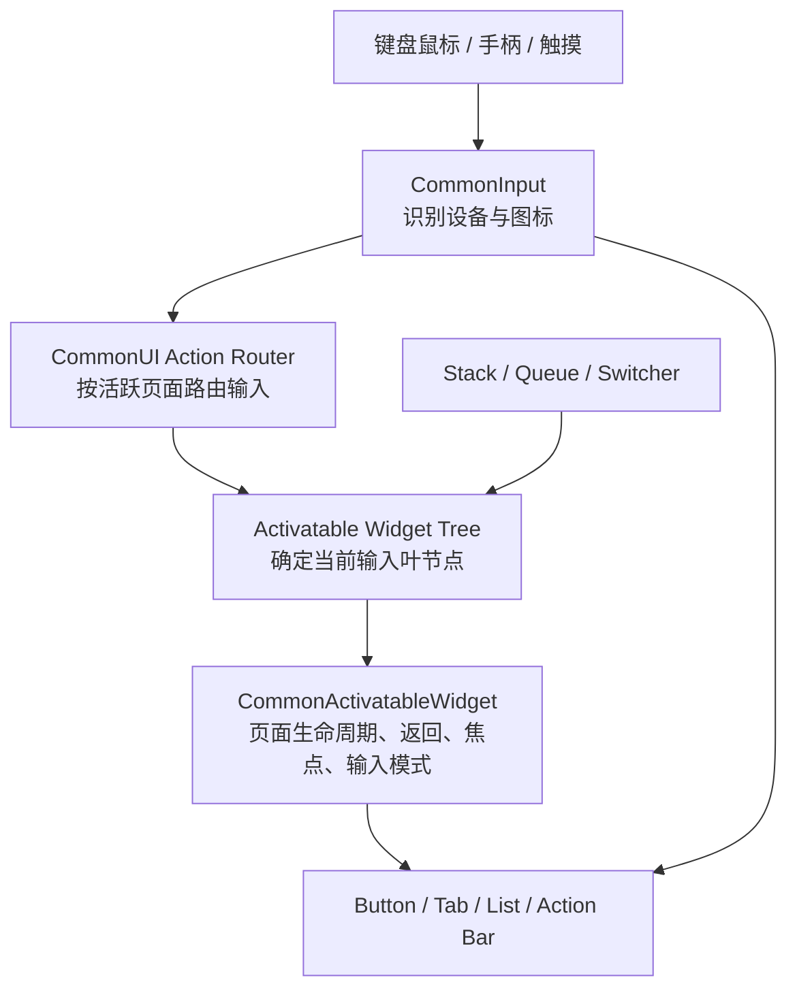

# UE5 CommonUI 入门指南

> 适用读者：刚接触 UE5、UMG 和游戏 UI 的开发者  
> 适用版本：UE5（不同引擎版本的属性名称和可用功能可能略有差异）  
> 文档目标：先建立 CommonUI 的整体认识，再了解它包含的主要模块、控件与使用场景

---

## 1. CommonUI 是什么

CommonUI 是 Epic 提供的一套跨平台 UI 框架，构建在 **UMG / Slate** 之上。

UMG 负责“把界面画出来”，CommonUI 则主要帮助我们解决复杂游戏 UI 中经常重复遇到的问题：

- 同一套界面同时支持键盘鼠标、手柄和触摸屏；
- 输入设备切换后，自动切换按键提示图标；
- 管理页面的打开、关闭、返回和生命周期；
- 管理手柄焦点以及页面切换后的焦点恢复；
- 用栈、队列和切换器组织菜单、弹窗与通知；
- 按当前活跃页面路由 UI 输入；
- 统一按钮、文字等控件的视觉样式；
- 提供页签、操作提示栏、异步图片等常用组件。

可以把二者的关系简单理解为：

> **UMG 负责界面的布局和显示，CommonUI 负责大型游戏 UI 的页面秩序、输入秩序和跨平台体验。**

CommonUI 不是对 UMG 的替代。使用 CommonUI 时，我们仍然会创建 Widget Blueprint、摆放 Canvas Panel、Text、Image 等普通 UMG 控件。

### 1.1 什么时候值得使用 CommonUI

CommonUI 比较适合以下项目：

- 需要同时发布到 PC、主机或移动平台；
- 有主菜单、设置页、背包、地图、弹窗等多层页面；
- 需要完整的手柄导航；
- 希望 `Esc`、手柄返回键和手机返回操作有统一行为；
- 希望页面打开时自动切换输入模式、鼠标状态和焦点；
- 希望按键提示能随设备自动从 `E` 变成手柄 `A` 等图标。

如果项目只有一个非常简单、只支持鼠标点击的界面，直接使用 UMG 也完全可以。

---

## 2. CommonUI 与其他系统的关系

初学时最容易混淆的是 CommonUI、CommonInput、Enhanced Input、CommonGame 和项目 UI 框架。它们并不是同一个东西。

| 系统 | 所属层级 | 主要职责 |
|---|---|---|
| UMG / Slate | UE 基础 UI | 绘制控件、布局、动画和底层事件 |
| CommonUI | UE 插件 | 页面激活、输入路由、焦点、返回、容器和通用控件 |
| CommonInput | CommonUI 插件中的独立运行时模块 | 识别当前输入设备，提供平台和按键图标数据 |
| Enhanced Input | UE 输入系统 | 定义 Input Action、Mapping Context，处理角色和 UI 输入映射 |
| CommonGame | 示例/框架插件 | 可在 CommonUI 上提供 Primary Game Layout、UI Layer 等更完整的页面框架，但不属于 CommonUI 核心模块 |

需要特别记住两点：

1. **CommonUI 可以和 Enhanced Input 配合，但两者职责不同。** Enhanced Input 描述“什么输入触发什么 Action”，CommonUI 决定“当前哪一个活跃 UI 有资格处理这个 Action”。
2. 网上常见的 `PrimaryGameLayout`、`UI.Layer.Menu`、`PushContentToLayerForPlayer` 等 Lyra 风格能力，并不全部来自 CommonUI 核心插件，很多来自 CommonGame 或项目自己的封装。

---

## 3. 插件包含的模块

UE5 的 `CommonUI.uplugin` 主要声明了三个模块。

| 模块 | 类型 | 简介 |
|---|---|---|
| `CommonUI` | Runtime | 核心控件、可激活页面、页面容器、输入路由、操作提示栏、样式等 |
| `CommonInput` | Runtime | 输入类型检测、手柄型号识别、平台输入配置、按键图标查询等 |
| `CommonUIEditor` | Editor | 编辑器资产创建和定制，例如通用输入 Action DataTable 的编辑支持 |

插件还依赖 `EnhancedInput`，编辑器侧会使用 `GameplayTagsEditor`。

如果在 C++ 模块中使用 CommonUI，通常需要在对应的 `Build.cs` 中加入依赖：

```csharp
PublicDependencyModuleNames.AddRange(new string[]
{
    "UMG",
    "CommonUI",
    "CommonInput"
});
```

依赖应放在 `PublicDependencyModuleNames` 还是 `PrivateDependencyModuleNames`，取决于这些类型是否出现在该模块的公开头文件中。

---

## 4. 先建立一个整体心智模型

CommonUI 的核心不是某一个按钮，而是下面这条协作链：



一个典型过程如下：

1. 玩家打开设置菜单；
2. 设置页被加入页面栈，并进入 Activated 状态；
3. CommonUI 把它视为当前活跃页面；
4. 页面声明自己需要 `Menu` 输入模式，并指定默认焦点按钮；
5. Action Router 优先把 UI Action 交给这个页面；
6. 玩家按下返回键，设置页处理 Back 并 Deactivate；
7. 页面栈移除设置页，重新激活下方页面并恢复焦点。

接下来分别介绍这条链上的核心类型。

---

## 5. 页面与生命周期

### 5.1 `UCommonUserWidget`

`UCommonUserWidget` 继承自 `UUserWidget`，是许多 CommonUI 控件的基础类。

它在普通 UserWidget 基础上增加了：

- 注册和移除 UI Action Binding；
- 访问 CommonInput、CommonUI 子系统；
- 管理模拟滚动等输入接收者；
- 可选择消费到达自身的指针输入。

它适合做需要 CommonUI 输入能力、但不需要“打开/关闭页面状态”的普通组件。

### 5.2 `UCommonActivatableWidget`

`UCommonActivatableWidget` 是 CommonUI 最重要的类型，可以把它理解为“有活跃状态的页面”。

一个普通 `UUserWidget` 主要有创建和销毁；一个 Activatable Widget 在没有被销毁的情况下，还可以反复：

```text
Construct -> Activate -> Deactivate -> Activate -> ... -> Destruct
```

这对菜单和弹窗很重要，因为页面被关闭时不一定需要立即销毁，也可能只是暂时退出活跃状态或进入对象池。

| 生命周期事件 | 含义 | 适合做什么 |
|---|---|---|
| Construct / `NativeConstruct` | Widget 加入可用的 UI 层级 | 绑定只依赖控件构造的事件 |
| On Activated / `NativeOnActivated` | 页面开始成为活跃页面 | 刷新页面、注册临时监听、播放进入逻辑 |
| On Deactivated / `NativeOnDeactivated` | 页面不再活跃 | 停止输入、解除临时监听、保存临时状态 |
| Destruct / `NativeDestruct` | Widget 离开 UI 层级 | 最终清理与解绑 |

初学者常见错误是把所有“打开页面”的逻辑都写在 `Construct` 中。使用页面栈和对象池后，同一个实例可能多次激活，但不会每次都重新 Construct，因此页面进入逻辑通常应该放在 `On Activated` 中。

### 5.3 常用激活属性

`UCommonActivatableWidget` 提供了以下重要配置：

| 属性 | 作用 |
|---|---|
| `Auto Activate` | 构造后是否自动激活；默认并不会自动激活 |
| `Is Back Handler` | 是否自动接收 Back；默认处理是 Deactivate 自己 |
| `Is Back Action Displayed in Action Bar` | 是否把返回操作显示在 Bound Action Bar 中 |
| `Supports Activation Focus` | 是否参与活跃页面焦点和输入配置竞争 |
| `Auto Restore Focus` | 页面重新成为顶部页面时，尝试恢复之前的焦点 |
| `Is Modal` | 把页面作为输入路由根，阻止输入继续交给仍然活跃的父级页面 |
| `Action Domain` | 指定该页面所属的输入域，属于较高级的输入优先级能力 |

`ActivateWidget()` 和 `DeactivateWidget()` 改变的是活跃状态，不等同于创建、销毁，也不等同于简单地设置 Visibility。

### 5.4 返回行为

当页面启用 `Is Back Handler` 后，CommonUI 可以统一处理：

- PC 上的 `Esc`；
- 手柄上的返回键；
- 项目映射的其他 Back Action。

默认 Back 行为是 Deactivate 当前页面。需要“有未保存修改时先弹确认框”等特殊逻辑时，可以实现 `On Handle Back Action`，并返回是否已经处理。

注意：只有处于正确激活树、能够接收输入的页面才会处理 Back。仅仅把 Widget 设为 Visible 并不代表它是活跃页面。

---

## 6. 页面容器与页面切换

### 6.1 `UCommonActivatableWidgetContainerBase`

这是可激活页面容器的共同基类。容器一次只显示一个 Activatable Widget，并负责：

- 添加、移除页面；
- 激活当前页面、停用其他页面；
- 播放页面切换动画；
- 在适用时复用已经创建的 Widget；
- 在切换期间用 Input Guard 防止重复输入。

通常不直接使用这个抽象基类，而是使用 Stack 或 Queue。

### 6.2 `UCommonActivatableWidgetStack`

Stack 是后进先出页面栈，最适合普通菜单导航。

```text
MainMenu
  -> Settings
      -> AudioSettings
```

此时只有栈顶的 `AudioSettings` 显示并激活。它关闭后，`Settings` 重新显示并激活；再关闭则回到 `MainMenu`。

Stack 还可以配置一个不会被移除的 `Root Content`，作为该栈的常驻底层页面。

典型用途：

- 主菜单进入设置页；
- 背包进入物品详情；
- 地图进入区域详情；
- 暂停菜单逐级返回。

### 6.3 `UCommonActivatableWidgetQueue`

Queue 是先进先出队列。当前页面 Deactivate 后会被移除，然后显示下一个等待项。

典型用途：

- 连续获得多个奖励时依次展示；
- 系统通知逐个弹出；
- 多个确认提示排队处理。

不要用 Queue 表达“返回上一页”，这种需求应使用 Stack。

### 6.4 Switcher 系列

| 类型 | 作用 |
|---|---|
| `UCommonAnimatedSwitcher` | 在多个普通子控件之间切换，并播放过渡动画 |
| `UCommonActivatableWidgetSwitcher` | 切换页面时同步处理 Activatable Widget 的激活状态 |
| 普通 `WidgetSwitcher` | 只负责切换可见子项，不理解 CommonUI 页面生命周期 |

Switcher 适合页面内部的内容区，例如背包的“武器/道具/任务物品”内容切换。Stack 更适合真正具有前进和返回关系的页面导航。

---

## 7. 输入路由、输入模式与焦点

### 7.1 `UCommonUIActionRouterBase`

Action Router 是每个 `LocalPlayer` 对应的输入路由子系统。它维护可激活页面树，并根据当前活跃叶节点决定：

- 哪些 UI Action Binding 可以响应；
- 哪个页面的输入配置生效；
- 哪个页面应该获得焦点；
- Bound Action Bar 当前应该显示哪些操作；
- 输入是否继续传递给游戏。

这也是为什么 CommonUI 强调“激活页面”，而不只是把 Widget 加到 Viewport。

分屏或本地多人时，每个 LocalPlayer 都有自己的 CommonInput 和 Action Router 状态。获取子系统时应使用 Widget 的 Owning Local Player，不能默认使用第一个玩家。

### 7.2 `FUIInputConfig` 与输入模式

一个活跃页面可以通过 `Get Desired Input Config` 声明自己需要的输入模式。

| `ECommonInputMode` | 含义 | 常见场景 |
|---|---|---|
| `Game` | 输入主要交给游戏 | 局内 HUD、准星 |
| `Menu` | 输入主要交给 UI | 主菜单、暂停菜单、全屏设置页 |
| `All` | 游戏和 UI 都可以接收 | 部分非阻塞浮层，需要谨慎使用 |

`FUIInputConfig` 还包含鼠标捕获、鼠标锁定、是否忽略移动/视角输入等配置。

如果打开菜单后角色仍然移动或镜头仍然旋转，问题往往不在按钮，而在页面没有提供正确的 Input Config，或者页面没有成为当前活跃叶节点。

### 7.3 焦点

鼠标用户可以直接点击，但手柄和键盘导航依赖焦点。一个完整的菜单页通常需要：

1. 至少有一个可聚焦的控件；
2. 页面实现 `Get Desired Focus Target`；
3. 页面激活时让 CommonUI 把焦点放到目标控件；
4. 页面关闭后恢复下层页面之前的焦点。

推荐让页面自己声明默认焦点，不要在多个 Tick 中不断调用 `SetKeyboardFocus`。后者容易抢走弹窗或其他玩家的焦点。

### 7.4 Modal 与 Action Domain

- **Modal**：适合必须优先处理输入的模态弹窗。父页面虽然仍然存在，但不应该继续响应操作。
- **Action Domain**：把不同页面或容器的输入划分成有顺序的域，用于更复杂的输入优先级和传播规则。

初学阶段先掌握 Stack、Back、Input Config 和默认焦点即可；只有遇到多个同时活跃 UI 争抢输入时，再引入 Action Domain。

---

## 8. 多输入设备与按键图标

### 8.1 `CommonInput` 模块

CommonInput 识别三种输入类型：

```text
MouseAndKeyboard
Gamepad
Touch
```

核心类型 `UCommonInputSubsystem` 是 `ULocalPlayerSubsystem`。它可以：

- 返回当前输入类型；
- 在输入类型改变时发出事件；
- 判断当前平台支持哪些输入类型；
- 识别当前手柄类型；
- 根据按键和 Controller Data 查找对应图标。

例如，玩家最后使用鼠标时界面显示键鼠提示；按下手柄键后，界面可以自动切换为 Xbox 或 PlayStation 风格图标。

### 8.2 `UCommonUIInputData`

这是项目级输入基础数据，通常创建一个蓝图子类进行配置。它主要定义：

- 默认 Click Action；
- 默认 Back Action；
- 默认长按参数；
- 启用 Enhanced Input 支持时的 Click / Back Input Action。

随后在 `Project Settings -> Game -> Common Input Settings` 的 `Input Data` 中引用这个类。

### 8.3 `UCommonInputBaseControllerData`

Controller Data 描述某种输入设备如何显示，主要包含：

- 输入类型；
- 手柄名称和显示名；
- 具体按键对应的 Brush 图标；
- 多键组合对应的图标；
- 设备识别信息。

不同平台可以配置不同 Controller Data。例如 Windows 可以同时准备：

- Keyboard & Mouse；
- Xbox 手柄；
- DualShock 4；
- DualSense。

### 8.4 `UCommonActionWidget`

`CommonActionWidget` 用来显示某个操作在当前设备上的图标。

同一个“确认”操作可能显示成：

- 键盘上的 `Enter`；
- Xbox 手柄上的 `A`；
- PlayStation 手柄上的 `Cross`；
- 触摸平台上的自定义图标。

输入设备改变后，它会监听 CommonInput 并刷新图标。它还支持显示长按进度材质。

### 8.5 基于硬件的显隐

`UCommonHardwareVisibilityBorder` 可以根据平台和当前输入设备的 Gameplay Tag Query 控制子内容显隐。

典型例子：

- 只在触摸设备下显示虚拟摇杆；
- 只在键鼠模式下显示鼠标操作说明；
- 只在主机平台显示某个主机专属入口。

底层的 `UCommonUIVisibilitySubsystem` 会组合平台 Trait、当前输入类型和用户附加条件，生成当前可用的 Visibility Tags。

---

## 9. UI Action 与操作提示栏

### 9.1 UI Action Binding

CommonUI 允许 Widget 注册 UI Action。只有当 Widget 所属的激活链有效时，普通 Binding 才会接收输入；Persistent Binding 则会在注册期间持续监听，应谨慎使用。

常见 UI Action 包括：

- Back；
- Confirm；
- 切换上一个/下一个页签；
- 打开筛选；
- 查看详情；
- 执行页面特有操作。

### 9.2 两套 Action 数据来源

UE 5.4 的 CommonUI 可以使用两种方式描述 UI Action：

| 方式 | 数据 | 特点 |
|---|---|---|
| 传统 CommonUI 方式 | `FCommonInputActionDataBase` DataTable Row | CommonUI 早期和很多现有项目仍在使用 |
| Enhanced Input 方式 | `UInputAction` | 与 Enhanced Input 资产统一，需要在 Common Input Settings 中启用支持并重启编辑器 |

不要在同一个按钮上无意中同时注册两套等价 Action，否则可能出现一次按键触发两次逻辑。选择哪套方案应遵循当前项目约定。

### 9.3 `UCommonBoundActionBar`

Bound Action Bar 会收集当前有效的 UI Action Binding，并动态生成操作提示按钮。

例如设置页底部可以自动显示：

```text
[Esc / B] 返回    [R / Y] 恢复默认    [Enter / A] 应用
```

页面切换后，Action Bar 会刷新为新页面支持的操作，不需要每个页面手工拼接整条提示栏。

相关类型：

| 类型 | 作用 |
|---|---|
| `UCommonBoundActionBar` | 收集并排列当前操作 |
| `UCommonBoundActionButton` | Action Bar 中单个操作按钮的基类 |
| `UCommonActionWidget` | 显示当前设备对应的按键图标 |

---

## 10. 常用控件简介

### 10.1 按钮与样式

#### `UCommonButtonBase`

Common Button 不只是普通 UMG Button。它支持：

- Normal、Hovered、Pressed、Disabled 等状态；
- Selected、Locked、Interaction Enabled 等游戏 UI 状态；
- 鼠标、触摸、键盘/手柄不同的点击方式；
- 长按触发及长按进度；
- 绑定输入 Action；
- 自动更新操作图标；
- 选中时切换文字样式；
- 与 Button Group 配合实现单选或多选。

`UCommonButtonBase` 是抽象类，通常先创建项目自己的按钮蓝图基类，再创建具体业务按钮。

#### `UCommonButtonStyle`

按钮外观集中在 Style 类中，包括不同状态下的 Brush、Padding、声音、文字样式等。

把视觉状态放进 Style 的好处是：

- 多个按钮共享同一套视觉规范；
- 改一次 Style 就能影响所有引用者；
- 业务按钮不需要复制大量 Hover/Pressed 样式配置。

#### `UCommonButtonGroupBase`

Button Group 管理一组按钮的选中关系，适合：

- 页签单选；
- 单选设置项；
- 一组互斥分类按钮；
- 统一监听组内按钮点击和选中变化。

### 10.2 页签

`UCommonTabListWidgetBase` 把“页签按钮列表”和“内容 Switcher”连接起来，负责：

- 注册和移除 Tab；
- 用唯一 Tab ID 查找页签；
- 创建对应的 Tab Button；
- 选择页签后切换内容；
- 启用、禁用或隐藏单个页签；
- 响应上一个/下一个页签输入；
- 广播 Tab Created、Selected、Removed 等事件。

常见组合是：

```text
CommonTabListWidgetBase
        |
        +---- CommonAnimatedSwitcher
                  |---- VideoSettings
                  |---- AudioSettings
                  +---- ControlSettings
```

### 10.3 文字控件

| 类型 | 主要功能 |
|---|---|
| `UCommonTextBlock` | 使用 `UCommonTextStyle` 统一字体、字号、颜色、阴影等 |
| `UCommonRichTextBlock` | Rich Text 的 CommonUI 扩展，可使用项目级 Rich Text Data |
| `UCommonNumericTextBlock` | 数值格式化以及数值变化插值动画 |
| `UCommonDateTimeTextBlock` | 日期和时间格式化显示 |

### 10.4 异步加载控件

| 类型 | 主要功能 |
|---|---|
| `UCommonLazyImage` | 接收软引用并异步加载 Texture/Material，加载时显示占位状态 |
| `UCommonLazyWidget` | 按需异步加载并创建 Widget 类 |
| `UCommonLoadGuard` | 加载期间隐藏正式内容，显示 Spinner 和提示文字 |

`Lazy` 并不意味着没有成本。页面销毁、重复请求、软引用失效和加载完成后的生命周期仍然需要正确处理。

### 10.5 列表、滚动与选择

| 类型 | 主要功能 |
|---|---|
| `UCommonListView` | CommonUI 风格 ListView |
| `UCommonTileView` | 网格/平铺列表 |
| `UCommonTreeView` | 树形列表 |
| `UCommonHierarchicalScrollBox` | 支持层级导航的滚动容器 |
| `UCommonRotator` | 在若干选项间轮换，常用于设置项 |
| `UAnalogSlider` | 支持手柄模拟量操作的 Slider |

列表 Entry 经常会复用。Entry 的“构造完成”不等于“绑定了当前数据”，因此数据刷新应放在 List Entry 的对象设置/释放生命周期中，而不是只放在 Construct。

### 10.6 切换、轮播与可见性

| 类型 | 主要功能 |
|---|---|
| `UCommonAnimatedSwitcher` | 带动画的内容切换 |
| `UCommonWidgetCarousel` | 页面/卡片轮播 |
| `UCommonWidgetCarouselNavBar` | 轮播导航栏 |
| `UCommonVisibilitySwitcher` | 根据条件切换显示的子项 |
| `UCommonHardwareVisibilityBorder` | 根据平台和输入设备控制显隐 |

### 10.7 其他实用控件

| 类型 | 主要功能 |
|---|---|
| `UCommonVideoPlayer` | UI 内视频播放封装 |
| `UCommonVisualAttachment` | 在视觉布局中附加内容 |
| `UCommonBorder` | CommonUI 基础 Border |
| `UCommonActionWidget` | 平台相关按键图标和长按进度 |

不需要为了“使用 CommonUI”而把所有普通 UMG 控件都替换掉。只在 CommonUI 提供了实际价值的地方使用对应控件。

---

## 11. 从零搭建一个最小示例

下面用“主菜单打开设置页”说明最小工作流。不同项目对根布局有不同封装，因此节点名可能略有差异。

### 11.1 工程设置

1. 在 `Edit -> Plugins` 中启用 Common UI；
2. 重启编辑器；
3. 将 Game Viewport Client Class 设置为 `CommonGameViewportClient` 或它的项目子类，使输入先经过 CommonUI 路由；
4. 创建 `CommonUIInputData` 蓝图子类并配置默认 Click / Back；
5. 在 Common Input Settings 中设置 Input Data；
6. 为目标平台配置 Keyboard、Gamepad、Touch 对应的 Controller Data；
7. 确认项目采用传统 DataTable Action 还是 Enhanced Input Action。

### 11.2 创建页面

创建两个 Widget Blueprint：

```text
WBP_MainMenu       : CommonActivatableWidget
WBP_Settings       : CommonActivatableWidget
```

在 `WBP_MainMenu` 中：

- 放置一个 `CommonButtonBase` 子类按钮；
- 按钮文本设为“设置”；
- 实现 `Get Desired Focus Target`，返回这个按钮；
- 页面输入模式选择 `Menu`。

在 `WBP_Settings` 中：

- 开启 `Is Back Handler`；
- 放置至少一个可聚焦按钮；
- 实现 `Get Desired Focus Target`；
- 页面输入模式选择 `Menu`。

### 11.3 创建页面栈

根布局中放置一个 `CommonActivatableWidgetStack`，把主菜单作为 Root Content，或在初始化时把主菜单加入栈。

点击“设置”时，把 `WBP_Settings` 的 Class 添加到 Stack。不要只使用 `Create Widget -> Add to Viewport`，否则页面虽然看得见，却绕过了栈的激活、返回和焦点管理。

预期行为：

1. 主菜单激活，焦点落在“设置”；
2. 点击后设置页入栈，主菜单 Deactivate；
3. 设置页激活并获得焦点；
4. 按 `Esc` 或手柄返回键；
5. 设置页 Deactivate 并从栈中移除；
6. 主菜单重新激活并恢复焦点。

### 11.4 建议验证的设备

- 鼠标能否点击；
- 键盘方向键能否导航；
- `Enter` 与 `Esc` 是否正常；
- 手柄十字键/摇杆能否导航；
- 手柄确认与返回是否正常；
- 输入设备切换后 Action 图标是否刷新；
- 反复打开关闭页面时事件是否重复绑定。

---

## 12. 常见问题与排查思路

### 12.1 页面显示了，但 `On Activated` 没执行

可能原因：

- 页面只是 `Add to Viewport`，没有加入 Activatable Widget 容器；
- `Auto Activate` 没有开启，也没有手动调用 Activate；
- 使用了普通 `UserWidget`，而不是 `CommonActivatableWidget`；
- 页面被直接加入 Viewport，却没有经过 Activatable Widget 容器管理。

### 12.2 `Esc` 或手柄返回无效

依次检查：

- 页面是否真的处于 Activated 状态；
- 是否启用了 `Is Back Handler`；
- 默认 Back Action 是否配置；
- Viewport Client 是否继承 `CommonGameViewportClient`；
- 上层 Modal 页面是否截断了输入；
- 输入 Action 是否被其他高优先级 Binding 消费。

### 12.3 鼠标能用，手柄不能用

通常检查：

- 页面是否返回了有效的 Desired Focus Target；
- 目标按钮是否 Focusable；
- Widget Navigation 是否正确；
- 当前 LocalPlayer 是否正确；
- 手柄 Controller Data 和按键映射是否配置；
- 切页后焦点是否落到了已经隐藏或禁用的控件。

### 12.4 打开菜单后角色还在移动

检查当前页面的 Desired Input Config。全屏菜单通常应使用 `Menu`，并根据需要忽略 Move / Look 输入。还要确认该页面确实是激活树中的当前输入叶节点。

### 12.5 按键图标不会随设备改变

检查：

- `CommonActionWidget` 是否绑定了有效 Action；
- 当前平台是否有对应 Controller Data；
- Controller Data 是否包含该 Key 的 Brush；
- Widget 是否拥有正确的 LocalPlayer；
- 是否错误缓存了输入类型，而没有监听输入方式改变事件。

### 12.6 页面事件触发多次

页面栈和列表可能复用 Widget。若每次 Activated 都绑定一次委托，却没有在 Deactivated 中解除，就会产生重复回调。

推荐成对管理：

```text
On Activated   -> Bind / Subscribe
On Deactivated -> Unbind / Unsubscribe
```

永久生命周期的监听也可以在 Initialize/Destruct 中成对处理，关键是绑定与解绑必须处在同一生命周期层次。

### 12.7 应该使用 Visibility 还是 Activate/Deactivate

- 只是页面内部一个装饰控件的显隐：使用 Visibility；
- 一个页面是否参与输入、返回和焦点：使用 Activate/Deactivate；
- 页面前进与返回：使用 Stack；
- 通知依次显示：使用 Queue。

---

## 13. 推荐学习顺序

建议按以下顺序实践，不要一开始就钻进 Action Domain 等高级功能：

1. 熟悉普通 UMG 的 Widget Blueprint、事件和焦点；
2. 创建一个 `CommonActivatableWidget` 页面；
3. 理解 Construct 与 Activated 的区别；
4. 用 Stack 完成“主菜单 -> 设置 -> 返回”；
5. 配置 Desired Focus Target，让手柄可以操作；
6. 配置 Input Config，正确阻止或放行游戏输入；
7. 使用 Common Button Style 统一按钮；
8. 使用 CommonInput 和 CommonActionWidget 显示跨设备图标；
9. 使用 Tab List、Action Bar、Lazy Image；
10. 最后再学习 Modal、Action Domain 和复杂输入优先级。

只要先掌握下面四个概念，就已经抓住了 CommonUI 的主干：

> **Activatable Widget、Stack、Action Router、CommonInput。**

---

## 14. 源码索引

遇到文档和实际行为不一致时，应以所使用 UE5 版本的 CommonUI 源码为准。

### 14.1 引擎插件

```text
Engine/Plugins/Runtime/CommonUI/CommonUI.uplugin
Engine/Plugins/Runtime/CommonUI/Source/CommonUI/Public/CommonActivatableWidget.h
Engine/Plugins/Runtime/CommonUI/Source/CommonUI/Public/CommonUserWidget.h
Engine/Plugins/Runtime/CommonUI/Source/CommonUI/Public/CommonButtonBase.h
Engine/Plugins/Runtime/CommonUI/Source/CommonUI/Public/CommonTabListWidgetBase.h
Engine/Plugins/Runtime/CommonUI/Source/CommonUI/Public/CommonActionWidget.h
Engine/Plugins/Runtime/CommonUI/Source/CommonUI/Public/Widgets/CommonActivatableWidgetContainer.h
Engine/Plugins/Runtime/CommonUI/Source/CommonUI/Public/Input/CommonUIActionRouterBase.h
Engine/Plugins/Runtime/CommonUI/Source/CommonUI/Public/Input/CommonBoundActionBar.h
Engine/Plugins/Runtime/CommonUI/Source/CommonInput/Public/CommonInputSubsystem.h
Engine/Plugins/Runtime/CommonUI/Source/CommonInput/Public/CommonInputBaseTypes.h
Engine/Plugins/Runtime/CommonUI/Source/CommonInput/Public/CommonInputSettings.h
```

---

## 15. 术语速查

| 术语 | 简单解释 |
|---|---|
| Activation | 页面当前是否参与显示、输入和焦点管理 |
| Activatable Widget | 可以反复激活/停用的页面 Widget |
| Action Router | 决定当前 UI 输入交给谁的路由器 |
| Input Config | 页面活跃时希望采用的游戏/UI输入和鼠标配置 |
| Focus | 键盘或手柄当前操作的控件 |
| Stack | 后进先出的页面导航容器 |
| Queue | 先进先出的顺序展示容器 |
| Input Type | 键鼠、手柄或触摸 |
| Controller Data | 某类设备的名称、识别信息和按键图标数据 |
| Action Binding | UI Action 与处理回调之间的绑定 |
| Bound Action Bar | 自动展示当前可用操作的提示栏 |
| Action Domain | 更高级的 UI 输入分域和优先级机制 |
| Modal | 优先独占当前 UI 输入的模态页面 |
