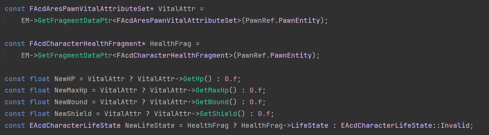
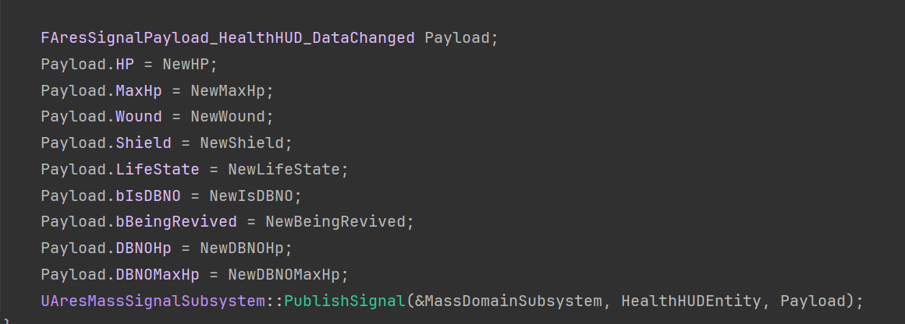
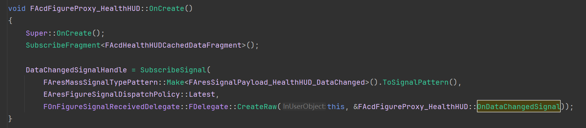
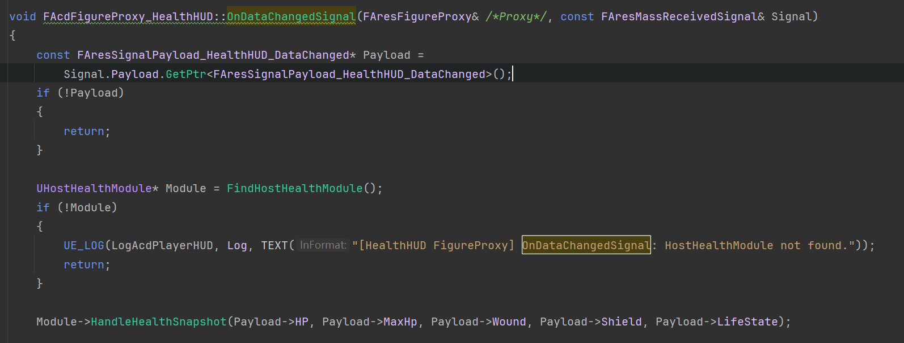
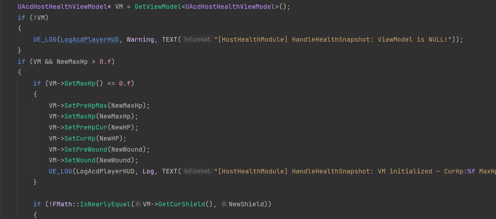
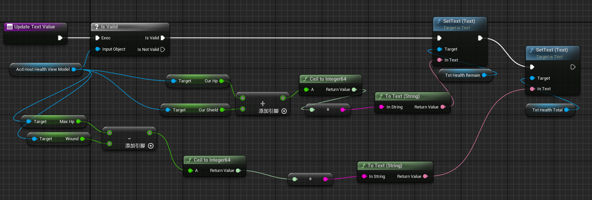

以**角色血条**的MaxHp绑定为例

1. ### `apbMassFeature_HealthHUD.cpp`每Tick获取Fragment中的数据并判断是否发生变化，如果变化则发送Signal

`FapbhdsPawnVitalAttributeSet`是`apbhdsAttributeSetFragment.h`中定义的，是Fragment

如果角色身上的Fragment数据发生了变化，就要发送Signal

`FhdsSignalPayload_HealthHUD_DataChanged`是`apbHealthHUDFragments.h`中定义的，是FhdsSignalPayload

1. ### `apbFigureTemplate_HealthHUD.cpp`，Proxy订阅Signal

`FapbFigureProxy_HealthHUD`在创建时会订阅Signal，并绑定回调函数`OnDataChangedSignal`

`OnDataChangedSignal`函数中获取Module并执行Module的`HandleHealthSnapshot`函数

Module获取ViewModule并且往ViewModule中写数据

ViewModule只存储数据，数据的写入只由Module管理，ViewModule的cpp文件都是空的

1. ### MVVM绑定调用蓝图函数

当`apbHostHealthViewModel`的MaxHp变量发生变化时，`OnMaxHpUpdate`就会被触发

从ViewModel中取出数据