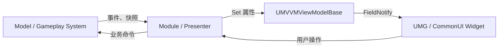
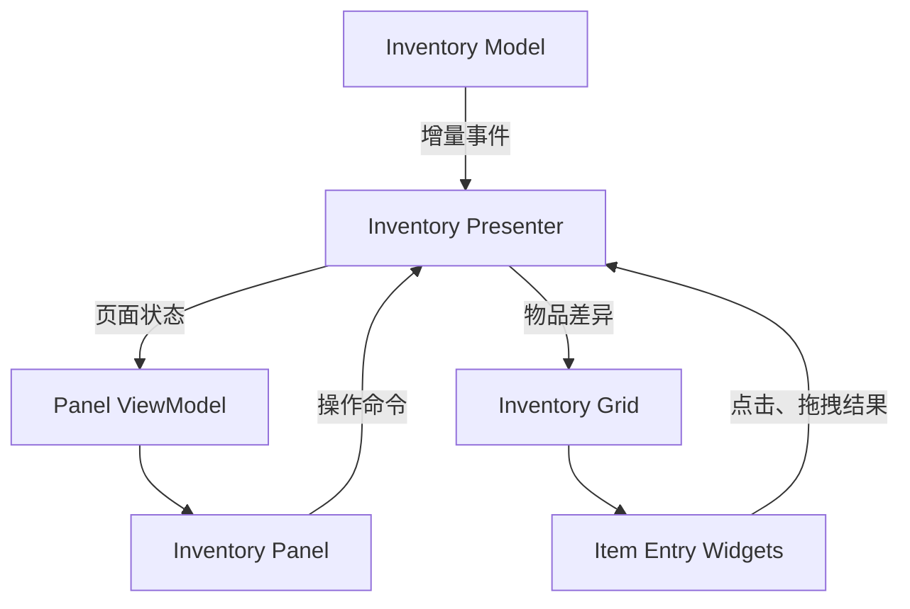
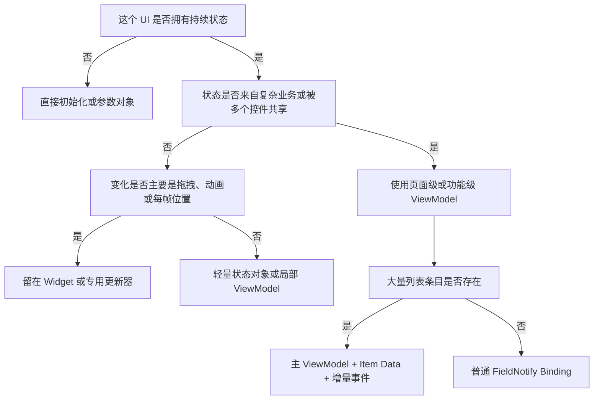

# UE5 MVVM 适用与不适用场景指南

> 面向对象：UE5 / UMG / CommonUI 初学者  
> 目标：理解什么时候应该使用 MVVM，什么时候直接写 Widget 反而更合理  
> 内容说明：本文使用通用类名和虚构业务示例，不包含具体项目名称、路径或内部配置。

## 1. 结论先行

MVVM 不是“更高级的 Widget 写法”，也不是所有界面都必须遵守的统一模板。

它最适合解决的是：

> 一份持续变化的界面状态，需要与复杂业务数据解耦，并被一个或多个 Widget 稳定地观察和展示。

如果一个控件只是接收一次数据、播放一段动画，或者处理拖拽和鼠标位置，那么引入完整 ViewModel 往往只会增加代码量和生命周期管理成本。

可以先记住下面的判断：

```text
长期状态 + 持续变化 + 多个消费者 + 复杂数据源
    → 优先考虑 MVVM

一次性参数 + 局部视觉 + 短生命周期 + 强交互过程
    → 优先直接调用、Delegate 或轻量数据对象
```

实际项目通常不是“全部 MVVM”或“完全不用 MVVM”，而是采用混合架构：

```text
页面级状态       → ViewModel
业务操作         → Module / Service / Controller
大量列表条目     → Item Data + 增量事件
拖拽、动画、焦点 → Widget
```

---

## 2. MVVM 的基本结构

MVVM 是 Model、View、ViewModel 三部分的缩写。

### 2.1 Model

Model 是业务数据和业务规则，例如：

- 角色属性系统；
- 物品和背包系统；
- 任务系统；
- 网络请求结果；
- 配置表；
- 存档数据；
- 游戏实体或组件。

Model 是权威数据源，不应该为了方便显示而直接保存某个 Widget 的引用。

### 2.2 View

View 是玩家实际看到和操作的界面，例如：

- UserWidget；
- CommonActivatableWidget；
- Text、Image、ProgressBar；
- 按钮、列表和动画；
- 焦点、拖拽和输入表现。

View 的核心职责是展示状态和接收用户交互。

### 2.3 ViewModel

ViewModel 是面向界面的状态对象。它把复杂业务数据转换为 Widget 容易使用的形式，例如：

```text
业务数据：CurrentHealth = 750，MaxHealth = 1000
ViewModel：HealthPercent = 0.75
           HealthText = "750 / 1000"
           bIsLowHealth = false
```

ViewModel 通常应该：

- 保存界面所需的状态；
- 对数据变化发送通知；
- 对业务数据进行轻量转换；
- 不直接操作具体 Text、Image 或 Widget Animation；
- 不成为新的全能 Manager。

### 2.4 UE5 中的典型数据流



UE5 的 MVVM 插件通常使用：

- `UMVVMViewModelBase`；
- `FieldNotify`；
- `UE_MVVM_SET_PROPERTY_VALUE`；
- Widget Blueprint 中的 View Binding；
- Global、GameInstance、LocalPlayer 或手动传入的 ViewModel Context。

---

## 3. 为什么不能所有控件都使用 MVVM

每引入一个 ViewModel，通常都会增加以下成本：

- 新的类和字段；
- ViewModel 的创建位置；
- Context 名称与注册方式；
- Widget 与 ViewModel 的绑定；
- 初始化快照；
- 解绑和销毁；
- 异步与重建时序处理；
- 调试时的数据链路长度。

如果界面本来只需要：

```text
CreateWidget
    ↓
Initialize(Data)
    ↓
显示
```

强行改成：

```text
创建 ViewModel
    ↓
注册 Context
    ↓
设置多个 FieldNotify 属性
    ↓
创建 Widget
    ↓
建立绑定
    ↓
显示
    ↓
解绑并注销 Context
```

就不一定产生实际收益。

判断 MVVM 是否合适，关键不是控件大小，而是“状态复杂度和生命周期”。

---

## 4. 适合使用 MVVM 的核心特征

一个界面满足的特征越多，越适合使用 MVVM。

### 4.1 界面长期存在

例如：

- 局内 HUD；
- 主菜单大厅；
- 设置页面；
- 任务追踪面板；
- 角色详情页；
- 长时间打开的背包页面。

长期界面容易接收到大量状态变化。如果让 Widget 自己监听所有业务系统，生命周期和解绑逻辑会越来越复杂。

ViewModel 可以作为比某个具体 Widget 更稳定的状态层，即使 Widget 因页面切换而重建，当前状态仍可保留。

### 4.2 数据会持续变化

例如：

- 当前生命值；
- 技能冷却；
- 网络连接状态；
- 下载进度；
- 设置项的临时修改；
- 任务目标完成数量；
- 当前选中物品和筛选条件。

这类状态适合通过 `FieldNotify` 在变化时推送给界面。

### 4.3 数据来自多个业务系统

例如一个角色状态面板可能同时读取：

- 属性组件；
- 装备系统；
- Buff 系统；
- 角色配置；
- 异步加载的头像资源；
- 本地化文本。

如果 Widget 直接访问所有数据源，它就同时承担了 View、Controller 和业务适配器的职责。

可以增加 Module 或 Presenter，把多个数据源合成一个适合显示的 ViewModel。

### 4.4 多个 Widget 需要观察同一状态

例如“当前选中的角色”同时影响：

- 角色立绘；
- 装备槽；
- 属性列表；
- 技能列表；
- 按钮可用状态；
- 页面标题。

把选中状态放入页面级 ViewModel，可以让多个区域绑定同一数据，而不需要它们互相调用。

### 4.5 Widget 会被销毁或重建，但状态需要保留

CommonUI 页面切换、分辨率变化、平台布局切换和动态挂载，都可能导致 View 重建。

如果状态只保存在 Widget 中，重建后就需要重新查询和恢复。

如果状态属于 ViewModel，新的 Widget 建立绑定后可以读取当前快照。

### 4.6 需要可测试的展示逻辑

例如需要测试：

```text
生命值低于 20% → bIsLowHealth = true
存款不足 → bCanPurchase = false
没有选中物品 → bCanDiscard = false
搜索无结果 → bShowEmptyState = true
```

这些逻辑如果放在 ViewModel 或 Presenter 中，可以不启动完整 UMG 界面就进行测试。

### 4.7 需要减少轮询和重复刷新

MVVM 的核心价值之一是差异通知：

```text
值没有变化
    → 不广播 FieldNotify
    → Widget 不重新执行绑定
    → 减少 Slate 属性写入和失效
```

它适合把“Widget 每帧主动查询”改成“数据变化时通知 Widget”。

但这并不表示所有每帧数据都应该直接写入 ViewModel，具体限制会在后文说明。

---

## 5. 典型适用场景

### 5.1 局内 HUD

HUD 通常是最适合 MVVM 的场景之一。

适合放入 ViewModel 的状态：

- 生命值、护盾和体力；
- 当前武器和弹药；
- 技能是否可用；
- Buff 和状态提示；
- 队伍成员状态；
- 当前任务追踪；
- 战斗或观战状态。

推荐架构：

```text
Gameplay / ECS / Ability
        ↓
Module 或 Presenter
        ↓
HUD ViewModel
        ↓
HUD Widget
```

注意：准星位置、世界投影坐标等高频视觉数据不一定适合逐帧写入通用 ViewModel，可以使用专门的受控 Tick、Slate 属性或投影组件。

### 5.2 设置页面

设置页面非常适合 MVVM，因为它天然包含“编辑中状态”和“已保存状态”。

ViewModel 可以保存：

```text
CurrentResolution
PendingResolution
MasterVolume
bHasUnsavedChanges
bCanApply
bCanRestoreDefaults
```

多个控件修改 ViewModel，页面根据状态决定是否允许应用或撤销。

需要小心 Two Way Binding，防止：

- 控件初始化时误写业务数据；
- Slider 高频更新触发昂贵逻辑；
- 多个控件互相形成反馈循环。

### 5.3 商店或购买页面

适合放入 ViewModel 的状态包括：

- 当前选中商品；
- 货币数量；
- 购买数量；
- 总价；
- 是否买得起；
- 购买按钮状态；
- 错误提示文本。

购买操作本身仍应交给业务 Service：

```text
Widget 点击购买
    ↓
Controller / Service 执行购买
    ↓
Model 更新余额和物品
    ↓
ViewModel 接收结果
    ↓
Widget 刷新
```

### 5.4 角色详情和装备页面

这类页面通常包含多个共同依赖当前角色的区域，因此适合页面级 ViewModel。

```text
SelectedCharacterId
CharacterName
Portrait
Level
CombatPower
EquipmentSummary
AttributeSummary
```

如果装备列表很大，可以让页面 ViewModel 管理选中状态和汇总状态，装备格子继续使用轻量 Item Data。

### 5.5 任务和成就页面

适合 MVVM 的部分：

- 当前分类；
- 筛选条件；
- 已追踪任务；
- 页面空状态；
- 任务详情；
- 领奖状态；
- 总完成进度。

大量任务条目应结合 ListView Item Data，而不是为每个可见格子注册全局 ViewModel。

### 5.6 异步加载页面

例如：

- 在线好友列表；
- 匹配状态；
- 云存档；
- 排行榜；
- DLC 或资源下载页面。

ViewModel 很适合表达异步状态机：

```text
Loading
Loaded
Empty
Error
Retrying
```

界面只需绑定：

```text
bShowLoading
bShowContent
bShowEmpty
bShowError
ErrorMessage
```

异步请求本身建议由 Service 承担，并通过请求编号或 Generation 防止旧回调覆盖新状态。

---

## 6. 不适合使用完整 MVVM 的场景

### 6.1 纯视觉控件

例如：

- 装饰线；
- 背景图片；
- 通用分割线；
- 只播放动画的特效控件；
- 固定图标组合；
- 不持有业务状态的布局容器。

这些控件没有独立状态模型，没有必要创建 ViewModel。

### 6.2 一次性初始化的短生命周期控件

例如物品 Tips：

```text
打开 Tips
    ↓
传入 ItemData
    ↓
设置名称、图标和描述
    ↓
关闭并销毁
```

如果显示期间数据不会变化，直接提供：

```text
Initialize(ItemDisplayData)
```

通常比创建和注册 ViewModel 更清晰。

如果 Tips 需要在显示期间实时响应物品耐久、价格或比较目标变化，再考虑共享页面 ViewModel 或专用 Tips ViewModel。

### 6.3 确认弹窗

简单确认弹窗通常只需要：

```text
Title
Message
ConfirmText
CancelText
OnConfirmed
OnCancelled
```

这些内容用参数对象或弹窗描述结构即可。

只有弹窗内部存在复杂表单、异步校验或持续变化状态时，才值得使用 ViewModel。

### 6.4 拖拽过程和鼠标位置

拖拽涉及：

- Pointer Event；
- 屏幕坐标；
- Drag Visual；
- Drop Target；
- Hover 状态；
- 每帧位置更新。

这些是 View 层交互过程，不适合经过通用 ViewModel 往返。

ViewModel 可以保存拖拽完成后的结果，例如：

```text
SelectedItemId
LastMoveResult
InventoryRevision
```

但不应该保存每一帧鼠标坐标。

### 6.5 高频视觉动画数据

例如：

- 准星抖动；
- 世界坐标投影；
- 每帧跟随 Actor 的血条位置；
- 拖拽图标位置；
- 材质动画时间；
- 连续滚动偏移。

如果每帧通过 FieldNotify 更新，会产生大量通知和绑定执行。

更合适的方案可能是：

- Slate 属性；
- 按需 Tick；
- Active Timer；
- 专用动画控制器；
- 降频更新；
- 只在变化超过阈值时写入。

### 6.6 大量列表的每个条目

背包、排行榜、邮件列表可能包含数百个数据项。

不推荐默认做法：

```text
每个数据项
    → 一个全局注册的 UMVVMViewModelBase
```

这会增加对象数量、绑定数量和回收复杂度。

优先考虑：

- ListView / TileView；
- UObject Item Data；
- 条目接口；
- 稳定 ID；
- 增量 Add、Remove、Move、Update；
- 只为真正复杂的条目使用局部 ViewModel。

### 6.7 无状态的可复用叶子控件

例如通用按钮、物品品质边框和小型进度条。

这些控件由父级设置属性即可：

```text
SetLabel(Text)
SetIcon(Texture)
SetQuality(Quality)
SetPercent(Percent)
```

如果每个叶子控件都有一个 ViewModel，界面层级会变得难以理解。

---

## 7. 几个容易判断错误的场景

### 7.1 “数据一直变化，所以一定要 MVVM”

不一定。

如果变化频率接近每帧，而且只有一个 Widget 消费，这可能更适合专用更新器或按需 Tick。

MVVM 更擅长“离散状态变化”，例如：

```text
生命值从 800 变成 750
技能从可用变成冷却
任务数量从 2 变成 3
按钮从可用变成禁用
```

而不是把所有动画采样值都变成 FieldNotify 属性。

### 7.2 “控件很复杂，所以一定要 MVVM”

复杂控件也可能只是视觉组合。

应该判断的是：

- 它是否拥有独立且长期的状态；
- 状态是否来自复杂业务系统；
- 状态是否需要被多个控件共享；
- 状态是否需要跨 Widget 重建保存。

视觉树复杂不等于状态复杂。

### 7.3 “控件很小，所以不应该用 MVVM”

小控件也可能需要共享状态。

例如一个很小的网络状态图标，同时受到登录、服务器、匹配和重连系统影响。虽然视觉简单，但状态来源复杂，使用共享 ViewModel 仍然合理。

### 7.4 “使用 Delegate 就不需要 MVVM”

Delegate 和 MVVM 解决的问题不同：

- Delegate：通知某件事情发生了；
- ViewModel：保存界面当前应该呈现的状态；
- FieldNotify：通知 ViewModel 中某个状态变了。

两者经常配合：

```text
业务 Delegate 到达
    ↓
Presenter 更新 ViewModel
    ↓
FieldNotify 驱动 Widget
```

### 7.5 “使用 MVVM 后 Widget 里不应该有任何逻辑”

Widget 仍然应该负责：

- 动画；
- 焦点；
- 输入反馈；
- 拖拽；
- 控件局部布局；
- 视觉状态过渡；
- 将用户操作转发给 Controller。

需要移出 Widget 的主要是复杂业务查询、权威数据修改和跨系统协调。

---

## 8. 背包界面的推荐方案

背包是一个典型的混合场景。

### 8.1 适合使用 ViewModel 的部分

页面级 ViewModel 可以保存：

```text
SelectedCharacterId
FocusedItemId
WarehouseCapacityText
BackpackCapacityText
EquipmentValue
bIsSellMode
bCanRepairAll
bShowUseHint
bShowEquipHint
SortType
FilterType
```

这些状态通常会同时影响多个区域。

### 8.2 不适合逐项使用完整 ViewModel 的部分

物品网格中的每个条目更适合使用：

```text
ItemId
ItemConfigId
GridPosition
StackCount
Icon
Quality
DurabilityPercent
bSelected
bHighlighted
```

将其作为 Item Data 交给格子 Widget，并通过增量事件处理：

```text
AddItem
RemoveItem
MoveItem
UpdateItem
```

不要因为页面使用 MVVM，就在每次移动物品时重建整个数组和全部 Widget。

### 8.3 拖拽和业务操作

```text
拖拽位置和 Hover → Widget
移动是否合法     → Inventory Service
移动操作请求     → Controller / Service
移动后的页面状态 → ViewModel 或增量事件
```

推荐整体结构：



---

## 9. HUD、Tips、列表和弹窗的对比

| 场景 | 推荐方案 | 原因 |
|---|---|---|
| 长期局内 HUD | MVVM | 数据持续变化、来源复杂、Widget 可能重建 |
| 设置页面 | MVVM | 多字段编辑、校验、应用和撤销 |
| 角色详情页 | 页面级 MVVM | 多个区域共享当前角色状态 |
| 背包顶层面板 | 页面级 MVVM | 选中、容量、模式和操作状态相互影响 |
| 背包物品格子 | Item Data + 增量事件 | 数量多、移动频繁、需要对象复用 |
| 简单物品 Tips | Initialize 参数 | 生命周期短、一次性显示 |
| 实时比较型 Tips | 共享或局部 ViewModel | 显示期间状态持续变化 |
| 简单确认弹窗 | 参数对象 + 回调 | 状态少、流程短 |
| 复杂表单弹窗 | MVVM | 多字段编辑和校验 |
| 通知列表容器 | 事件队列 + 条目数据 | 核心是消息生命周期与对象池 |
| 单个通知条目 | Initialize 参数 | 一次性文本、图标和动画 |
| 大型排行榜 | 页面 VM + List Item Data | 页面状态与大量列表数据需要分层 |
| 准星和投影标记 | 专用更新器 | 高频位置变化，不适合通用绑定链路 |

---

## 10. ViewModel 中应该放什么

推荐放入：

- Widget 需要展示的稳定状态；
- 从业务数据计算出的显示值；
- 多个子控件共同依赖的页面状态；
- Loading、Empty、Error 等状态机；
- 当前选择、筛选、排序和模式；
- 按钮是否可用；
- 跨 Widget 重建需要保留的状态。

示例：

```text
HealthPercent
HealthText
bIsLowHealth
SelectedCategory
bHasSelection
bCanConfirm
LoadingState
ErrorMessage
```

---

## 11. ViewModel 中不应该放什么

通常不要放入：

- TextBlock、Image 等具体 Widget 引用；
- Widget Animation 引用；
- 鼠标坐标和拖拽 Visual；
- Canvas Slot；
- 具体页面的焦点路径；
- 每帧材质动画时间；
- 复杂网络请求实现；
- 权威背包或角色数据；
- 只为了调用方便而塞入的全局 Manager。

一个简单判断是：

> 如果更换一套完全不同的 Widget 皮肤后，这个字段仍然有意义，它更可能属于 ViewModel；如果只对某个具体控件的视觉实现有意义，它更可能属于 View。

例如：

```text
bIsLowHealth        → ViewModel
LowHealthAnim       → View
HealthPercent       → ViewModel
ProgressBarWidget   → View
SelectedItemId      → ViewModel
DragVisualPosition  → View
```

---

## 12. ViewModel 的作用域选择

ViewModel 的生命周期应该与状态所有者一致。

### 12.1 Widget 级

适合：

- 单个复杂控件；
- 状态不需要跨重建保留；
- 没有其他消费者。

Widget 销毁时一起释放。

### 12.2 页面级

适合：

- 背包页面；
- 设置页面；
- 角色详情页；
- 商店页面。

页面下的多个子 Widget 共享同一个 ViewModel。

### 12.3 LocalPlayer 级

适合：

- 玩家 HUD；
- 输入设备状态；
- 当前本地玩家的队伍状态；
- 分屏玩家之间需要隔离的数据。

不要把 LocalPlayer 状态错误注册成全 GameInstance 共享，否则可能出现分屏数据串线。

### 12.4 GameInstance 或全局级

适合真正跨 World、跨页面共享的状态，例如：

- 登录账户展示状态；
- 全局下载任务；
- 全局连接状态。

不应为了“任何地方都能拿到”而把普通页面 ViewModel 注册成全局对象。

---

## 13. Binding 模式怎样选择

### 13.1 One Way

```text
ViewModel → View
```

适合大多数展示属性：

- 文本；
- 图片；
- 进度；
- 可见性；
- 按钮可用状态。

这是最容易理解和维护的模式。

### 13.2 One Time

只在绑定建立时读取一次。

适合：

- 创建后不再变化的标题；
- 固定资源；
- 静态配置展示。

如果数据会异步到达，不应使用 One Time。

### 13.3 Two Way

```text
ViewModel ↔ View
```

适合输入框、Slider、CheckBox 等编辑控件，但需要谨慎使用。

常见风险：

- 初始化过程中反向覆盖 ViewModel；
- 浮点值来回转换产生抖动；
- Setter 触发网络请求；
- 多个控件互相形成更新循环。

很多情况下，更安全的做法是：

```text
ViewModel → View：One Way Binding
View → Presenter：显式 OnValueChanged
```

---

## 14. 性能注意事项

MVVM 不会自动让 UI 变快。错误使用仍然可能造成性能问题。

### 14.1 Setter 应进行差异判断

推荐：

```cpp
void SetValue(float InValue)
{
    UE_MVVM_SET_PROPERTY_VALUE(Value, InValue);
}
```

避免无条件广播同一个值，否则 Widget 绑定仍可能重复执行。

浮点数据可以根据显示精度设置阈值。例如界面只显示整数百分比时，没有必要为非常小的浮点变化持续刷新文本。

### 14.2 避免把大型数组整体反复写入

如果一个列表只有一项发生变化，却每次都替换整个数组，可能导致：

- 全列表绑定重新执行；
- 条目重建；
- 排序和布局重复计算；
- 大量 Slate Invalidation。

可以组合使用：

- 全量 Snapshot 用于首次初始化；
- Add、Remove、Move、Update 用于后续增量；
- Revision 或事件 Flag 触发差异消费；
- ListView 自身的条目更新接口。

### 14.3 不要把所有高频值都放进 MVVM

对于必须连续变化的数据，可以考虑：

- 只在 Widget 可见时更新；
- 降到 10 Hz、20 Hz 或 30 Hz；
- 变化超过阈值再通知；
- 动画开始和结束用事件，中间插值由 Widget 完成；
- 多个属性合成一次 Snapshot。

例如技能冷却：

```text
ViewModel 通知：冷却开始时间、结束时间、是否冷却中
Widget：可见期间根据时间插值进度
ViewModel 通知：冷却结束
```

不一定要让 ViewModel 每帧发送一个新的百分比。

### 14.4 控制 ViewModel 数量

ViewModel 应围绕功能状态建立，而不是机械地对应每个 Widget。

不推荐：

```text
一个 TextBlock 一个 ViewModel
一个 Image 一个 ViewModel
每个背包空格一个 ViewModel
```

推荐：

```text
一个页面一个主 ViewModel
复杂且可独立复用的区域拥有子 ViewModel
大量简单条目使用 Item Data
```

---

## 15. 生命周期注意事项

### 15.1 先有数据还是先有 Widget

可靠的 MVVM 应同时支持：

```text
ViewModel 先创建 → 保存当前状态 → Widget 后绑定
Widget 先创建 → 等待 ViewModel → 建立绑定后读取快照
```

不能假设两者总在同一帧创建。

### 15.2 初始快照不能只靠变化事件

如果 Widget 建立绑定前数据已经变化过，只监听未来事件可能拿不到当前值。

因此 ViewModel 应保存当前状态，而不是只传递瞬时事件。

### 15.3 瞬时事件和稳定状态要分开

稳定状态：

```text
CurrentHealth
bCanPurchase
SelectedItemId
```

瞬时事件：

```text
播放受击动画
显示一次通知
播放购买成功特效
```

瞬时事件可以使用：

- Delegate；
- Gameplay Message；
- 递增事件序号；
- 专用事件通道。

不要只用一个长期保持为 `true` 的布尔属性表达“播放一次动画”，否则重新绑定时可能重复播放。

### 15.4 页面停用与销毁不是一回事

CommonUI 页面可能只是 Deactivate，并未销毁。

需要分别考虑：

- 停用时是否继续接收数据；
- 重新激活时是否需要完整刷新；
- 绑定是在 Construct、Activate 还是设置 ViewModel 时建立；
- 销毁时是否解除外部 Delegate；
- ViewModel 是否由页面、LocalPlayer 或更高层拥有。

---

## 16. 常见反模式

### 16.1 ViewModel 持有 Widget

错误：

```text
ViewModel.HealthBarWidget:SetPercent(...)
```

这样 ViewModel 又重新依赖 View，破坏了解耦。

应该由 Widget 绑定 `HealthPercent`。

### 16.2 Widget 一边绑定 ViewModel，一边查询同一份 Model

例如血量文本绑定 ViewModel，但低血量状态又由 Widget 直接查询角色组件。

这会形成两个数据源，容易出现显示不同步。

同一个展示概念应尽量拥有单一来源。

### 16.3 ViewModel 变成业务系统

ViewModel 不应该拥有完整的背包算法、战斗结算或网络协议。

它可以调用一个接口转发命令，但权威业务规则仍应位于 Model 或 Service。

### 16.4 每次变化重建全部 UI

MVVM 的目标不是把“全量 Refresh”换成“FieldNotify 后全量 Refresh”。

应该让通知粒度与界面变化粒度匹配。

### 16.5 Context 作用域过大

页面私有 ViewModel 注册为全局对象，可能造成：

- 多页面实例互相覆盖；
- 分屏玩家串数据；
- 页面关闭后对象仍存活；
- 调试时不知道当前绑定的是哪个实例。

---

## 17. 选择方案的决策表

| 判断问题 | 是 | 否 |
|---|---|---|
| 状态是否会持续变化？ | 倾向 MVVM | 倾向直接初始化 |
| Widget 是否长期存在？ | 倾向 MVVM | 参数对象可能足够 |
| 是否有多个 Widget 消费同一状态？ | 倾向共享 ViewModel | 局部数据即可 |
| 数据是否来自多个复杂系统？ | 使用 Presenter + ViewModel | 可以直接适配 |
| 状态是否需要跨 Widget 重建保留？ | 使用更长生命周期 ViewModel | Widget 内保存即可 |
| 是否主要处理动画、拖拽和坐标？ | 留在 View | 可继续判断 |
| 是否存在数百个简单条目？ | Item Data + 列表 | 可考虑局部 ViewModel |
| 是否需要独立测试展示逻辑？ | ViewModel 有明显收益 | 不一定需要 |
| 是否只有一个 `Initialize(Data)`？ | 通常不需要 MVVM | 可继续判断 |

---

## 18. 快速决策流程



---

## 19. 从现有事件驱动 UI 迁移到 MVVM

不建议一次性重写整个界面，可以按以下顺序渐进迁移。

### 第一步：找出稳定页面状态

先列出当前 Widget 中长期保存的字段，例如：

```text
当前选中对象
页面模式
容量文本
总价值
按钮可用状态
Loading / Empty / Error
```

不要先迁移动画和拖拽。

### 第二步：建立页面级 ViewModel

把这些字段放入一个 ViewModel，并使用差异通知 Setter。

### 第三步：保留现有业务事件

现有 Delegate、Signal 或 Event Bus 不必删除。让 Presenter 继续监听它们，然后更新 ViewModel：

```text
现有业务事件
    ↓
Presenter
    ↓
ViewModel
```

### 第四步：先迁移简单展示属性

优先迁移：

- Text；
- Visibility；
- IsEnabled；
- Progress；
- 图片资源；
- 选中状态。

暂时保留复杂列表、拖拽和动画逻辑。

### 第五步：清理重复数据源

某个字段已经绑定 ViewModel 后，删除 Widget 对同一业务数据的直接查询，保证单一数据来源。

### 第六步：再评估列表是否需要改造

如果现有列表已经使用增量事件并且性能稳定，不需要仅为了 MVVM 标签而重写。

---

## 20. 实践建议

### 建议一：以功能边界创建 ViewModel

优先考虑：

```text
HUD ViewModel
Inventory Panel ViewModel
Settings ViewModel
Shop ViewModel
Quest Detail ViewModel
```

避免以每个视觉控件为单位机械创建。

### 建议二：状态与事件分开设计

```text
状态：可以在任何时间读取当前值
事件：只表示某个时刻发生了一次事情
```

ViewModel 以状态为主，Delegate/Message 负责瞬时事件。

### 建议三：先定义数据所有权

在编码前回答：

- 谁拥有权威数据？
- 谁负责转换为显示数据？
- 谁拥有 ViewModel？
- Widget 销毁后状态是否继续存在？
- 用户操作交给谁执行？

如果这些问题没有答案，即使使用 MVVM，代码仍然会混乱。

### 建议四：允许混合架构

一个页面可以同时使用：

- MVVM 表达页面状态；
- Delegate 传递瞬时事件；
- ListView 管理大量条目；
- Widget 处理动画和输入；
- Service 执行业务操作。

这不是架构不纯，而是让每种工具解决它最擅长的问题。

---

## 21. 最终检查清单

准备创建 ViewModel 前，可以检查：

- [ ] 这个 UI 是否拥有持续存在的状态？
- [ ] 状态是否会多次变化？
- [ ] 是否有多个 Widget 需要观察它？
- [ ] 数据源是否复杂或与 UMG 不适合直接耦合？
- [ ] Widget 重建后是否需要恢复当前状态？
- [ ] 展示逻辑是否值得独立测试？
- [ ] ViewModel 是否有明确的所有者和作用域？
- [ ] 用户操作是否有明确的 Controller 或 Service 接收？
- [ ] 高频动画数据是否仍留在 View 层？
- [ ] 大量条目是否使用 Item Data 和增量更新？

如果前六项大多为“是”，MVVM 通常值得使用。

如果界面只有一次初始化、少量参数和局部动画，直接调用通常更加合适。

---

## 22. 总结

MVVM 最适合：

- 长生命周期界面；
- 持续变化的离散状态；
- 多数据源聚合；
- 多 Widget 共享状态；
- Widget 重建后需要恢复；
- 希望减少轮询并测试展示逻辑。

MVVM 不适合被强行用于：

- 纯视觉控件；
- 一次性短生命周期 Tips；
- 简单确认弹窗；
- 拖拽过程；
- 每帧坐标和动画参数；
- 大量简单列表条目的逐项全局 ViewModel。

最实用的原则是：

> 用 ViewModel 表达“界面现在是什么状态”，用事件表达“刚刚发生了什么”，用 Widget 处理“应该怎样表现”，用业务系统决定“操作是否成立”。

延伸阅读：

- [CommonUI 入门指南](./CommonUI_入门指南.md)
- [CommonUI HUD 界面入门实践](./CommonUI_HUD界面入门实践.md)
- [UI Socket 与 DynamicEntryBox 使用指南](./UI_Socket与DynamicEntryBox使用指南.md)

