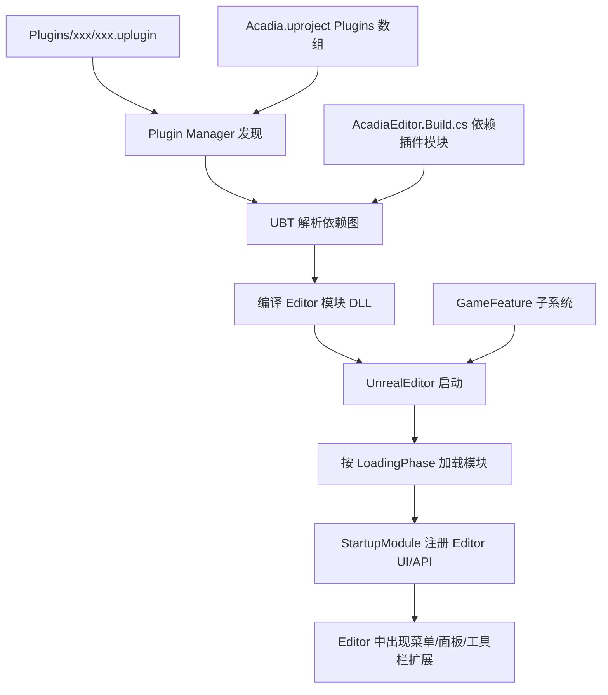

# Agent 回答记录

> 后续对话的回答会追加到本文件。

---

## 2026-06-01 — Plugins 目录内容如何绑定到 UE 编辑器

### 问题

`Plugins` 目录中的内容是怎么绑定到 UE 编辑器中的？

### 总览

UE 的 Plugin 机制分三层：**发现（Discovery）→ 编译链接（Build）→ 运行时加载与 UI 挂载（Runtime）**。  
Acadia 项目里同时存在两类插件目录：

| 位置 | 示例 | 说明 |
|------|------|------|
| `Projects/Acadia/Plugins/` | `AcdEditorTools`、`AcdGeneral`、`Wwise` | **项目插件**，随项目分发 |
| `Engine/Plugins/` | `AresCore`、`LogicSpell`、`MassEntity` | **引擎插件**，引擎源码树内 |

---

### 1. 发现：`.uplugin` 是入口

每个插件根目录下有一个 `*.uplugin` JSON 描述文件，UE 的 **Plugin Manager** 会扫描以下路径：

1. `<ProjectDir>/Plugins/**/`（递归查找 `.uplugin`）
2. `<EngineDir>/Plugins/**/`
3. 引擎安装目录 / Marketplace 已安装插件

**示例 — 项目编辑器插件 `AcdEditorTools`：**

```json
{
  "Modules": [
    {
      "Name": "AcdEditorTools",
      "Type": "Editor",
      "LoadingPhase": "Default"
    }
  ]
}
```

关键字段：

- **`Modules`**：插件包含哪些 C++ 模块
- **`Type`**：`Editor` / `Runtime` / `UncookedOnly` / `Developer` 等，决定该模块进哪个 Target
- **`LoadingPhase`**：模块加载时机（`PreDefault`、`Default`、`PostEngineInit` 等）
- **`Plugins`**：插件间依赖（如 `LogicSpell` 依赖 `AresCore`）
- **`CanContainContent`**：是否挂载 `Content/` 资产目录
- **`EnabledByDefault`**：未在 `.uproject` 中显式列出时的默认开关

**注意：** 并非所有 `Plugins/` 下的插件都在 `Acadia.uproject` 的 `Plugins` 数组里。  
例如 `AcdEditorTools` 未写入 `.uproject`，但仍会被自动发现并在 Editor Target 中编译（见下文 `BuildPlugins` 列表）。

---

### 2. 启用/禁用：`.uproject` 与过滤规则

`Acadia.uproject` 中的 `Plugins` 数组用于**显式控制**插件开关及 Target/Platform 过滤：

```json
{
  "Name": "HoudiniEngine",
  "Enabled": true,
  "TargetAllowList": ["Editor"]
}
```

常见过滤字段：

| 字段 | 作用 |
|------|------|
| `Enabled` | 是否启用 |
| `TargetAllowList` / `TargetDenyList` | 仅 Editor / Server / Game 等 |
| `PlatformAllowList` / `PlatformDenyList` | 平台过滤 |
| `SupportedTargetPlatforms` | 支持的平台列表 |

插件还可以在其 `.uplugin` 内声明对其它插件的依赖（传递启用）。  
用户本地在 **Edit → Plugins** 中的勾选状态会写入 `Saved/Config/.../EditorPerProjectUserSettings.ini`。

---

### 3. 编译绑定：UBT + Build.cs + Target

#### 3.1 Editor Target 决定编译哪些模块

`Source/AcadiaEditor.Target.cs`：

```csharp
Type = TargetType.Editor;
ExtraModuleNames.AddRange(new string[] { "Acadia", "AcadiaEditor", "AcadiaUncooked" });
```

编译 **AcadiaEditor** Target 时，UBT 会：

1. 读取 `.uproject` 和所有已启用插件的 `.uplugin`
2. 递归解析插件依赖图
3. 对 `Type == Editor` / `UncookedOnly` 的模块生成编译任务
4. 输出 `Binaries/Win64/AcadiaEditor.target`，其中 `BuildPlugins` 列出实际参与编译的插件

`AcadiaEditor.target` 片段（编译产物证据）：

```json
"BuildPlugins": [
  "AcdEditorTools",
  "AcdLevelDesigner",
  "AresCore",
  "LogicSpell",
  ...
]
```

#### 3.2 每个模块的 `*.Build.cs` 声明链接依赖

插件模块通过 `ModuleRules` 声明它依赖哪些其它模块（引擎模块或其它插件模块）：

`Plugins/AcdEditorTools/Source/AcdEditorTools/AcdEditorTools.Build.cs` 依赖 `UnrealEd`、`ToolMenus`、`UMGEditor` 等编辑器模块。

#### 3.3 项目 Editor 模块反向依赖插件模块

项目自身的 `AcadiaEditor` 模块也可以 **直接依赖** 插件模块，从而在游戏 Editor 代码里调用插件 API：

`Source/AcadiaEditor/AcadiaEditor.Build.cs` 中可见：

```csharp
PrivateDependencyModuleNames.AddRange(new string[] {
    "AcdLevelDesigner",
    "AcdCharacterEditor",
    "AcdSkillEditor",
    "LogicSpellEditorModule",
    ...
});
```

这意味着：**插件模块被编进 Editor DLL，并通过 Build.cs 依赖图与项目 Editor 模块链接在一起**。

#### 3.4 UHT / 反射

启用插件后，其 `Source/` 下的 `UCLASS`/`USTRUCT`/`UENUM` 会参与 **UnrealHeaderTool** 代码生成。  
`UhtPluginWrapper` 等插件会在 `PreDefault` 阶段介入 UHT 流程。

---

### 4. 运行时加载：Editor 启动时的模块生命周期

启动 `UnrealEditor.exe Acadia.uproject` 时：

```
UnrealEditor 启动
    ↓
IPluginManager 扫描并加载已启用 Plugin
    ↓
按 LoadingPhase 顺序 LoadModule（FModuleManager）
    ↓
IMPLEMENT_MODULE 注册的模块调用 StartupModule()
    ↓
模块向 Editor 子系统注册 UI / 菜单 / Asset Action 等
```

#### 4.1 模块注册宏

每个 C++ 模块末尾有：

```cpp
IMPLEMENT_MODULE(FAcdEditorToolsModule, AcdEditorTools)
```

`StartupModule()` 是绑定 Editor 功能的入口。

#### 4.2 实际 Editor 绑定方式（以 AcdEditorTools 为例）

`Plugins/AcdEditorTools/Source/AcdEditorTools/Private/AcdEditorTools.cpp`：

1. **`StartupModule()`** — 初始化 Style、注册 Commands、监听 `OnPostEngineInit`
2. **`RegisterMenus()`** — 通过 `UToolMenus` / `FBlueprintEditorModule` 的 **Menu Extender** 把按钮挂到 Widget Blueprint 编辑器工具栏
3. **`ShutdownModule()`** — 反注册，清理资源

其它常见 Editor 绑定手段（本项目及其他插件中广泛使用）：

| 机制 | 用途 |
|------|------|
| `UToolMenus` | 扩展主菜单 / 工具栏 |
| `FAssetEditorExtender` | 扩展资产编辑器工具栏 |
| `FModuleManager::LoadModuleChecked<IxxxModule>` | 获取已有 Editor 模块并注册扩展 |
| `UEditorSubsystem` / `UAssetActionUtility` | 编辑器子系统、右键资产动作 |
| `RegisterNomadTabSpawner` | 注册独立 Dock Tab 面板 |
| `FEditorMode` | 自定义 Editor Mode（如建模模式） |
| Content Browser 扩展 | 自定义资产类型展示与操作 |

---

### 5. 特殊类型：GameFeature 插件

`Plugins/GameFeatures/` 下的插件（如 `AcdGeneral`）是 **Game Feature Plugin**，除了常规 `.uplugin` 外还有：

```json
"ExplicitlyLoaded": true,
"BuiltInInitialFeatureState": "Registered",
"Category": "Game Features"
```

运行时由 **`UGameFeaturesSubsystem`** 管理（本项目在 `DefaultGame.ini` 配置了 `GameFeaturesManagerClassName`）。  
它们的内容路径在 `DefaultGame.ini` 中被 Stage；Editor 中通过 Game Features 窗口或数据资产控制激活，而不是仅在模块 `StartupModule` 里一次性挂载。

---

### 6. 内容（Content）绑定

若 `.uplugin` 中 `"CanContainContent": true`，插件的 `Content/` 目录会被挂载到虚拟路径：

```
/PluginName/...
```

Editor 的 Content Browser 可直接浏览、引用这些资产。GameFeature 插件通常包含大量 Content 和 Script。

---

### 7. 端到端流程图（Acadia 项目）



---

### 8. 如何验证某个插件是否已绑定到 Editor

1. **编译产物**：查看 `Binaries/Win64/AcadiaEditor.target` 的 `BuildPlugins` 是否包含该插件名
2. **Editor UI**：Edit → Plugins 搜索插件名，确认 Enabled
3. **模块加载日志**：启动 Editor 时加 `-log`，搜索 `LogPluginManager` / 模块名
4. **本地配置**：`Saved/Config/WindowsEditor/EditorPerProjectUserSettings.ini` 中的插件时间戳

---

### 9. 新增一个 Editor 插件的最小步骤（本项目惯例）

1. 在 `Projects/Acadia/Plugins/MyPlugin/` 创建 `MyPlugin.uplugin`（`Type: Editor`）
2. 创建 `Source/MyPlugin/MyPlugin.Build.cs` + 模块 cpp/h
3. 在模块中 `IMPLEMENT_MODULE`，于 `StartupModule` 注册 Editor 扩展
4. （可选）在 `Acadia.uproject` 的 `Plugins` 数组中添加 `"Name": "MyPlugin", "Enabled": true`
5. （可选）若项目 Editor 代码需直接调用，在 `AcadiaEditor.Build.cs` 添加模块依赖
6. 重新编译 `AcadiaEditor` Target

---

### 相关文件索引

| 文件 | 作用 |
|------|------|
| `Acadia.uproject` | 项目模块 + 插件启用列表 |
| `Source/AcadiaEditor.Target.cs` | Editor 编译 Target |
| `Source/AcadiaEditor/AcadiaEditor.Build.cs` | 项目 Editor 模块对插件模块的链接 |
| `Plugins/**/**.uplugin` | 各插件描述符 |
| `Plugins/**/Source/**/*.Build.cs` | 插件模块编译规则 |
| `Binaries/Win64/AcadiaEditor.target` | 实际编译进 Editor 的插件列表 |
| `Config/DefaultGame.ini` | GameFeature 等运行时配置 |
| `Engine/Plugins/AresCore/AresCore.uplugin` | 引擎侧框架插件示例 |
| `Engine/Plugins/LogicSpell/LogicSpell.uplugin` | 引擎侧编辑器+运行时插件示例 |
