## 基础架构思路

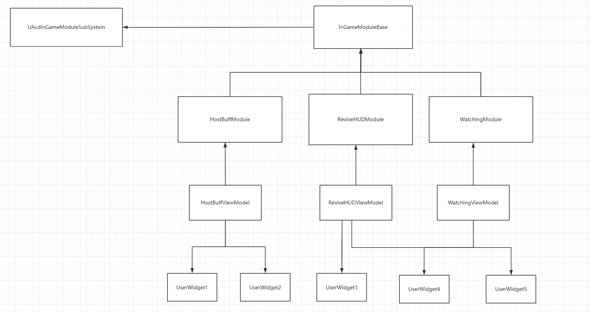

（没用标准UML来画，但想表达一下基础架构）

通过战斗或者关卡的数据 ，在Module里面加工好 然后把需要的显示数据往viewmodel里面丢，viewmodel会驱动HUD表现。

### 总结

Module里面写逻辑 ViewModel存HUD数据

## 如何创建Module

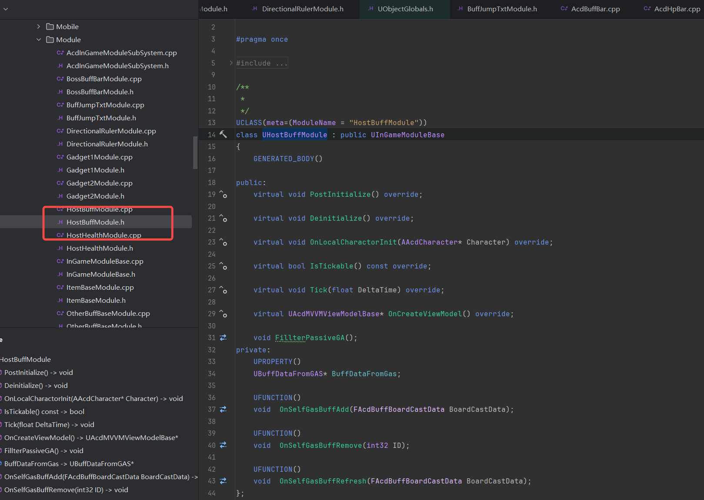

继承**UItemBaseModule** 

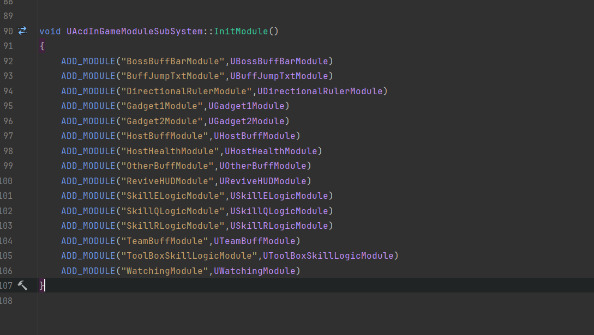

添加初始化**Module**代码

# 如何创建ViewModel

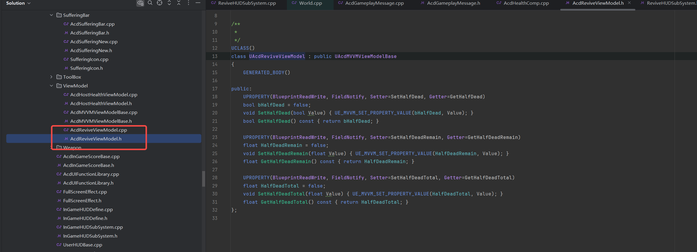

集中放在这个文件夹下

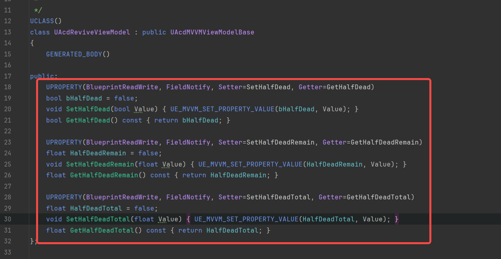

创建对应get set方法。

问题：

Wsm 不用 #define 因为这些代码看起来都一样

答：

这些都是需要UHT预先处理的，如果写成define 在UHT处理的时候还没展开呢。（其实这些代码应该写在UHT里面）

# HUD 如何绑定

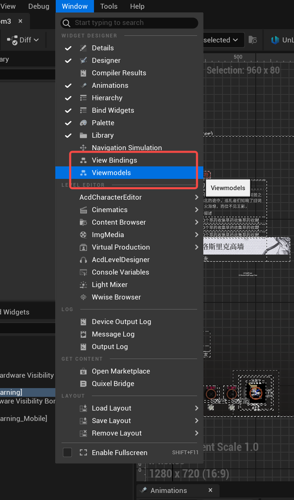

蓝图上有两个viewmodel选项

先选ViewModel

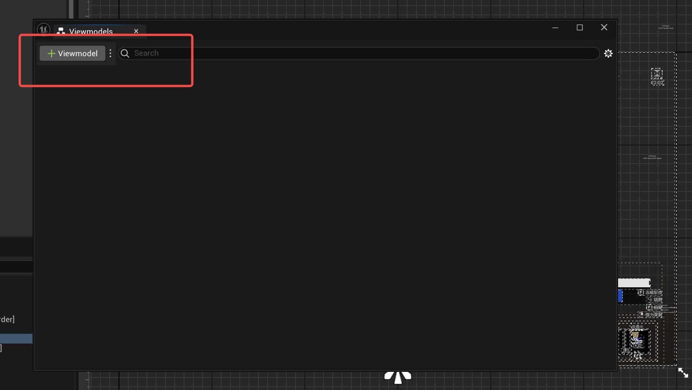

给蓝图绑定上一个viewmodel

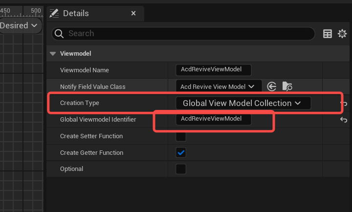

模式选global 。因为我们框架就是用global的方式。

**标识填** 

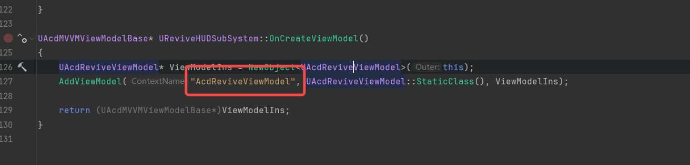

接下来点viewbindings

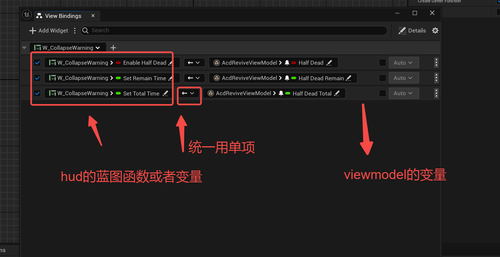

只要viewmodel的值发生改变。

就会调用对应左边绑定函数或者方法

**viewmodel存的是显示数据，用于驱动View显示，一般view不修改viewmodel中的显示数据，因此单向就够用了，**

**只有一个方向的数据源也方便管理。**

## MVVM中的ListView

### 背景知识

UE的MVVM框架中,对ListView的绑定做了扩展，简单来说会对子Item自动绑定子ViewModel，详情可以阅读一下代码

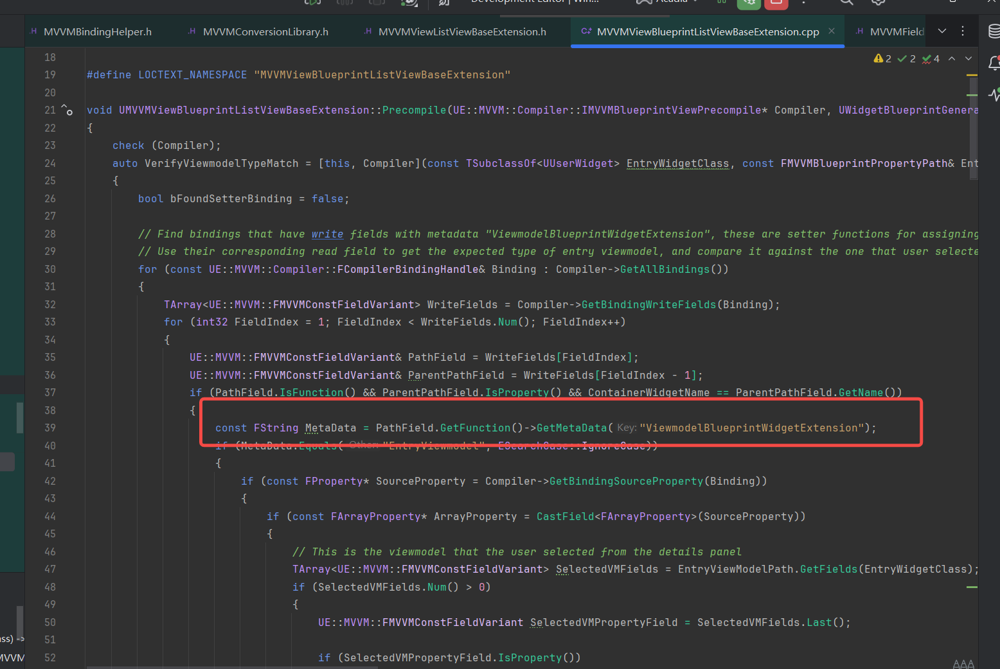

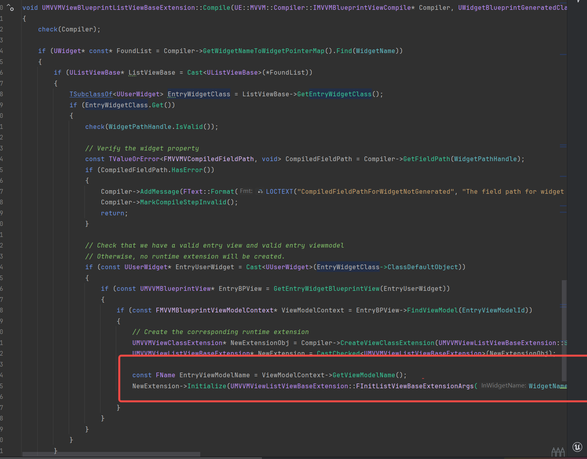

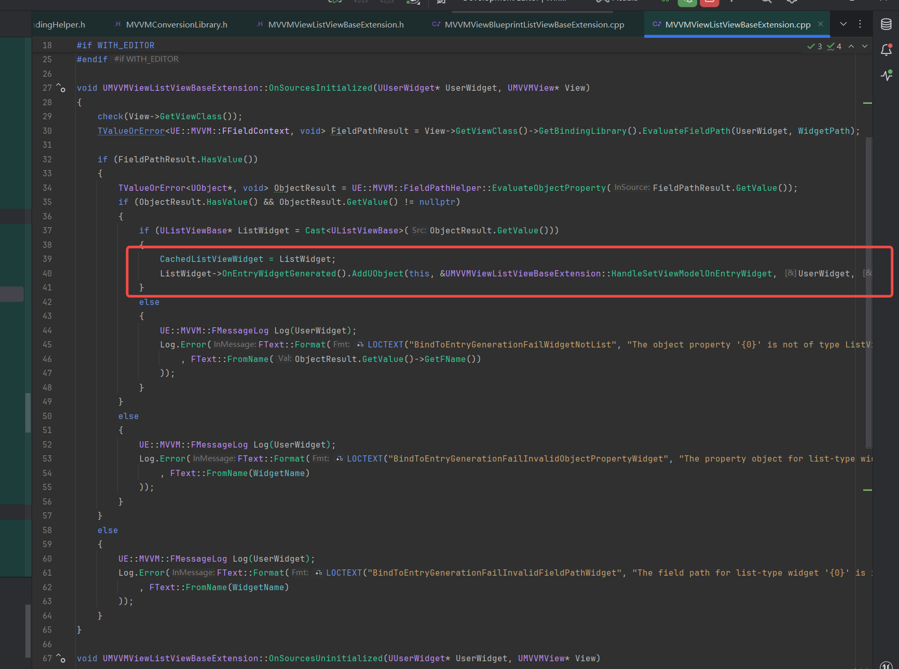

在UE中的使用方式为

1.创建子ItemMvvmModel

2.父Item创建TArray包含子Item

3.TArray绑定bp_setlistview函数

4.子Item绑定子viewmodel 驱动对应表现

详细使用方式如下：

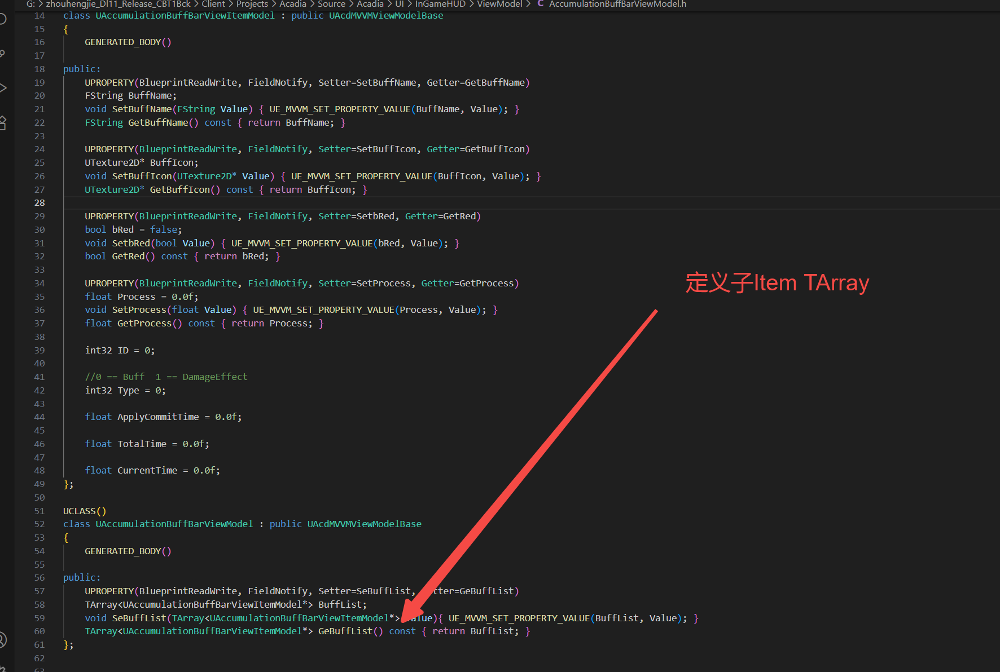

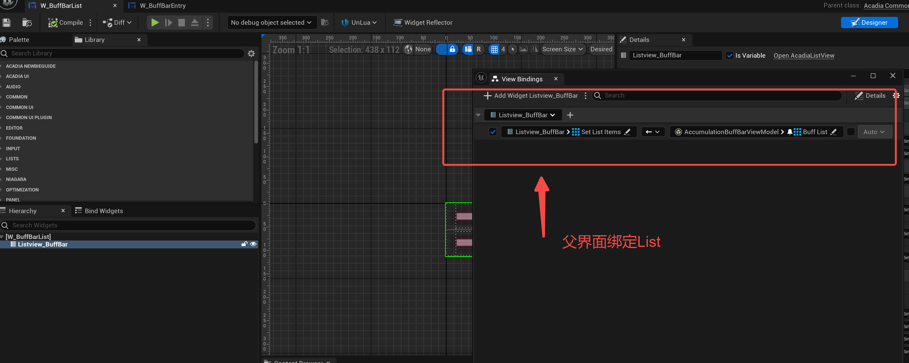

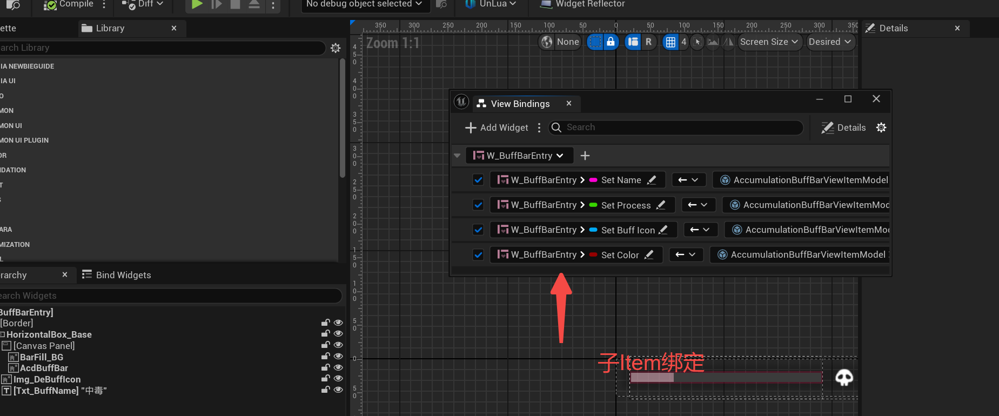

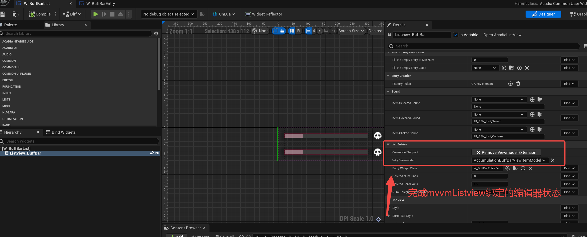