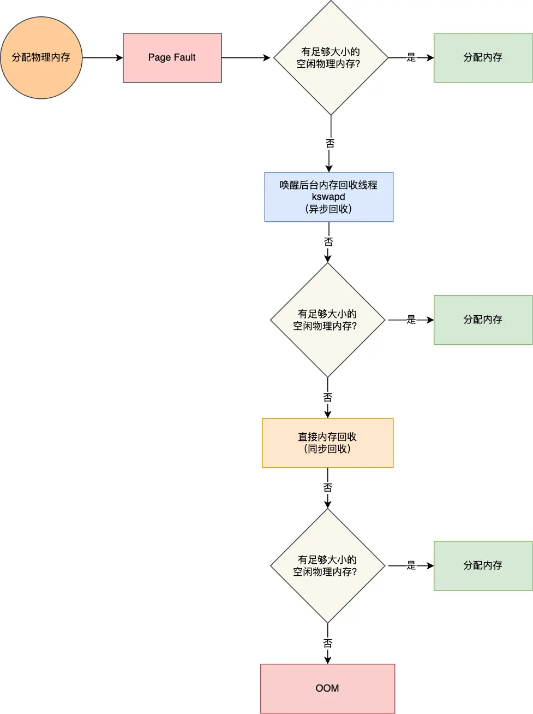
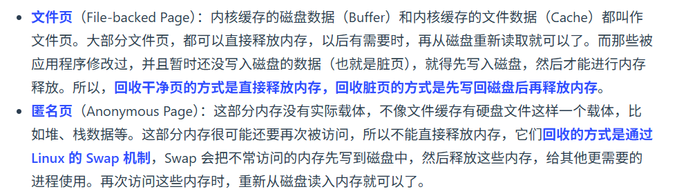

#### 从内存不足到内存回收的大致流程

当操作系统内存物理内存不足时，会产生缺页异常，从而执行**内存回收**

申请物理内存的过程如下图：

可以看出，大致可以分为几个步骤：

1. 如果有足够的物理内存大小，直接分配
2. 唤醒后台线程kswapd进行**异步回收**（后台内存回收）
3. 直接内存回收，同步回收
4. OOM（out of memory）

------

#### 到底哪些内存可以被回收？

​	==文件页==包括**内核缓存的磁盘数据（Buffer）**和**内核缓存的文件数据（Cache）**。没被修改的，和磁盘上一模一样的文件页可以直接回收，下次需要的时候再读到内存里就可以了；被修改过的，还没有写到磁盘上的文件页**（脏页）**需要先写回磁盘然后再回收

​	==匿名页==跟文件页一个很大的区别就是，文件页本质上是从磁盘里面拿出来的数据，但是匿名页是一些临时数据（比如堆，栈数据），他们不是从磁盘读出来的，也大概率不会写进磁盘，所以他们是不能随便清理掉的，说不好马上就会被用到。

​	为了处理匿名页，就得使用到**swap**机制，将不常用的匿名页换到磁盘里面，后面用的时候再换回来，**LRU**就是一种常用的算法

