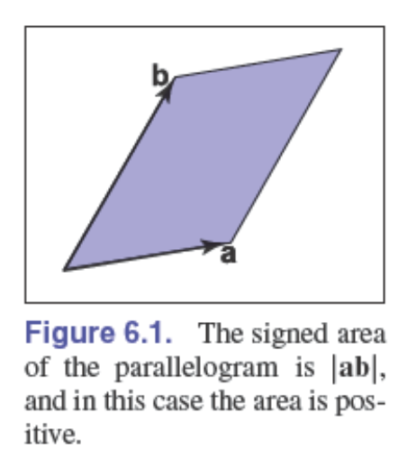
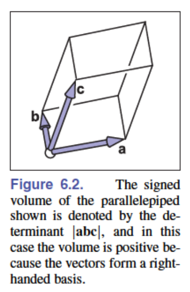
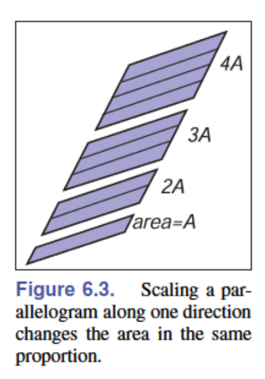
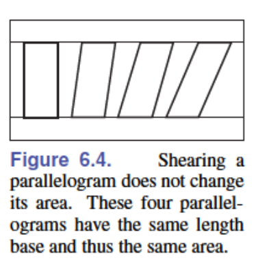
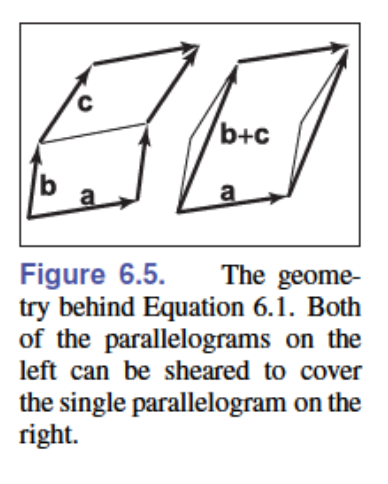
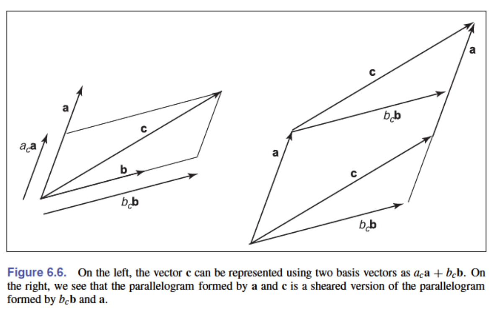
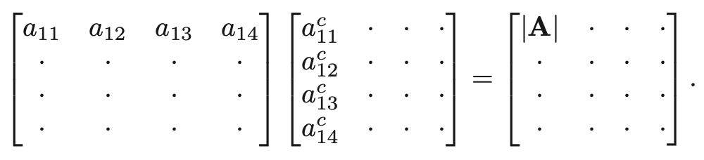
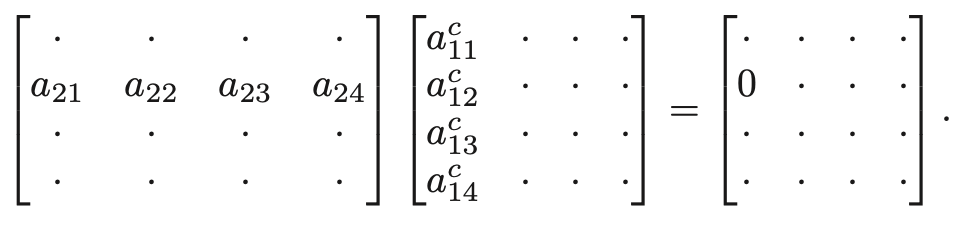

# 6 - 线性代数

也许，图形程序中最通用的工具是那些用于改变或变换点和向量的矩阵。在下一章中，我们将看到如何将向量表示为单列矩阵，以及如何通过与方形矩阵相乘来在不同基底下表示向量。我们还将描述如何使用这种矩阵乘法来实现向量的变换，如缩放、旋转和平移。在本章中，我们从几何角度回顾基础线性代数，重点关注在二维和三维情况下运行良好的直觉理解和算法。

对线性代数已经熟悉的读者可以跳过本章。然而，即使对于这样的读者，可能也会发现一些有启发性的内容，例如行列式的推导以及奇异值分解和特征值分解的讨论。

## 6.1 行列式

我们通常认为行列式产生于线性方程组的求解过程中。然而，对于我们的目的，我们将行列式视为向量相乘的另一种方式。对于二维向量 $\mathbf{a}$ 和 $\mathbf{b}$，行列式 $|\mathbf{a}\mathbf{b}|$ 是由 $\mathbf{a}$ 和 $\mathbf{b}$ 构成的平行四边形的面积（图6.1）。这是一个有向面积，如果 $\mathbf{a}$ 和 $\mathbf{b}$ 构成右手系，则符号为正；如果构成左手系，则符号为负。这意味着 $|\mathbf{a}\mathbf{b}| = -|\mathbf{b}\mathbf{a}|$。在二维情况下，我们可以将"右手系"理解为逆时针旋转第一个向量至与第二个向量形成的最小角度。



在三维情况下，行列式必须一次考虑三个向量。对于三个三维向量 $\mathbf{a}$、$\mathbf{b}$ 和 $\mathbf{c}$，行列式 $|\mathbf{a}\mathbf{b}\mathbf{c}|$ 是由这三个向量构成的平行六面体（三维平行四边形；一个剪切的三维盒子）的有向体积（图6.2）。



要计算二维行列式，我们首先需要建立它的几个性质。我们注意到，缩放平行四边形的一边会按相同比例缩放其面积（图6.3）：

$$|(k\mathbf{a})\mathbf{b}| = |\mathbf{a}(k\mathbf{b})| = k|\mathbf{a}\mathbf{b}|$$



同样，我们注意到"剪切"平行四边形不会改变其面积（图6.4）：

$$|(\mathbf{a} + k\mathbf{b})\mathbf{b}| = |\mathbf{a}(\mathbf{b} + k\mathbf{a})| = |\mathbf{a}\mathbf{b}|$$



最后，我们看到行列式具有以下性质：

$$|\mathbf{a}(\mathbf{b} + \mathbf{c})| = |\mathbf{a}\mathbf{b}| + |\mathbf{a}\mathbf{c}| \tag{6.1}$$

这是因为如图6.5所示，我们可以将两个平行四边形之间的边"滑动"过去形成一个单一的平行四边形，而不改变原来两个平行四边形中任何一个的面积。



现在让我们假设 $\mathbf{a}$ 和 $\mathbf{b}$ 的笛卡尔表示：

$$|\mathbf{a}\mathbf{b}| = |(x_a\mathbf{x} + y_a\mathbf{y})(x_b\mathbf{x} + y_b\mathbf{y})|$$

$$= x_ax_b|\mathbf{x}\mathbf{x}| + x_ay_b|\mathbf{x}\mathbf{y}| + y_ax_b|\mathbf{y}\mathbf{x}| + y_ay_b|\mathbf{y}\mathbf{y}|$$

$$= x_ax_b(0) + x_ay_b(+1) + y_ax_b(-1) + y_ay_b(0)$$

$$= x_ay_b - y_ax_b$$

这个简化过程利用了对于任何向量 $\mathbf{v}$，都有 $|\mathbf{v}\mathbf{v}| = 0$ 这一事实，因为平行四边形将与 $\mathbf{v}$ 共线，因此没有面积。

在三维情况下，三个三维向量 $\mathbf{a}$、$\mathbf{b}$ 和 $\mathbf{c}$ 的行列式记作 $|\mathbf{a}\mathbf{b}\mathbf{c}|$。使用向量的笛卡尔表示，平行六面体具有与平行四边形类似的规则，我们可以进行与二维情况类似的展开：

$$|\mathbf{a}\mathbf{b}\mathbf{c}| = |(x_a\mathbf{x} + y_a\mathbf{y} + z_a\mathbf{z})(x_b\mathbf{x} + y_b\mathbf{y} + z_b\mathbf{z})(x_c\mathbf{x} + y_c\mathbf{y} + z_c\mathbf{z})|$$

$$= x_ay_bz_c - x_az_by_c - y_ax_bz_c + y_az_bx_c + z_ax_by_c - z_ay_bx_c$$

正如你所看到的，随着维数的增加，用这种方式计算行列式变得越来越复杂。我们将在第6.3节中讨论计算行列式的更加不易出错的方法。

**例题 2** 当计算将一个向量表示为另外两个向量的线性组合时，行列式自然地出现了——例如，如果我们希望将向量 $\vec{c}$ 表示为向量 $\vec{a}$ 和 $\vec{b}$ 的组合：

$$\vec{c} = \mathbf{a}_c\vec{a} + \mathbf{b}_c\vec{b}$$



从图6.6中我们可以看出：

$$|(\mathbf{b}_c\vec{b})\vec{a}| = |\vec{c}\vec{a}|$$

因为这些平行四边形只是彼此的剪切版本。解出 $\mathbf{b}_c$ 得到：

$$\mathbf{b}_c = \frac{|\vec{c}\vec{a}|}{|\vec{b}\vec{a}|}$$

类似的论证可以得到：

$$\mathbf{a}_c = \frac{|\vec{b}\vec{c}|}{|\vec{b}\vec{a}|}$$

这是克拉默法则的二维版本，我们将在第6.3.2节中重新讨论。

## 6.2 矩阵

矩阵是遵循特定算术规则的数值元素数组。一个具有两行三列的矩阵示例如下：

$$\begin{bmatrix}
1.7 & -1.2 & 4.2 \\
3.0 & 4.5 & -7.2
\end{bmatrix}$$

矩阵在计算机图形学中被广泛用于多种用途，包括空间变换的表示。在我们的讨论中，我们假设矩阵的所有元素都是实数。本章将描述矩阵运算的机制以及"方阵"（即行数与列数相等的矩阵）的行列式计算。

### 6.2.1 矩阵运算

矩阵乘以常数会得到一个新矩阵，其中每个元素都乘以该常数，例如：

$$2 \begin{bmatrix}
1 & -4 \\
3 & 2
\end{bmatrix} = \begin{bmatrix}
2 & -8 \\
6 & 4
\end{bmatrix}$$

对于矩阵乘法，我们将第一个矩阵的"行"与第二个矩阵的"列"相乘：

$$\begin{bmatrix}
a_{11} & \cdots & a_{1m} \\
\vdots & \ddots & \vdots \\
a_{i1} & \cdots & a_{im} \\
\vdots & \ddots & \vdots \\
a_{r1} & \cdots & a_{rm}
\end{bmatrix}
\begin{bmatrix}
b_{11} & \cdots & b_{1j} & \cdots & b_{1c} \\
\vdots & \ddots & \vdots & \ddots & \vdots \\
b_{m1} & \cdots & b_{mj} & \cdots & b_{mc}
\end{bmatrix} =
\begin{bmatrix}
p_{11} & \cdots & p_{1j} & \cdots & p_{1c} \\
\vdots & \ddots & \vdots & \ddots & \vdots \\
p_{i1} & \cdots & p_{ij} & \cdots & p_{ic} \\
\vdots & \ddots & \vdots & \ddots & \vdots \\
p_{r1} & \cdots & p_{rj} & \cdots & p_{rc}
\end{bmatrix}$$

因此，结果矩阵中元素$p_{ij}$为：

$$p_{ij} = a_{i1}b_{1j} + a_{i2}b_{2j} + \cdots + a_{im}b_{mj} \tag{6.2}$$

只有当左矩阵的列数与右矩阵的行数相等时，两个矩阵的乘法才可能进行。

矩阵乘法在大多数情况下不满足交换律：

$$\mathbf{A}\mathbf{B} \neq \mathbf{B}\mathbf{A} \tag{6.3}$$

同时，如果$\mathbf{A}\mathbf{B} = \mathbf{A}\mathbf{C}$，也不一定意味着$\mathbf{B} = \mathbf{C}$。幸运的是，矩阵乘法满足结合律和分配律：

$$(\mathbf{A}\mathbf{B})\mathbf{C} = \mathbf{A}(\mathbf{B}\mathbf{C})$$

$$\mathbf{A}(\mathbf{B} + \mathbf{C}) = \mathbf{A}\mathbf{B} + \mathbf{A}\mathbf{C}$$

$$(\mathbf{A} + \mathbf{B})\mathbf{C} = \mathbf{A}\mathbf{C} + \mathbf{B}\mathbf{C}$$

### 6.2.2 矩阵运算

我们希望找到矩阵的逆，类似于实数的倒数。我们知道实数$x$的倒数是$1/x$，且$x$与其倒数的乘积为1。我们需要一个矩阵$\mathbf{I}$，可以将其视为"矩阵中的1"。这只对方阵存在，被称为单位矩阵；它由对角线上的1和其他位置的0组成。例如，四阶单位矩阵为：

$$\mathbf{I} = \begin{bmatrix}
1 & 0 & 0 & 0 \\
0 & 1 & 0 & 0 \\
0 & 0 & 1 & 0 \\
0 & 0 & 0 & 1
\end{bmatrix}$$

矩阵$\mathbf{A}$的逆矩阵$\mathbf{A}^{-1}$是确保$\mathbf{A}\mathbf{A}^{-1} = \mathbf{I}$的矩阵。

例如：
$$\begin{bmatrix}
1 & 2 \\
3 & 4
\end{bmatrix}^{-1} = \begin{bmatrix}
-2.0 & 1.0 \\
1.5 & -0.5
\end{bmatrix}$$

因为：
$$\begin{bmatrix}
1 & 2 \\
3 & 4
\end{bmatrix} \begin{bmatrix}
-2.0 & 1.0 \\
1.5 & -0.5
\end{bmatrix} = \begin{bmatrix}
1 & 0 \\
0 & 1
\end{bmatrix}$$

注意$\mathbf{A}^{-1}$的逆矩阵是$\mathbf{A}$。因此$\mathbf{A}\mathbf{A}^{-1} = \mathbf{A}^{-1}\mathbf{A} = \mathbf{I}$。两个矩阵乘积的逆等于各自逆矩阵的乘积，但顺序颠倒：

$$(\mathbf{A}\mathbf{B})^{-1} = \mathbf{B}^{-1}\mathbf{A}^{-1}\tag{6.4}$$

我们将在6.3节中回到计算逆矩阵的问题。

矩阵$\mathbf{A}$的转置$\mathbf{A}^T$具有相同的数值，但行与列互换。如果我们将$\mathbf{A}^T$的元素标记为$a'_{ij}$，那么：

$$a_{ij} = a'_{ji}$$

例如：
$$\begin{bmatrix}
1 & 2 \\
3 & 4 \\
5 & 6
\end{bmatrix}^T = \begin{bmatrix}
1 & 3 & 5 \\
2 & 4 & 6
\end{bmatrix}$$

两个矩阵乘积的转置遵循类似于公式(6.4)的规则：

$$(\mathbf{A}\mathbf{B})^T = \mathbf{B}^T\mathbf{A}^T$$

方阵的行列式就是将矩阵的列视为向量集合时的行列式。行列式与刚刚讨论的矩阵运算有几个很好的关系，我们在此列出以供参考：

$$|\mathbf{A}\mathbf{B}| = |\mathbf{A}||\mathbf{B}| \tag{6.5}$$

$$\left|\mathbf{A}^{-1}\right| = \frac{1}{|\mathbf{A}|} \tag{6.6}$$

$$\left|\mathbf{A}^T\right| = |\mathbf{A}| \tag{6.7}$$

### 6.2.3 向量运算的矩阵形式

在图形学中，我们使用方阵来变换以矩阵形式表示的向量。例如，如果你有一个2D向量$\vec{a} = (x_a, y_a)$，想要将其绕原点逆时针旋转90度形成向量$\vec{a}' = (-y_a, x_a)$，你可以使用一个$2 \times 2$矩阵与一个$2 \times 1$矩阵（称为列向量）的乘积。矩阵形式的运算为：

$$\begin{bmatrix}
0 & -1 \\
1 & 0
\end{bmatrix} \begin{bmatrix}
x_a \\
y_a
\end{bmatrix} = \begin{bmatrix}
-y_a \\
x_a
\end{bmatrix}$$

我们也可以通过使用该矩阵的转置，并用行向量在左侧相乘（"前乘"）来获得相同的结果：

$$\begin{bmatrix}
x_a & y_a
\end{bmatrix} \begin{bmatrix}
0 & 1 \\
-1 & 0
\end{bmatrix} = \begin{bmatrix}
-y_a & x_a
\end{bmatrix}$$

如今，使用列向量的后乘法已经相当标准，但在许多较旧的书籍和系统中，你会遇到行向量和前乘法。唯一的区别是变换矩阵必须替换为其转置。

我们还可以使用矩阵形式来编码仅对向量的运算。如果我们将点积的结果视为$1 \times 1$矩阵，则可以写成：

$$\vec{a} \cdot \vec{b} = \vec{a}^T\vec{b}$$

例如，如果我们取两个3D向量，得到：

$$\begin{bmatrix}
x_a & y_a & z_a
\end{bmatrix} \begin{bmatrix}
x_b \\
y_b \\
z_b
\end{bmatrix} = x_a x_b + y_a y_b + z_a z_b$$

一个相关的向量乘积是两个向量之间的外积，可以表示为左侧列向量与右侧行向量的矩阵乘法：$\vec{a}\vec{b}^T$。结果是一个矩阵，由$\vec{a}$的每个分量与$\vec{b}$的每个分量的所有成对乘积组成。对于3D向量，我们有：

$$\begin{bmatrix}
x_a \\
y_a \\
z_a
\end{bmatrix} \begin{bmatrix}
x_b & y_b & z_b
\end{bmatrix} = \begin{bmatrix}
x_a x_b & x_a y_b & x_a z_b \\
y_a x_b & y_a y_b & y_a z_b \\
z_a x_b & z_a y_b & z_a z_b
\end{bmatrix}$$

通过向量运算来思考矩阵乘法通常是有用的。以三维情况为例，我们可以用两种方式将$3 \times 3$矩阵视为三个3D向量的集合：要么它由三个并排的列向量组成，要么它由三个堆叠的行向量组成。例如，矩阵-向量乘法$\vec{y} = A\vec{x}$的结果可以解释为一个向量，其分量是$\vec{x}$与$A$的各行的点积。将这些行向量命名为$\vec{r}_i$，我们有：

$$\begin{bmatrix}
| \\
\vec{y} \\
|
\end{bmatrix} = \begin{bmatrix}
— & \vec{r}_1 & — \\
— & \vec{r}_2 & — \\
— & \vec{r}_3 & —
\end{bmatrix} \begin{bmatrix}
| \\
\vec{x} \\
|
\end{bmatrix}$$

$$y_i = \vec{r}_i \cdot \vec{x}$$

或者，我们可以将同样的乘积视为$A$的三个列向量$\vec{c}_i$的加权和，权重为$\vec{x}$的分量：

$$\begin{bmatrix}
| \\
\vec{y} \\
|
\end{bmatrix} = \begin{bmatrix}
| & | & | \\
\vec{c}_1 & \vec{c}_2 & \vec{c}_3 \\
| & | & |
\end{bmatrix} \begin{bmatrix}
x_1 \\
x_2 \\
x_3
\end{bmatrix}$$

$$\vec{y} = x_1\vec{c}_1 + x_2\vec{c}_2 + x_3\vec{c}_3$$

使用相同的思想，我们可以将矩阵-矩阵乘积$AB$理解为：包含$A$的所有行与$B$的所有列的成对点积的数组（参见公式(6.2)）；矩阵$A$与$B$的所有列向量的乘积的集合，从左到右排列；$A$的所有行向量与矩阵$B$的乘积的集合，从上到下堆叠；或者$A$的所有列与$B$的所有行的成对外积之和。（参见练习8。）

这些对矩阵乘法的解释通常能够为那些看起来非常抽象的运算提供有价值的几何解释。

### 6.2.4 特殊类型的矩阵

单位矩阵是**对角矩阵**的一个例子，对角矩阵的所有非零元素都出现在对角线上。对角线由那些列索引等于行索引的元素组成（从左上角开始计数）。

单位矩阵还具有与其转置相同的性质。这样的矩阵被称为**对称矩阵**。

单位矩阵也是一个**正交矩阵**，因为将其每一列视为向量时，都具有长度1，并且各列之间相互正交。对于行向量也是如此（参见练习2）。任何正交矩阵的行列式都是$+1$或$-1$。

正交矩阵的一个非常有用的性质是它们几乎是自己的逆矩阵。正交矩阵与其转置相乘的结果是单位矩阵：

$$R^T R = I = R R^T \quad \text{（对于正交矩阵}R\text{）}$$

这很容易理解，因为$R^T R$的元素是$R$的列向量之间的点积。非对角元素是正交向量之间的点积，而对角元素是（单位长度）列向量与自身的点积。

**例3** 矩阵
$$\begin{bmatrix}
8 & 0 & 0 \\
0 & 2 & 0 \\
0 & 0 & 9
\end{bmatrix}$$
是对角矩阵，因此是对称的，但不是正交的（各列相互正交但不是单位长度）。

矩阵
$$\begin{bmatrix}
1 & 1 & 2 \\
1 & 9 & 7 \\
2 & 7 & 1
\end{bmatrix}$$
是对称的，但既不是对角矩阵也不是正交矩阵。

矩阵
$$\begin{bmatrix}
0 & 1 & 1 \\
0 & 0 & 1 \\
1 & 0 & 0
\end{bmatrix}$$
是正交的，但既不是对角矩阵也不是对称矩阵。

## 6.3 使用矩阵和行列式进行计算

回顾第6.1节，行列式将$n$个$n$维向量进行组合，得到由这些向量定义的$n$维平行多面体的有符号$n$维体积。例如，二维中的行列式是由向量形成的平行四边形的面积。我们可以使用矩阵来处理行列式的计算机制。

如果我们有二维向量$\mathbf{r}$和$\mathbf{s}$，我们将行列式记作$|\mathbf{r}\mathbf{s}|$；这个值是由向量形成的平行四边形的有符号面积。假设我们有两个具有笛卡尔坐标$(a,b)$和$(A,B)$的二维向量（图5.7）。行列式可以用列向量的形式表示，或者用简写形式：

$$\left|\begin{bmatrix} a \\ b \end{bmatrix} \begin{bmatrix} A \\ B \end{bmatrix}\right| \equiv \begin{vmatrix} a & A \\ b & B \end{vmatrix} = aB - Ab$$

注意到矩阵的行列式和矩阵转置的行列式相同：

$$\begin{vmatrix} a & A \\ b & B \end{vmatrix} = \begin{vmatrix} a & b \\ A & B \end{vmatrix} = aB - Ab$$

这意味着对于二维平面中的任何平行四边形，都存在一个具有相同面积但不同形状的"孪生"平行四边形（图5.8）。例如，由向量$(3,1)$和$(2,4)$定义的平行四边形的面积为10，由向量$(3,2)$和$(1,4)$定义的平行四边形的面积也为10。

**例子。** 三维行列式的几何含义有助于理解为什么某些公式是合理的。例如，通过点$(x_i,y_i,z_i)$（其中$i = 0,1,2$）的平面方程为：

$$\begin{vmatrix}
x-x_0 & x-x_1 & x-x_2 \\
y-y_0 & y-y_1 & y-y_2 \\
z-z_0 & z-z_1 & z-z_2
\end{vmatrix} = 0$$

每一列都是从点$(x_i,y_i,z_i)$到点$(x,y,z)$的向量。以这些向量为边的平行六面体的体积为零，当且仅当点$(x,y,z)$与其他三个点共面。几乎所有涉及行列式的方程都有类似简单的几何基础。

正如我们之前所见，我们可以通过暴力展开来计算行列式，其中大部分项为零，并且需要大量的正负号记录工作。计算行列式的标准代数方法是使用拉普拉斯展开的一种形式。这种方法计算行列式的关键部分是找到各个矩阵元素的余子式。方阵的每个元素都有一个余子式，它是一个少一行一列的矩阵的行列式，可能还要乘以负一。较小的矩阵是通过消除所讨论元素所在的行和列得到的。例如，对于一个$10 \times 10$矩阵，元素$a_{82}$的余子式是消除第8行和第2列后的$9 \times 9$矩阵的行列式。余子式的符号在行索引和列索引之和为偶数时为正，否则为负。这可以通过棋盘模式来记忆：

第$(i,j)$位置的符号遵循$(-1)^{i+j}$的规律，形成如下的符号模式：
- 当$i+j$为偶数时：正号$(+)$
- 当$i+j$为奇数时：负号$(-)$

余子式$C_{ij}$可以表示为：
$$C_{ij} = (-1)^{i+j} M_{ij}$$
其中$M_{ij}$是消除第$i$行和第$j$列后得到的子矩阵的行列式。

因此，对于一个$4 \times 4$矩阵，

$$A = \begin{bmatrix}
a_{11} & a_{12} & a_{13} & a_{14} \\
a_{21} & a_{22} & a_{23} & a_{24} \\
a_{31} & a_{32} & a_{33} & a_{34} \\
a_{41} & a_{42} & a_{43} & a_{44}
\end{bmatrix}$$

第一行的余子式为：

$$C_{11} = \begin{vmatrix}
a_{22} & a_{23} & a_{24} \\
a_{32} & a_{33} & a_{34} \\
a_{42} & a_{43} & a_{44}
\end{vmatrix}, \quad C_{12} = -\begin{vmatrix}
a_{21} & a_{23} & a_{24} \\
a_{31} & a_{33} & a_{34} \\
a_{41} & a_{43} & a_{44}
\end{vmatrix}$$

$$C_{13} = \begin{vmatrix}
a_{21} & a_{22} & a_{24} \\
a_{31} & a_{32} & a_{34} \\
a_{41} & a_{42} & a_{44}
\end{vmatrix}, \quad C_{14} = -\begin{vmatrix}
a_{21} & a_{22} & a_{23} \\
a_{31} & a_{32} & a_{33} \\
a_{41} & a_{42} & a_{43}
\end{vmatrix}$$

矩阵的行列式可以通过任意一行或一列的元素与其余子式的乘积之和来求得。例如，上述$4 \times 4$矩阵沿第二列展开的行列式为：

$$|A| = a_{12}C_{12} + a_{22}C_{22} + a_{32}C_{32} + a_{42}C_{42}$$

我们可以沿任意行或列进行类似的展开，它们都会产生相同的结果。注意这种展开的递归性质。

### 6.3.1 计算逆矩阵

行列式为我们提供了计算矩阵逆的工具。对于大矩阵来说，这是一种非常低效的方法，但在图形学中，我们的矩阵通常很小。发展这种方法的关键是，具有两个相同行的矩阵的行列式为零。这应该很清楚，因为如果$n$维平行六面体的两条边相同，那么它的体积就是零。假设我们有一个$4 \times 4$矩阵$A$，我们希望找到它的逆矩阵$A^{-1}$。逆矩阵为：

$$A^{-1} = \frac{1}{|A|} \begin{bmatrix}
C_{11} & C_{21} & C_{31} & C_{41} \\
C_{12} & C_{22} & C_{32} & C_{42} \\
C_{13} & C_{23} & C_{33} & C_{43} \\
C_{14} & C_{24} & C_{34} & C_{44}
\end{bmatrix}$$

其中$C_{ij}$是元素$a_{ij}$的余子式。注意这个矩阵是余子式矩阵的转置，通常称为**伴随矩阵**（adjugate matrix）或**代数余子式矩阵**。

这个公式的有效性基于以下事实：当矩阵$A$与其伴随矩阵相乘时，结果是一个对角矩阵，其对角元素都等于$|A|$。

注意这只是将$A$的元素替换为其相应余子式乘以前导常数（1或-1）后的矩阵的转置。这个矩阵称为$A$的**伴随矩阵**（adjoint）。伴随矩阵是$A$的余子式矩阵的转置。我们可以看出为什么这是一个逆矩阵。观察乘积$AA^{-1}$，我们期望它是单位矩阵。如果我们将$A$的第一行与伴随矩阵的第一列相乘，我们需要得到$|A|$（记住上面的前导常数要除以$|A|$）：



这是正确的，因为$A$的第一行元素恰好与伴随矩阵第一列中对应的余子式相乘，这正好等于行列式的值。结果矩阵对角线上的其他值由于类似的原因也都是$|A|$。零元素遵循类似的逻辑：



注意这个乘积实际上是某个矩阵的行列式：

$$a_{21}a^{c}_{11} + a_{22}a^{c}_{12} + a_{23}a^{c}_{13} + a_{24}a^{c}_{14}$$

这个矩阵实际上是：

$$\begin{bmatrix}
a_{21} & a_{22} & a_{23} & a_{24} \\
a_{21} & a_{22} & a_{23} & a_{24} \\
a_{31} & a_{32} & a_{33} & a_{34} \\
a_{41} & a_{42} & a_{43} & a_{44}
\end{bmatrix}$$

由于前两行相同，该矩阵是奇异的，因此其行列式为零。

上述论证不仅适用于四阶矩阵；使用这个尺寸只是为了简化排版。对于任意矩阵，其**逆矩阵等于伴随矩阵除以被求逆矩阵的行列式**。伴随矩阵是余子式矩阵的转置，而余子式矩阵就是将原矩阵的每个元素替换为其对应余子式得到的矩阵。

因此，对于任意$n \times n$可逆矩阵$A$，我们有：

$$A^{-1} = \frac{1}{|A|} \text{adj}(A) = \frac{1}{|A|} (C_{ij})^T$$

其中$C_{ij}$是元素$a_{ij}$的余子式，$\text{adj}(A)$表示$A$的伴随矩阵。

### 6.3.2 线性方程组

我们在图形学中经常遇到具有"$n$个方程和$n$个未知数"的线性方程组，通常$n = 2$或$n = 3$。例如：

$$\begin{align}
3x + 7y + 2z &= 4 \\
2x - 4y - 3z &= -1 \\
5x + 2y + z &= 1
\end{align}$$

这里，$x$、$y$和$z$是我们希望求解的"未知数"。我们可以将其写成矩阵形式：

这类方程组的常用简记形式是$\mathbf{A}\mathbf{x} = \mathbf{b}$，其中假定$\mathbf{A}$是一个包含已知常数的方阵，$\mathbf{x}$是一个未知列向量（在我们的例子中元素为$x$、$y$和$z$），$\mathbf{b}$是一个包含已知常数的列矩阵。

$$\begin{bmatrix}
3 & 7 & 2 \\
2 & -4 & -3 \\
5 & 2 & 1
\end{bmatrix} \begin{bmatrix}
x \\
y \\
z\end{bmatrix} = \begin{bmatrix}
4 \\
-1 \\
1
\end{bmatrix}$$

这类方程组的常用简记形式是$\mathbf{A}\mathbf{x} = \mathbf{b}$，其中假定$\mathbf{A}$是一个包含已知常数的方阵，$\mathbf{x}$是一个未知列向量（在我们的例子中元素为$x$、$y$和$z$），$\mathbf{b}$是一个包含已知常数的列矩阵。

求解这类方程组有很多方法，合适的方法取决于矩阵$\mathbf{A}$的性质和维数。由于在图形学中我们经常处理维数$n \leq 4$的方程组，这里我们将讨论一种适用于这些方程组的方法，称为**克拉默法则（Cramer's rule）**。我们之前在第108页的例子中从2D几何视角见过这个方法，这里我们从代数角度来展示。

上述方程的解为：

$$x_i = \frac{|\mathbf{A}_i|}{|\mathbf{A}|}$$

其中：
- $|\mathbf{A}|$是矩阵$\mathbf{A}$的行列式
- $|\mathbf{A}_i|$是将矩阵$\mathbf{A}$的第$i$列替换为向量$\mathbf{b}$后得到的矩阵的行列式
- $x_i$是未知向量$\mathbf{x}$的第$i$个分量

这里的规则是取行列式的比值，其中分母是$|\mathbf{A}|$，分子是将矩阵$\mathbf{A}$的某一列替换为列向量$\mathbf{b}$后所得矩阵的行列式。被替换的列对应于向量$\mathbf{x}$中未知数的位置。例如，$y$是第二个未知数，因此替换第二列。注意，如果$|\mathbf{A}| = 0$，则除法未定义，方程组无解。这正是以下规则的另一种表述：如果$\mathbf{A}$是奇异矩阵（行列式为零），则方程组没有唯一解。

## 6.4 特征值与矩阵对角化

方阵具有与之相关联的特征值和特征向量。特征向量是那些在与矩阵相乘时方向不发生改变的非零向量。例如，假设对于矩阵$\mathbf{A}$和向量$\mathbf{a}$，我们有：

$$\mathbf{A}\vec{a} = \lambda\vec{a} \tag{6.9}$$

这意味着我们拉伸或压缩了$\vec{a}$，但其方向没有改变。缩放因子$\lambda$称为与特征向量$\vec{a}$相关联的**特征值**。了解矩阵的特征值和特征向量在各种实际应用中都很有帮助。我们将描述它们以深入理解几何变换矩阵，并作为下一节中描述的奇异值和向量的预备知识。

如果我们假设矩阵至少有一个特征向量，那么我们可以进行标准操作来找到它。首先，我们将两边都写成矩阵与向量$\mathbf{a}$的乘积：

$$\mathbf{A}\vec{a} = \lambda\vec{I}\vec{a} \tag{6.10}$$

其中$\vec{I}$是单位矩阵。这可以重写为：

$$\mathbf{A}\mathbf{a} - \lambda\vec{I}\vec{a} = \mathbf{0} \tag{6.11}$$

由于矩阵乘法满足分配律，我们可以将矩阵分组：

$$(\mathbf{A} - \lambda\vec{I})\vec{a} = \mathbf{0} \tag{6.12}$$

这个方程只有在矩阵$(\mathbf{A} - \lambda\vec{I})$是奇异的（即其行列式为零）时才成立。这个矩阵中的元素是$\mathbf{A}$中的数值，除了对角线元素。例如，对于$2 \times 2$矩阵，特征值满足：

$$\begin{vmatrix}
a_{11} - \lambda & a_{12} \\
a_{21} & a_{22} - \lambda
\end{vmatrix} = \lambda^2 - (a_{11} + a_{22})\lambda + (a_{11}a_{22} - a_{12}a_{21}) = 0 \tag{6.13}$$

由于这是一个二次方程，我们知道$\lambda$恰好有两个解。这些解可能是唯一的也可能不是，可能是实数也可能不是。对$n \times n$矩阵进行类似操作将产生关于$\lambda$的$n$次多项式。由于一般来说不可能找到大于四次的多项式方程的精确显式解，我们只能通过解析方法计算$4 \times 4$或更小矩阵的特征值。对于更大的矩阵，数值方法是唯一的选择。

特征值和特征向量特别简单的一个重要特殊情况是**对称矩阵**（其中$\mathbf{A} = \mathbf{A}^T$）。实对称矩阵的特征值总是**实数**，并且如果它们是不同的，其特征向量是**相互正交的**。这种矩阵可以写成对角形式：

$$\mathbf{A} = \mathbf{Q}\mathbf{D}\mathbf{Q}^T \tag{6.14}$$

其中$\mathbf{Q}$是正交矩阵，$\mathbf{D}$是对角矩阵。$\mathbf{Q}$的列向量是$\mathbf{A}$的特征向量，$\mathbf{D}$的对角元素是$\mathbf{A}$的特征值。将$\mathbf{A}$写成这种形式也称为**特征值分解**，因为它将$\mathbf{A}$分解为更简单矩阵的乘积，从而揭示了其特征向量和特征值。

**示例7** 给定矩阵
$$\mathbf{A} = \begin{pmatrix}
2 & 1 \\
1 & 1
\end{pmatrix}$$

$\mathbf{A}$的特征值是以下方程的解：
$$\lambda^2 - 3\lambda + 1 = 0$$

为了表示的紧凑性，我们使用近似值：
$$\lambda = \frac{3 \pm \sqrt{5}}{2} \approx \begin{cases}
2.618 \\
0.382
\end{cases}$$

现在我们可以找到相关联的特征向量。第一个是齐次方程的非平凡解（不是$x = y = 0$）：
$$\begin{pmatrix}
2 - 2.618 & 1 \\
1 & 1 - 2.618
\end{pmatrix}
\begin{pmatrix}
x \\ y
\end{pmatrix} = 
\begin{pmatrix}
0 \\ 0
\end{pmatrix}$$

即：
$$\begin{pmatrix}
-0.618 & 1 \\
1 & -1.618
\end{pmatrix}
\begin{pmatrix}
x \\ y
\end{pmatrix} = 
\begin{pmatrix}
0 \\ 0
\end{pmatrix}$$

这近似为$(x, y) = (0.8507, 0.5257)$。注意有无穷多个与该2D向量平行的解，我们只是选择了单位长度的那个。

类似地，与$\lambda_2$相关联的特征向量是$(x, y) = (-0.5257, 0.8507)$。这意味着$\mathbf{A}$的对角形式是（由于数值近似，存在一定精度误差）：

$$\begin{pmatrix}
2 & 1 \\
1 & 1
\end{pmatrix} = 
\begin{pmatrix}
0.8507 & -0.5257 \\
0.5257 & 0.8507
\end{pmatrix}
\begin{pmatrix}
2.618 & 0 \\
0 & 0.382
\end{pmatrix}
\begin{pmatrix}
0.8507 & 0.5257 \\
-0.5257 & 0.8507
\end{pmatrix}$$

我们将在下一章中重新讨论这个矩阵作为变换的几何意义。

### 6.4.0 详细推导过程

#### 1. 特征多项式求解
特征方程：
$$\det(\mathbf{A} - \lambda\mathbf{I}) = 0$$
$$\begin{vmatrix}
2 - \lambda & 1 \\
1 & 1 - \lambda
\end{vmatrix} = (2-\lambda)(1-\lambda) - 1 = 0$$
$$2 - 3\lambda + \lambda^2 - 1 = 0$$
$$\lambda^2 - 3\lambda + 1 = 0$$

使用二次公式：
$$\lambda = \frac{3 \pm \sqrt{9-4}}{2} = \frac{3 \pm \sqrt{5}}{2}$$

#### 2. 特征向量计算

对于$\lambda_1 \approx 2.618$：
$$(\mathbf{A} - 2.618\vec{I})\vec{v}_1 = \mathbf{0}$$
$$\begin{pmatrix}
-0.618 & 1 \\
1 & -1.618
\end{pmatrix}
\begin{pmatrix}
x \\ y
\end{pmatrix} = \mathbf{0}$$

从第一行：$-0.618x + y = 0 \Rightarrow y = 0.618x$

选择$x = 1$，得到$y = 0.618$，归一化得到单位向量：
$$\vec{v}_1 = \frac{1}{\sqrt{1 + 0.618^2}}(1, 0.618) \approx (0.8507, 0.5257)$$

对于$\lambda_2 \approx 0.382$：
类似计算得到$\vec{v}_2 \approx (-0.5257, 0.8507)$

#### 3. 几何解释

- **特征值** $\lambda_1 \approx 2.618 > 1$：沿$\vec{v}_1$方向拉伸
- **特征值** $\lambda_2 \approx 0.382 < 1$：沿$\vec{v}_2$方向压缩
- **特征向量**相互正交（对称矩阵的性质）

#### 4. 验证正交性
$$\vec{v}_1 \cdot \vec{v}_2 = 0.8507 \times (-0.5257) + 0.5257 \times 0.8507 \approx 0$$

这个例子展示了对称矩阵特征值分解的完整过程，为理解几何变换的本质提供了基础。

### 6.4.1 奇异值分解

我们在上一节中看到，任何对称矩阵都可以对角化，或分解为正交矩阵和对角矩阵的便利乘积形式。然而，在图形学中我们遇到的大多数矩阵都不是对称的，而非对称矩阵的特征值分解既不便利也不具有启发性，并且通常即使对于实值输入也会涉及复值特征值和特征向量。

存在另一种将对称特征值分解推广到非对称（甚至非方阵）矩阵的方法，这就是**奇异值分解**（SVD）。对称矩阵的特征值分解与非对称矩阵的SVD之间的主要区别在于，在SVD中，左侧和右侧的正交矩阵不需要相同：

$$\mathbf{A} = \mathbf{U}\mathbf{S}\mathbf{V}^T$$

这里，$\mathbf{U}$和$\mathbf{V}$是两个可能不同的正交矩阵，它们的列分别称为$\mathbf{A}$的**左奇异向量**和**右奇异向量**，$\mathbf{S}$是对角矩阵，其元素称为$\mathbf{A}$的**奇异值**。当$\mathbf{A}$是对称的且所有特征值都非负时，SVD与特征值分解是相同的。

奇异值与特征值之间还有另一个关系，可以用来计算SVD（尽管这不是工业级SVD实现的工作方式）。首先，我们定义$\mathbf{M} = \mathbf{A}\mathbf{A}^T$。我们假设可以对$\mathbf{M}$执行SVD：

$$\mathbf{M} = \mathbf{A}\mathbf{A}^T = (\mathbf{U}\mathbf{S}\mathbf{V}^T)(\mathbf{U}\mathbf{S}\mathbf{V}^T)^T$$
$$= \mathbf{U}\mathbf{S}(\mathbf{V}^T\mathbf{V})\mathbf{S}\mathbf{U}^T$$
$$= \mathbf{U}\mathbf{S}^2\mathbf{U}^T$$

这个替换基于以下事实：$(\mathbf{B}\mathbf{C})^T = \mathbf{C}^T\mathbf{B}^T$，正交矩阵的转置是其逆矩阵，对角矩阵的转置是矩阵本身。这种新形式的美妙之处在于$\mathbf{M}$是对称的，而$\mathbf{U}\mathbf{S}^2\mathbf{U}^T$是其特征值分解，其中$\mathbf{S}^2$包含（全部非负的）特征值。因此，我们发现**矩阵的奇异值是该矩阵与其转置乘积的特征值的平方根**，而**左奇异向量是该乘积的特征向量**。类似的论证允许从$\mathbf{A}^T\mathbf{A}$计算$\mathbf{V}$，即右奇异向量矩阵。

我们从 $\mathbf{M} = (\mathbf{U}\mathbf{S}\mathbf{V}^T)(\mathbf{U}\mathbf{S}\mathbf{V}^T)^T$ 开始，一步步分解：

1.  **对第二项应用转置法则**：
    矩阵乘积的转置等于各矩阵转置后的反向乘积，即 $(ABC)^T = C^T B^T A^T$。
    将这个法则应用到 $(\mathbf{U}\mathbf{S}\mathbf{V}^T)^T$ 上，得到：
    $$(\mathbf{V}^T)^T \mathbf{S}^T \mathbf{U}^T$$

2.  **简化转置项**：
    *   一个矩阵的转置再转置等于它自身，所以 $(\mathbf{V}^T)^T = \mathbf{V}$。
    *   $\mathbf{S}$ 是一个对角矩阵，对角矩阵的转置等于它自身，所以 $\mathbf{S}^T = \mathbf{S}$。
    经过简化，第二项变为 $\mathbf{V}\mathbf{S}\mathbf{U}^T$。

3.  **代入原式**：
    现在，原表达式变为：
    $$\mathbf{M} = (\mathbf{U}\mathbf{S}\mathbf{V}^T) (\mathbf{V}\mathbf{S}\mathbf{U}^T)$$

4.  **利用矩阵乘法结合律重新组合**：
    $$\mathbf{M} = \mathbf{U}\mathbf{S}(\mathbf{V}^T\mathbf{V})\mathbf{S}\mathbf{U}^T$$

5.  **利用正交矩阵的性质**：
    在SVD中，$\mathbf{V}$ 是一个正交矩阵。正交矩阵的定义是其转置等于其逆矩阵，即 $\mathbf{V}^T\mathbf{V} = \mathbf{I}$，其中 $\mathbf{I}$ 是单位矩阵。
    将 $\mathbf{V}^T\mathbf{V} = \mathbf{I}$ 代入，得到：
    $$\mathbf{M} = \mathbf{U}\mathbf{S}(\mathbf{I})\mathbf{S}\mathbf{U}^T$$

6.  **单位矩阵的性质**：
    任何矩阵乘以单位矩阵都等于其自身，所以 $\mathbf{S}\mathbf{I} = \mathbf{S}$。
    表达式简化为：
    $$\mathbf{M} = \mathbf{U}\mathbf{S}\mathbf{S}\mathbf{U}^T$$

7.  **合并对角矩阵**：
    $\mathbf{S}$ 是对角矩阵，两个相同的对角矩阵相乘，结果是一个新的对角矩阵，其对角线上的元素是原矩阵对角元素的平方。这个结果记为 $\mathbf{S}^2$。
    因此，最终得到：
    $$\mathbf{M} = \mathbf{U}\mathbf{S}^2\mathbf{U}^T$$

**示例8** 现在我们用一个具体例子来说明：

$$\mathbf{A} = \begin{bmatrix}
1 & 1 \\
0 & 1
\end{bmatrix}; \quad \mathbf{M} = \mathbf{A}\mathbf{A}^T = \begin{bmatrix}
2 & 1 \\
1 & 1
\end{bmatrix}$$

我们在前一节中看到了这个矩阵的特征值分解。我们立即观察到：

$$\begin{bmatrix}
1 & 1 \\
0 & 1
\end{bmatrix} = \begin{bmatrix}
0.8507 & -0.5257 \\
0.5257 & 0.8507
\end{bmatrix}
\begin{bmatrix}
\sqrt{2.618} & 0 \\
0 & \sqrt{0.382}
\end{bmatrix} \mathbf{V}^T$$

我们可以代数地求解$\mathbf{V}$：
$$\mathbf{V} = (\mathbf{S}^{-1}\mathbf{U}^T\mathbf{A})^T$$

$\mathbf{S}$的逆矩阵是一个对角矩阵，其对角元素是$\mathbf{S}$对角元素的倒数。这得到：

$$\begin{bmatrix}
1 & 1 \\
0 & 1
\end{bmatrix} = \mathbf{U} \begin{bmatrix}
\sigma_1 & 0 \\
0 & \sigma_2
\end{bmatrix} \mathbf{V}^T$$
$$= \begin{bmatrix}
0.8507 & -0.5257 \\
0.5257 & 0.8507
\end{bmatrix}
\begin{bmatrix}
1.618 & 0 \\
0 & 0.618
\end{bmatrix}
\begin{bmatrix}
0.5257 & 0.8507 \\
-0.8507 & 0.5257
\end{bmatrix}$$

这种形式使用了标准符号$\sigma_i$表示第$i$个奇异值。再次强调，对于对称矩阵，特征值和奇异值是相同的（$\sigma_i = \lambda_i$）。我们将在第7.1.6节中进一步研究SVD的几何性质。

#### 详细推导过程

##### 1. 计算左奇异向量
从$\mathbf{M} = \mathbf{A}\mathbf{A}^T$的特征值分解：
$$\mathbf{A}\mathbf{A}^T = \begin{bmatrix}
1 & 1 \\
0 & 1
\end{bmatrix}
\begin{bmatrix}
1 & 0 \\
1 & 1
\end{bmatrix} = \begin{bmatrix}
2 & 1 \\
1 & 1
\end{bmatrix}$$

特征值：$\lambda_1 = 2.618$, $\lambda_2 = 0.382$
奇异值：$\sigma_1 = \sqrt{2.618} \approx 1.618$, $\sigma_2 = \sqrt{0.382} \approx 0.618$

##### 2. 计算右奇异向量
使用关系$\mathbf{A}\mathbf{V} = \mathbf{U}\mathbf{S}$：
$$\mathbf{V} = (\mathbf{S}^{-1}\mathbf{U}^T\mathbf{A})^T$$

##### 3. 验证SVD
$$\mathbf{U}\mathbf{S}\mathbf{V}^T = \begin{bmatrix}
0.8507 & -0.5257 \\
0.5257 & 0.8507
\end{bmatrix}
\begin{bmatrix}
1.618 & 0 \\
0 & 0.618
\end{bmatrix}
\begin{bmatrix}
0.5257 & 0.8507 \\
-0.8507 & 0.5257
\end{bmatrix}$$

#### 几何意义

- **奇异值**$\sigma_1 > \sigma_2 > 0$：变换在两个主方向上的拉伸因子
- **左奇异向量**：输出空间中的正交基
- **右奇异向量**：输入空间中的正交基

这个分解揭示了矩阵$\mathbf{A}$如何将单位圆变换为椭圆，其中：
- 椭圆的半轴长度由奇异值确定
- 椭圆的方向由奇异向量确定

我们将在第7.1.6节中进一步探讨SVD的几何含义。

## 6.5 常见问题解答

### 为什么矩阵乘法要这样定义，而不是简单的逐元素相乘？

逐元素相乘确实是定义矩阵乘法的一种完全合理的方式，而且确实具有良好的性质。然而，在实践中它并不是很有用。最终，大多数矩阵都用于变换列向量；例如，在3D中你可能有：

$$\mathbf{b} = \mathbf{M}\mathbf{a}$$

其中$\mathbf{a}$和$\mathbf{b}$是向量，$\mathbf{M}$是$3 \times 3$矩阵。为了允许旋转等几何操作，$\mathbf{a}$的所有三个分量的组合必须参与到$\mathbf{b}$的每个元素中。这要求我们逐行或逐列遍历$\mathbf{M}$。

这种选择是基于矩阵复合具有所需的性质：
$$\mathbf{M}_2(\mathbf{M}_1\mathbf{a}) = (\mathbf{M}_2\mathbf{M}_1)\mathbf{a}$$

这允许我们使用一个复合矩阵$\mathbf{C} = \mathbf{M}_2\mathbf{M}_1$来变换我们的向量。当许多向量将被同一个复合矩阵变换时，这是很有价值的。

因此，总结来说，矩阵乘法这个看似奇怪的规则是为了具有这些所需的性质而设计的。

### 有时我听说特征值和奇异值是同一个东西，有时又说其中一个是另一个的平方。哪个是对的？

如果实矩阵$\mathbf{A}$是对称的，且其特征值是非负的，那么它的**特征值和奇异值是相同的**。

如果$\mathbf{A}$不是对称的，矩阵$\mathbf{M} = \mathbf{A}\mathbf{A}^T$是对称的且具有非负实特征值。$\mathbf{A}$和$\mathbf{A}^T$的奇异值是相同的，并且是$\mathbf{M}$的奇异值/特征值的**平方根**。

因此，当提到平方根关系时，是因为讨论的是两个不同的矩阵（具有非常特定的关系）：
$$\mathbf{M} = \mathbf{A}\mathbf{A}^T$$

### 详细说明

#### 情况1：对称矩阵（$\mathbf{A} = \mathbf{A}^T$，特征值非负）
```cpp
// 对于对称正定矩阵
Matrix A = symmetricMatrix();
auto eigenvals = eigenvalues(A);
auto singularvals = singularValues(A);
// eigenvals == singularvals
```

**原因**：对称正定矩阵的SVD和特征值分解具有相同的形式：
$$\mathbf{A} = \mathbf{Q}\mathbf{\Lambda}\mathbf{Q}^T = \mathbf{U}\mathbf{S}\mathbf{V}^T$$
其中$\mathbf{U} = \mathbf{V} = \mathbf{Q}$，$\mathbf{S} = \mathbf{\Lambda}$

#### 情况2：一般矩阵
```cpp
// 对于一般矩阵A
Matrix A = generalMatrix();
Matrix M = A * A.transpose();  // M = AA^T

auto eigenvals_M = eigenvalues(M);        // M的特征值
auto singularvals_A = singularValues(A);  // A的奇异值

// 关系：singularvals_A = sqrt(eigenvals_M)
```

**数学关系**：
- $\mathbf{A}$的奇异值：$\sigma_i$
- $\mathbf{M} = \mathbf{A}\mathbf{A}^T$的特征值：$\lambda_i = \sigma_i^2$
- 因此：$\sigma_i = \sqrt{\lambda_i}$

### 实例验证
```cpp
Matrix A = {{1, 1}, 
           {0, 1}};  // 非对称矩阵

Matrix M = A * A.transpose();  // M = {{2, 1}, {1, 1}}

// M的特征值：λ₁ ≈ 2.618, λ₂ ≈ 0.382
// A的奇异值：σ₁ ≈ 1.618, σ₂ ≈ 0.618
// 验证：σ₁ = √2.618 ≈ 1.618 ✓
//      σ₂ = √0.382 ≈ 0.618 ✓
```

### 为什么矩阵乘法如此重要？

#### 1. 变换复合
```glsl
// 顶点着色器中的典型变换
vec4 worldPos = modelMatrix * localPos;
vec4 viewPos = viewMatrix * worldPos;
vec4 clipPos = projMatrix * viewPos;

// 等价于
vec4 clipPos = (projMatrix * viewMatrix * modelMatrix) * localPos;
```

#### 2. 变换链
在图形管线中，变换矩阵的复合允许我们：
- **预计算**复合变换矩阵
- **批处理**多个顶点的变换
- **优化**计算性能

#### 3. 几何直觉
矩阵乘法$\mathbf{b} = \mathbf{M}\mathbf{a}$实际上是：
$$b_i = \sum_{j} M_{ij} a_j$$

这意味着输出向量的每个分量都是输入向量所有分量的**线性组合**，这正是几何变换（旋转、缩放、剪切等）所需要的。

逐元素乘法无法实现这种"混合"效果，因此不适合几何变换的表示。