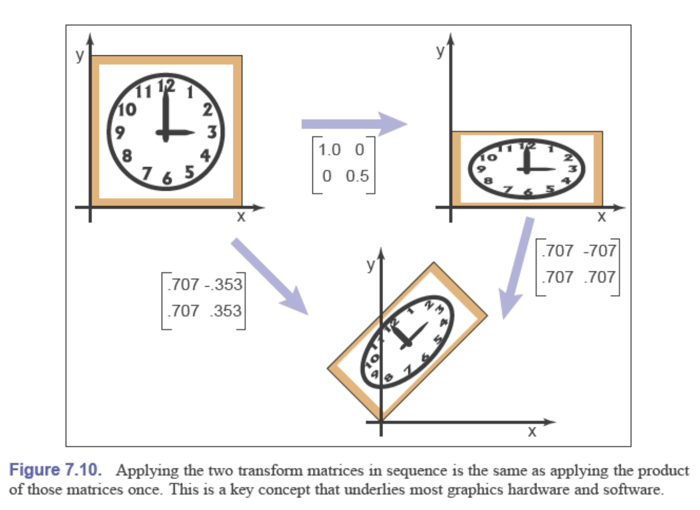
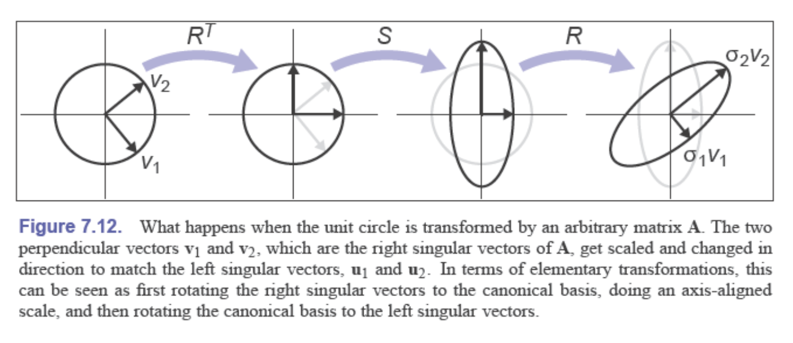
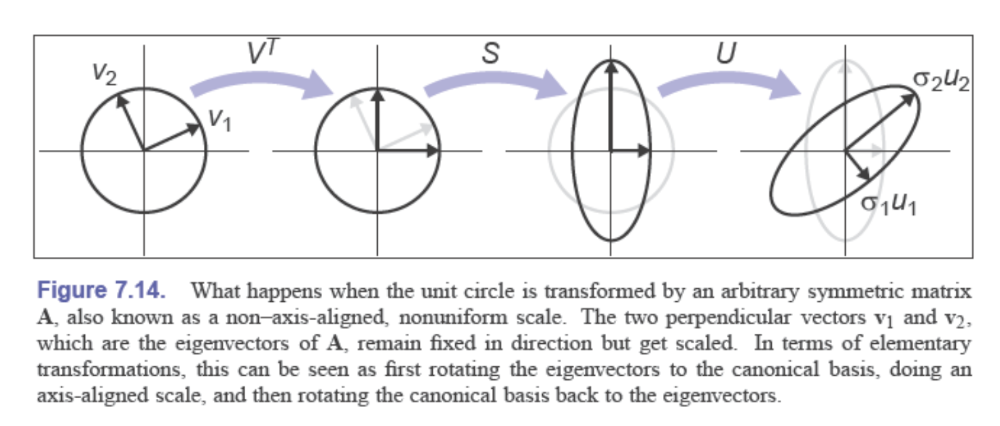
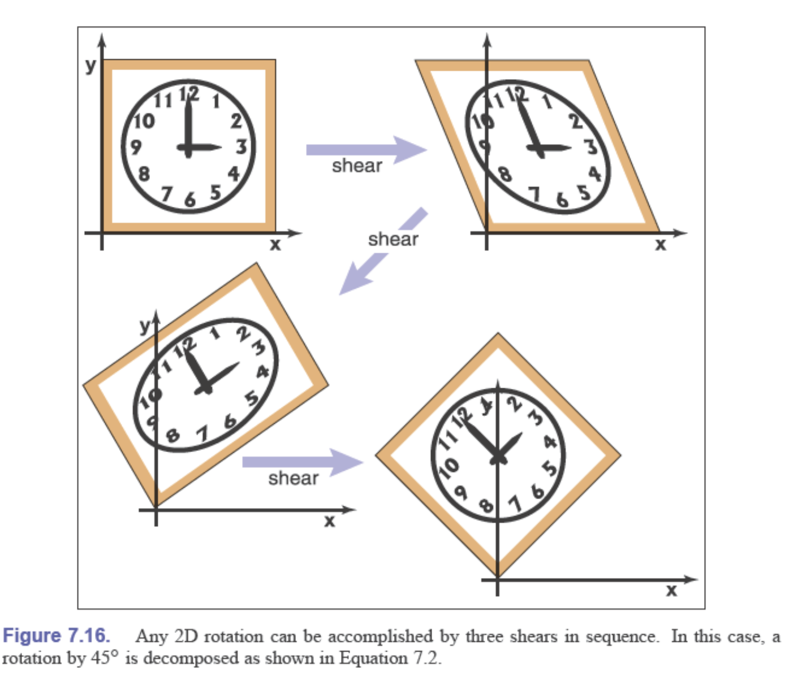
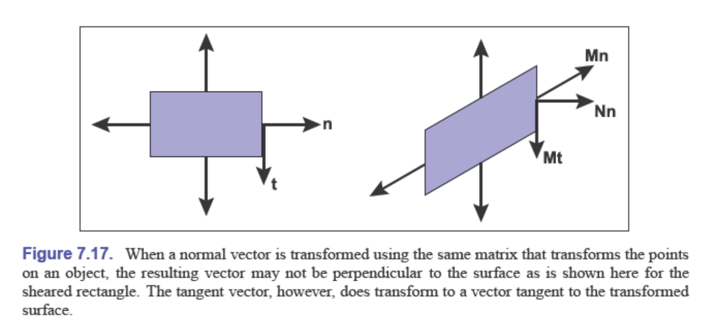
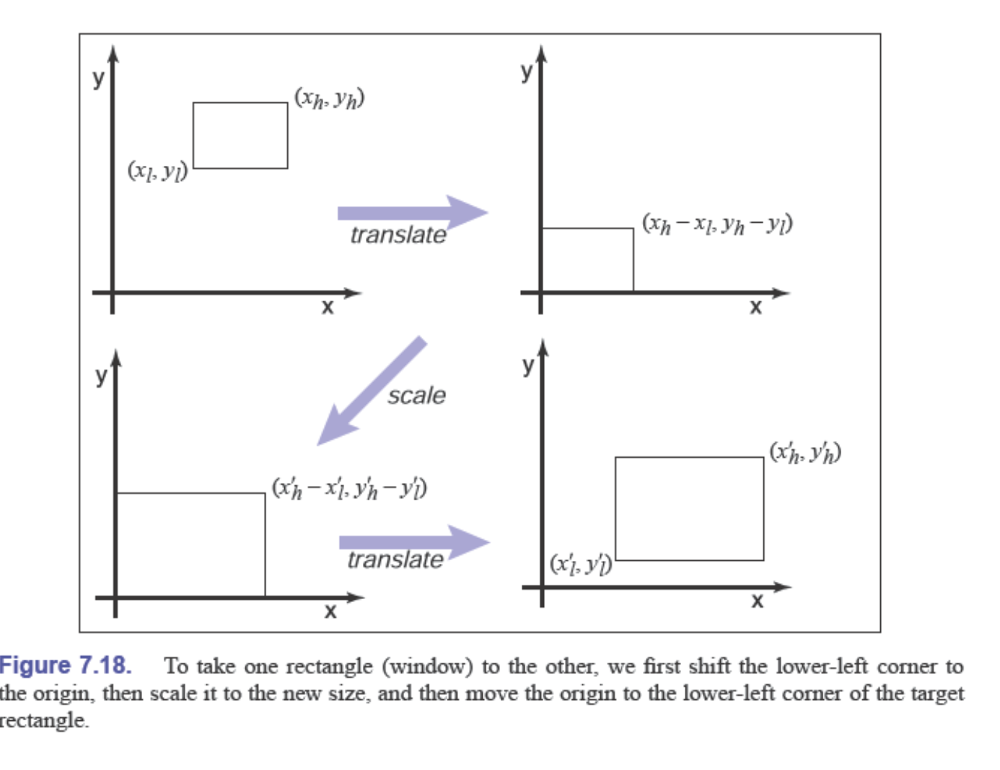
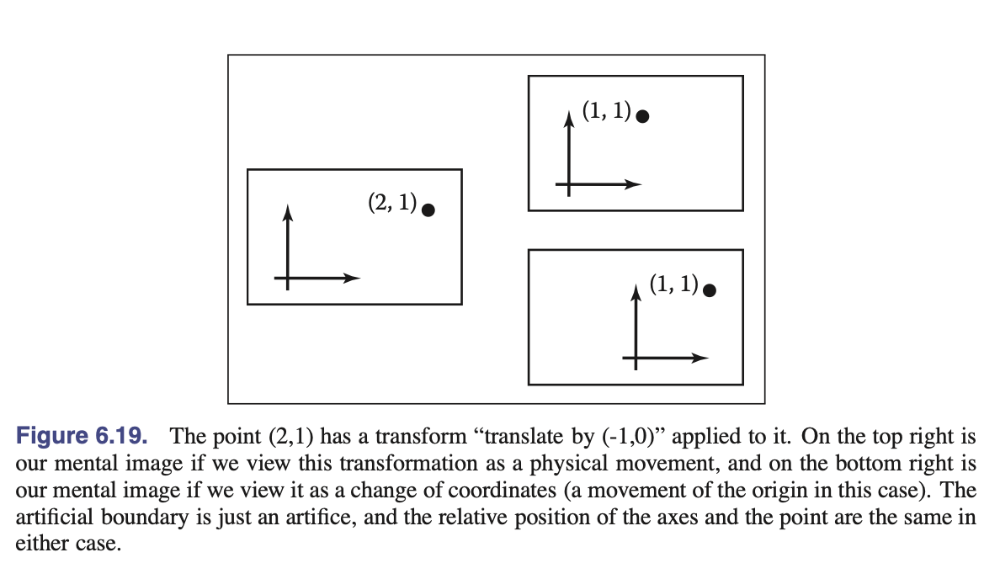
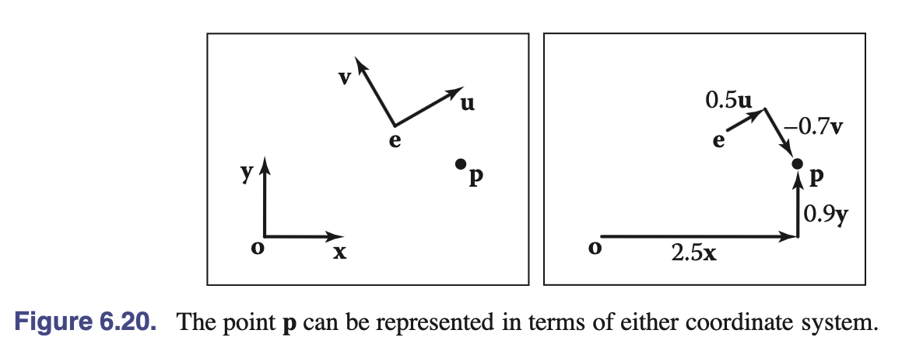

# 7. 变换矩阵

线性代数的机制可以用来表达在3D场景中排列对象、用摄像机观察它们并将它们显示到屏幕上所需的许多操作。几何变换，如旋转、平移、缩放和投影，都可以通过矩阵乘法来实现，而用于执行这些操作的变换矩阵正是本章的主题。
我们将展示当点被表示为从原点出发的偏移向量时，点集是如何变换的，我们将使用图7.1中显示的时钟作为点集的例子。因此，可以将时钟想象为一堆点，这些点是向量的端点，而这些向量的起点都在原点。我们还讨论这些变换如何对位置（点）、位移向量和表面法向量产生不同的作用。

## 7.1 二维线性变换

我们可以使用一个$2 \times 2$矩阵来改变或变换一个2D向量：

$$\begin{bmatrix}
a_{11} & a_{12} \\
a_{21} & a_{22}
\end{bmatrix}
\begin{bmatrix}
x \\
y
\end{bmatrix} = \begin{bmatrix}
a_{11}x + a_{12}y \\
a_{21}x + a_{22}y
\end{bmatrix}$$

这种操作接收一个二维向量并通过简单的矩阵乘法产生另一个二维向量，这是一个**线性变换**。

通过这个简单的公式，我们可以实现各种有用的变换，这取决于我们在矩阵的元素中放入什么值，这将在以下章节中讨论。对于我们的目的，考虑沿x轴的移动为水平移动，沿y轴的移动为垂直移动。

### 7.1.1 缩放

最基本的变换是沿坐标轴的缩放变换。这种变换可以改变长度，也可能改变方向：
在计算机图形学中，缩放变换是最基础的几何变换之一。沿坐标轴的缩放变换通过缩放矩阵来实现，其数学表达式为：

最基本的变换是沿坐标轴的缩放变换。这种变换可以改变长度，也可能改变方向：

在计算机图形学中，缩放变换是最基础的几何变换之一。沿坐标轴的缩放变换通过缩放矩阵来实现，其数学表达式为：

$$scale(s_{x}, s_{y}) = \begin{bmatrix}
s_x & 0 \\
0 & s_y
\end{bmatrix}$$

注意这个矩阵对具有笛卡尔分量 $(x, y)$ 的向量所产生的作用：

$$\begin{bmatrix}
s_x & 0 \\
0 & s_y
\end{bmatrix} \begin{bmatrix}
x \\
y
\end{bmatrix} = \begin{bmatrix}
s_x x \\
s_y y
\end{bmatrix}$$

因此，仅仅通过观察轴对齐缩放的矩阵，我们就能读出两个缩放因子。

### 7.1.2 切变

切变是一种将物体横向推移的变换，产生的效果类似于用手推一叠纸牌；底部的纸牌保持不动，而越靠近顶部的纸牌移动得越多。水平和垂直切变矩阵为

$$shear-x(s) = \begin{bmatrix}
1 & s \\
0 & 1
\end{bmatrix}, shear-y(s) = \begin{bmatrix}
1 & 0 \\
s & 1
\end{bmatrix}$$

### 7.1.3 旋转

假设我们想要将向量**a**逆时针旋转角度**φ**以得到向量**b**（图7.5）。如果**a**与x轴的夹角为**α**，且其长度为$r = \sqrt{x_a^2 + y_a^2}$，那么我们知道：

$$x_a = r \cos α$$
$$y_a = r \sin α$$

因为**b**是**a**的旋转结果，所以它也具有长度**r**。由于它相对于**a**旋转了角度**φ**，所以**b**与x轴的夹角为**(α + φ)**。使用三角恒等式（第2.3.3节）：

$$\cos(α + φ) = \cos α \cos φ - \sin α \sin φ$$
$$\sin(α + φ) = \sin α \cos φ + \cos α \sin φ$$

我们可以得到：

$$x_b = r \cos(α + φ) = r(\cos α \cos φ - \sin α \sin φ)$$
$$y_b = r \sin(α + φ) = r(\sin α \cos φ + \cos α \sin φ)$$

由于$x_a = r \cos α$和$y_a = r \sin α$，我们可以将上式重写为：

$$x_b = x_a \cos φ - y_a \sin φ$$
$$y_b = x_a \sin φ + y_a \cos φ$$

这就给出了二维旋转变换的基本公式：

$$rotate(φ) = \begin{bmatrix}
\cos φ & -\sin φ \\
\sin φ & \cos φ
\end{bmatrix}$$

### 7.1.4 反射

我们可以通过使用带有一个负缩放因子的缩放变换来实现向量在坐标轴上的反射（见图7.8和图7.9）：

**沿y轴反射**（即相对于y轴镜像）：
$$\text{reflect-y} = \begin{pmatrix} -1 & 0 \\ 0 & 1 \end{pmatrix}$$

**沿x轴反射**（即相对于x轴镜像）：
$$\text{reflect-x} = \begin{pmatrix} 1 & 0 \\ 0 & -1 \end{pmatrix}$$

这些反射变换的工作原理：

1. **沿y轴反射**：将x坐标取负值，y坐标保持不变
   - $(x, y) \rightarrow (-x, y)$

2. **沿x轴反射**：将y坐标取负值，x坐标保持不变
   - $(x, y) \rightarrow (x, -y)$

需要注意的是，反射变换实际上是一种特殊的缩放变换，其中一个轴的缩放因子为-1。这种变换会改变坐标系的手性（从右手系变为左手系，或反之）。

虽然人们可能会认为对角线上两个元素都为-1的矩阵也是反射变换，但实际上它只是一个旋转**π弧度**（即180°）的旋转变换。

$$\begin{pmatrix} -1 & 0 \\ 0 & -1 \end{pmatrix}$$

我们可以通过旋转矩阵来验证这一点：

$$\mathbf{R}(π) = \begin{pmatrix} \cos π & -\sin π \\ \sin π & \cos π \end{pmatrix} = \begin{pmatrix} -1 & 0 \\ 0 & -1 \end{pmatrix}$$

这个变换将点$(x, y)$映射为$(-x, -y)$，这相当于绕原点旋转180°，而不是反射。

**关键区别**：
- **反射变换**会改变坐标系的手性（行列式为-1）
- **旋转变换**保持坐标系的手性（行列式为+1）

对于上述矩阵：
$$\det\begin{pmatrix} -1 & 0 \\ 0 & -1 \end{pmatrix} = (-1) \times (-1) = 1$$

行列式为正，说明这是一个保持定向的变换（旋转），而不是改变定向的变换（反射）。

### 7.1.5 变换的组合

在图形程序中，通常需要对一个对象应用多个变换。例如，我们可能希望先应用缩放变换$S$，然后应用旋转变换$R$。对于二维向量$\vec{v_1}$，这需要分两步进行：

首先，$\mathbf{v_2} = \mathbf{S}\vec{v_1}$，然后，$\mathbf{v_3} = \mathbf{R}\vec{v_2}$。

另一种表示方法是：
$$\vec{v_3} = \mathbf{R}(\mathbf{S}\vec{v_1})$$

由于矩阵乘法具有结合律，我们也可以写成：
$$\vec{v_3} = (\mathbf{R}\mathbf{S})\vec{v_1}$$

换句话说，我们可以用一个相同尺寸的单一矩阵来表示对向量依次应用两个矩阵变换的效果，这个矩阵可以通过将两个矩阵相乘得到：$\mathbf{M} = \mathbf{R}\mathbf{S}$（图7.10）。

**非常重要的一点是要记住，这些变换是从右侧开始依次应用的。因此矩阵 $M = RS$ 首先应用 $S$，然后应用 $R$。**

这个顺序规则来源于矩阵乘法的性质：当我们写 $RS\vec{v}$ 时，根据结合律，这等价于 $R(S\vec{v})$，意味着先对向量 $\vec{v}$ 应用变换 $S$，再对结果应用变换 $R$。

### 7.1.6 变换的分解

有时候，需要"撤销"变换的组合，将一个变换分解为更简单的部分。例如，通常需要向用户呈现一个变换以便操作，这时最好将其表示为独立的旋转和缩放因子，但变换在内部可能只是简单地表示为一个矩阵，其中旋转和缩放已经混合在一起。如果矩阵可以通过计算分解为所需的部分，调整这些部分，然后通过将部分重新相乘来重新组装矩阵，那么就可以实现这种操作。

事实证明，无论矩阵中的条目如何，这种分解或因式分解都是可能的——这一事实为思考变换及其对被变换几何体的作用提供了一种富有成效的方式。

#### 对称特征值分解

让我们从对称矩阵开始。回顾第6.4节，对称矩阵总是可以使用特征值分解拆分为以下形式的乘积：

$$\mathbf{A} = \mathbf{R}\mathbf{S}\mathbf{R}^T$$

其中$\mathbf{R}$是正交矩阵，$\mathbf{S}$是对角矩阵；我们将$\mathbf{R}$的列（特征向量）称为$\vec{v_1}$和$\vec{v_2}$，将$\mathbf{S}$的对角元素（特征值）称为$\lambda_1$和$\lambda_2$。

从几何角度来看，我们现在可以将$\mathbf{R}$识别为旋转变换，将$\mathbf{S}$识别为缩放变换，因此这只是一个多步骤的几何变换（图7.12）：

1. 将$\vec{v_1}$和$\vec{v_2}$旋转到$x$轴和$y$轴（通过$\mathbf{R}^T$变换）
2. 在$x$和$y$方向上分别缩放$(\lambda_1, \lambda_2)$（通过$\mathbf{S}$变换）
3. 将$x$轴和$y$轴旋转回$\vec{v_1}$和$\vec{v_2}$（通过$\mathbf{R}$变换）

观察这三个变换的综合效果，我们可以看到它们的作用等同于沿一对轴进行非均匀缩放。与轴对齐缩放一样，这些轴是垂直的，但它们不是坐标轴；相反，它们是$\mathbf{A}$的特征向量。这告诉我们对称矩阵意味着什么：**对称矩阵仅仅是缩放操作——尽管可能是非均匀的和非轴对齐的缩放**。

#### 奇异值分解

对于非对称矩阵，也可以进行非常相似的分解：这就是奇异值分解（SVD），在第6.4.1节中也有讨论。不同之处在于对角矩阵两侧的矩阵不再相同：

$$\mathbf{A} = \mathbf{U}\mathbf{S}\mathbf{V}^T$$

替代单一旋转$\mathbf{R}$的两个正交矩阵称为$\mathbf{U}$和$\mathbf{V}$，它们的列分别称为$\vec{u_i}$（左奇异向量）和$\vec{v_i}$（右奇异向量）。在这种情况下，$\mathbf{S}$的对角元素称为奇异值而不是特征值。几何解释与对称特征值分解非常相似（图7.14）：

1. 将$\vec{v_1}$和$\vec{v_2}$旋转到$x$轴和$y$轴（通过$\mathbf{V}^T$变换）
2. 在$x$和$y$方向上分别缩放$(\sigma_1, \sigma_2)$（通过$\mathbf{S}$变换）
3. 将$x$轴和$y$轴旋转到$\vec{u_1}$和$\vec{u_2}$（通过$\mathbf{U}$变换）

主要区别在于用两个不同的正交矩阵代替了单一旋转。这种差异导致了另一个不太重要的区别。由于SVD在两侧具有不同的奇异向量，因此不需要负奇异值：我们总是可以翻转奇异值的符号，反转相关奇异向量之一的方向，最终得到相同的变换。因此，SVD总是产生一个对角线元素全为正的对角矩阵，但矩阵$\mathbf{U}$和$\mathbf{V}$不能保证是旋转——它们也可能包含反射。

在图形学等几何应用中，这是一个不便，但是是一个小问题：通过检查行列式很容易区分旋转和反射，旋转的行列式为$+1$，反射的行列式为$-1$。如果需要旋转，可以将其中一个奇异值取负，从而得到旋转-缩放-旋转序列，其中反射与缩放结合，而不是与其中一个旋转结合。

#### Paeth旋转分解

另一种分解使用切变来表示非零旋转(Paeth, 1990)。以下恒等式使这成为可能：

$$\begin{bmatrix} \cos\theta & -\sin\theta \\ \sin\theta & \cos\theta \end{bmatrix} = \begin{bmatrix} 1 & \frac{\cos\theta - 1}{\sin\theta} \\ 0 & 1 \end{bmatrix} \begin{bmatrix} 1 & 0 \\ \sin\theta & 1 \end{bmatrix} \begin{bmatrix} 1 & \frac{\cos\theta - 1}{\sin\theta} \\ 0 & 1 \end{bmatrix}$$

这种特殊的变换对栅格旋转很有用，因为剪切对图像来说是一种非常高效的栅格操作；它会引入一些锯齿，但不会留下空洞。关键观察是，如果我们取一个栅格位置$(i, j)$并对其应用水平剪切，我们得到：

$$\begin{bmatrix}
1 & s \\
0 & 1
\end{bmatrix} \begin{bmatrix}
i \\
j
\end{bmatrix} = \begin{bmatrix}
i + sj \\
j
\end{bmatrix}$$

如果我们将$sj$舍入到最近的整数，这相当于取图像中的每一行并将其横向移动某个量——每一行的移动量都不同。因为在一行内位移是相同的，这使我们能够在结果图像中没有间隙的情况下进行旋转。类似的操作对垂直剪切也有效。因此，我们可以轻松实现简单的栅格旋转。

## 7.2 三维线性变换

三维线性变换是二维线性变换的拓展。举个例子，一个沿着笛卡尔坐标轴的缩放变换可以通过以下矩阵来实现：

$$scale(s_x, s_y, s_z) = \begin{bmatrix}
s_x & 0 & 0 \\
0 & s_y & 0 \\
0 & 0 & s_z
\end{bmatrix}$$

三维旋转比二维旋转要复杂得多，因为有更多可能的旋转轴。然而，如果我们只是想绕$z$轴旋转，这只会改变$x$坐标和$y$坐标，我们可以使用二维旋转矩阵，对$z$不进行任何操作：

$$\text{rotate-z}(\phi) = \begin{bmatrix}
\cos\phi & -\sin\phi & 0 \\
\sin\phi & \cos\phi & 0 \\
0 & 0 & 1
\end{bmatrix}$$

同样地，我们可以构造绕$x$轴和$y$轴旋转的矩阵：

$$\text{rotate-x}(\phi) = \begin{bmatrix}
1 & 0 & 0 \\
0 & \cos\phi & -\sin\phi \\
0 & \sin\phi & \cos\phi
\end{bmatrix}$$

$$\text{rotate-y}(\phi) = \begin{bmatrix}
\cos\phi & 0 & \sin\phi \\
0 & 1 & 0 \\
-\sin\phi & 0 & \cos\phi
\end{bmatrix}$$

我们将在下一节中讨论绕任意轴的旋转。

与二维情况一样，我们可以沿特定轴进行切变，例如：

$$\text{shear-x}(d_y, d_z) = \begin{bmatrix}
1 & d_y & d_z \\
0 & 1 & 0 \\
0 & 0 & 1
\end{bmatrix}$$

与二维变换一样，任何三维变换矩阵都可以使用SVD分解为一个旋转、缩放和另一个旋转。任何对称的三维矩阵都有特征值分解，可以分解为旋转、缩放和逆旋转。最后，三维旋转可以分解为三维切变矩阵的乘积。

### 7.2.1 任意三维旋转

与二维情况一样，三维旋转是正交矩阵。从几何角度来说，这意味着矩阵的三行是三个相互正交的单位向量的笛卡尔坐标，如第2.4.5节所讨论的。列也是三个（可能不同的）相互正交的单位向量。这样的旋转矩阵有无穷多个。让我们写出这样一个矩阵：

$$\mathbf{R}_{uvw} = \begin{bmatrix}
x_u & y_u & z_u \\
x_v & y_v & z_v \\
x_w & y_w & z_w
\end{bmatrix}$$

这里，$\mathbf{u} = x_u\mathbf{x} + y_u\mathbf{y} + z_u\mathbf{z}$，对于$\mathbf{v}$和$\mathbf{w}$也是如此。由于这三个向量是标准正交的，我们知道：

$$\mathbf{u} \cdot \mathbf{u} = \mathbf{v} \cdot \mathbf{v} = \mathbf{w} \cdot \mathbf{w} = 1$$

$$\mathbf{u} \cdot \mathbf{v} = \mathbf{v} \cdot \mathbf{w} = \mathbf{w} \cdot \mathbf{u} = 0$$

我们可以通过将旋转矩阵应用于向量$\mathbf{u}$、$\mathbf{v}$和$\mathbf{w}$来推断旋转矩阵的一些行为。例如：

$$\mathbf{R}_{uvw}\mathbf{u} = \begin{bmatrix}
x_u & y_u & z_u \\
x_v & y_v & z_v \\
x_w & y_w & z_w
\end{bmatrix}
\begin{bmatrix}
x_u \\
y_u \\
z_u
\end{bmatrix} = \begin{bmatrix}
x_u x_u + y_u y_u + z_u z_u \\
x_v x_u + y_v y_u + z_v z_u \\
x_w x_u + y_w y_u + z_w z_u
\end{bmatrix}$$

注意$\mathbf{R}_{uvw}\mathbf{u}$的这三行都是点积：

$$\mathbf{R}_{uvw}\mathbf{u} = \begin{bmatrix}
\mathbf{u} \cdot \mathbf{u} \\
\mathbf{v} \cdot \mathbf{u} \\
\mathbf{w} \cdot \mathbf{u}
\end{bmatrix} = \begin{bmatrix}
1 \\
0 \\
0
\end{bmatrix} = \mathbf{x}$$

同样地，$\mathbf{R}_{uvw}\mathbf{v} = \mathbf{y}$，$\mathbf{R}_{uvw}\mathbf{w} = \mathbf{z}$。因此$\mathbf{R}_{uvw}$通过旋转将基底$uvw$转换为相应的笛卡尔坐标轴。

如果$\mathbf{R}_{uvw}$是具有标准正交行的旋转矩阵，那么$\mathbf{R}_{uvw}^T$也是具有标准正交列的旋转矩阵，实际上是$\mathbf{R}_{uvw}$的逆矩阵（正交矩阵的逆矩阵总是其转置矩阵）。一个重要点是，对于变换矩阵，代数逆也是几何逆。因此，如果$\mathbf{R}_{uvw}$将$\mathbf{u}$转换为$\mathbf{x}$，那么$\mathbf{R}_{uvw}^T$将$\mathbf{x}$转换为$\mathbf{u}$。对于$\mathbf{v}$和$\mathbf{y}$也应该如此，我们可以验证：

$$\mathbf{R}_{uvw}^T\mathbf{y} = \begin{bmatrix}
x_u & x_v & x_w \\
y_u & y_v & y_w \\
z_u & z_v & z_w
\end{bmatrix}
\begin{bmatrix}
0 \\
1 \\
0
\end{bmatrix} = \begin{bmatrix}
x_v \\
y_v \\
z_v
\end{bmatrix} = \mathbf{v}$$

因此，我们总是可以从标准正交基构造旋转矩阵。

如果我们希望绕任意向量$\mathbf{a}$旋转，我们可以形成一个以$\mathbf{w} = \mathbf{a}$为基的标准正交基，将该基旋转到标准基$xyz$，绕z轴旋转，然后将标准基旋转回$uvw$基。在矩阵形式中，绕$\mathbf{w}$轴旋转角度$\phi$：

$$\begin{bmatrix}
x_u & x_v & x_w \\
y_u & y_v & y_w \\
z_u & z_v & z_w
\end{bmatrix}
\begin{bmatrix}
\cos\phi & -\sin\phi & 0 \\
\sin\phi & \cos\phi & 0 \\
0 & 0 & 1
\end{bmatrix}
\begin{bmatrix}
x_u & y_u & z_u \\
x_v & y_v & z_v \\
x_w & y_w & z_w
\end{bmatrix}$$

这里，我们有$\mathbf{w}$是$\mathbf{a}$方向上的单位向量（即$\mathbf{a}$除以其自身长度）。但是$\mathbf{u}$和$\mathbf{v}$是什么呢？第2.4.6节给出了寻找合适的$\mathbf{u}$和$\mathbf{v}$的方法。

如果我们有一个旋转矩阵，并且希望将旋转表示为轴-角形式，我们可以计算其唯一的实特征值（为$\lambda = 1$），相应的特征向量就是旋转轴。这是唯一不被旋转改变的轴。

参见第16章，了解除旋转矩阵外几种最常用的旋转表示方法的比较。

### 7.2.2 法向量的变换

虽然我们使用的大多数三维向量表示位置（从原点出发的偏移向量）或方向（例如光的来源方向），但有些向量表示表面法线。表面法向量垂直于表面的切平面。当底层表面发生变换时，这些法线不会按我们期望的方式进行变换。例如，如果表面的点通过矩阵$\mathbf{M}$进行变换，与表面相切且乘以$\mathbf{M}$的向量$\mathbf{t}$将与变换后的表面相切。然而，通过$\mathbf{M}$变换的表面法向量$\mathbf{n}$可能不再垂直于变换后的表面（图6.17）。

我们可以推导出一个变换矩阵$\mathbf{N}$，它能将$\mathbf{n}$转换为垂直于变换后表面的向量。解决这个问题的一种方法是注意到表面法向量和切向量是垂直的，所以它们的点积为零，这可以用矩阵形式表示为：

$$\mathbf{n}^T\mathbf{t} = 0$$

如果我们将期望的变换后向量表示为$\mathbf{t}_M = \mathbf{M}\mathbf{t}$和$\mathbf{n}_N = \mathbf{N}\mathbf{n}$，我们的目标是找到$\mathbf{N}$，使得$\mathbf{n}_N^T\mathbf{t}_M = 0$。我们可以通过一些代数技巧来找到$\mathbf{N}$。

首先，我们可以在点积中巧妙地引入单位矩阵，然后利用$\mathbf{M}^{-1}\mathbf{M} = \mathbf{I}$：

$$\mathbf{n}^T\mathbf{t} = \mathbf{n}^T\mathbf{I}\mathbf{t} = \mathbf{n}^T\mathbf{M}^{-1}\mathbf{M}\mathbf{t} = 0$$

虽然上述操作看起来没有明显的进展，但请注意我们可以添加括号，使上述表达式更明显地表示为点积：

$$(\mathbf{n}^T\mathbf{M}^{-1})(\mathbf{M}\mathbf{t}) = (\mathbf{n}^T\mathbf{M}^{-1})\mathbf{t}_M = 0$$

这意味着与$\mathbf{t}_M$垂直的行向量就是上述表达式的左半部分。该表达式对切平面中的任何切向量都成立。由于在三维空间中只有一个方向（及其相反方向）垂直于所有这些切向量，我们知道上述表达式的左半部分必须是$\mathbf{n}_N$的行向量表达式；即它就是$\mathbf{n}_N^T$，因此我们可以推断出$\mathbf{N}$：

$$\mathbf{n}_N^T = \mathbf{n}^T\mathbf{M}^{-1}$$

所以我们可以对此取转置得到：

$$\mathbf{n}_N = (\mathbf{n}^T\mathbf{M}^{-1})^T = (\mathbf{M}^{-1})^T\mathbf{n} \quad (7.5)$$

因此，我们可以看出正确变换法向量使其保持法线性质的矩阵是$\mathbf{N} = (\mathbf{M}^{-1})^T$，即逆矩阵的转置。

由于这个矩阵可能会改变$\mathbf{n}$的长度，我们可以将其乘以任意标量，它仍然会产生方向正确的$\mathbf{n}_N$。回顾第6.3节，矩阵的逆等于伴随矩阵的转置除以行列式。因为我们不关心法向量的长度，我们可以跳过除法运算，对于$3 \times 3$矩阵，我们发现：

$$\mathbf{N} = \begin{bmatrix}
m_{11}^{c} & m_{12}^{c} & m_{13}^{c} \\
m_{21}^{c} & m_{22}^{c} & m_{23}^{c} \\
m_{31}^{c} & m_{32}^{c} & m_{33}^{c}
\end{bmatrix}$$

这里假设$\mathbf{M}$中第$i$行第$j$列的元素是$m_{ij}$。所以$\mathbf{N}$的完整表达式为：

$$\mathbf{N} = \begin{bmatrix}
m_{22}m_{33}-m_{23}m_{32} & m_{23}m_{31}-m_{21}m_{33} & m_{21}m_{32}-m_{22}m_{31} \\
m_{13}m_{32}-m_{12}m_{33} & m_{11}m_{33}-m_{13}m_{31} & m_{12}m_{31}-m_{11}m_{32} \\
m_{12}m_{23}-m_{13}m_{22} & m_{13}m_{21}-m_{11}m_{23} & m_{11}m_{22}-m_{12}m_{21}
\end{bmatrix}$$

## 7.3 平移和仿射变换

我们一直在研究使用矩阵$\mathbf{M}$改变向量的方法。在二维情况下，这些变换具有以下形式：

$$\begin{aligned}
x' &= m_{11}x + m_{12}y \\
y' &= m_{21}x + m_{22}y
\end{aligned}$$

我们无法使用此类变换来移动物体，只能对其进行缩放和旋转。特别地，原点$(0,0)$在线性变换下总是保持固定。要移动或平移一个物体——通过对所有点进行相同量的偏移，我们需要如下形式的变换：

$$\begin{aligned}
x' &= x + x_t \\
y' &= y + y_t
\end{aligned}$$

通过将$(x,y)$乘以$2 \times 2$矩阵是无法实现这种变换的。向线性变换系统添加平移的一种可能方法是简单地将一个单独的平移向量与每个变换矩阵相关联，让矩阵处理缩放和旋转，让向量处理平移。这完全可行，但记账工作很麻烦，而且两个变换的复合规则不如线性变换那样简单和干净。

相反，我们可以使用一个巧妙的技巧，让单个矩阵乘法同时完成这两个操作。这个想法很简单：用三维向量$[x \quad y \quad 1]^T$表示点$(x,y)$，并使用如下形式的$3 \times 3$矩阵：

$$\begin{bmatrix}
m_{11} & m_{12} & x_t \\
m_{21} & m_{22} & y_t \\
0 & 0 & 1
\end{bmatrix}$$

固定的第三行用于将1复制到变换后的向量中，使所有向量的最后一位都是1，前两行将$x'$和$y'$计算为$x$、$y$和1的线性组合：

$$\begin{bmatrix}
x' \\
y' \\
1
\end{bmatrix} = \begin{bmatrix}
m_{11} & m_{12} & x_t \\
m_{21} & m_{22} & y_t \\
0 & 0 & 1
\end{bmatrix}
\begin{bmatrix}
x \\
y \\
1
\end{bmatrix} = \begin{bmatrix}
m_{11}x + m_{12}y + x_t \\
m_{21}x + m_{22}y + y_t \\
1
\end{bmatrix}$$

单个矩阵实现了线性变换后跟平移的组合！这种变换称为仿射变换（affine transformation），这种通过添加额外维度来实现仿射变换的方法称为齐次坐标（homogeneous coordinates）（Roberts, 1965; Riesenfeld, 1981; Penna & Patterson, 1986）。齐次坐标不仅简化了变换的代码，但这种方案还使得如何复合两个仿射变换变得显而易见：只需将矩阵相乘即可。

当我们需要变换不代表位置的向量时——它们表示方向或位置间的偏移量——这种新形式就会出现问题。当我们对物体进行平移时，表示方向或偏移量的向量应该保持不变。幸运的是，我们可以通过将第三个坐标设置为零来实现这一点：

$$\begin{bmatrix}
1 & 0 & x_t \\
0 & 1 & y_t \\
0 & 0 & 1
\end{bmatrix}
\begin{bmatrix}
x \\
y \\
0
\end{bmatrix} =
\begin{bmatrix}
x \\
y \\
0
\end{bmatrix}$$

如果矩阵的左上角$2 \times 2$项中存在缩放/旋转变换，它将作用于向量，但平移仍然与零相乘而被忽略。此外，零被复制到变换后的向量中，所以方向向量在变换后仍然是方向向量。

这正是我们对向量所期望的行为，因此它们能够顺利融入系统：额外的（第三个）坐标将是1或0，取决于我们编码的是位置还是方向。我们确实需要存储齐次坐标，这样我们就能区分位置和其他向量。例如：

$$\begin{bmatrix} 3 \\ 2 \\ 1 \end{bmatrix} \text{是一个位置，而} \begin{bmatrix} 3 \\ 2 \\ 0 \end{bmatrix} \text{是一个位移或方向。}$$

稍后，当我们进行透视观察时，我们会看到允许齐次坐标取1或0以外的值是有用的。

齐次坐标几乎普遍用于图形系统中表示变换。特别地，齐次坐标是图形硬件中实现的渲染器设计和操作的基础。我们将在第8章中看到，齐次坐标也使得透视绘制场景变得容易，这是它们受欢迎的另一个原因。

齐次坐标可以被视为处理平移变换记录的一种巧妙方法，但它还有另一种不同的几何解释。关键观察是，当我们基于z坐标进行3D切变变换时，我们得到这样的变换：

$$\begin{bmatrix}
1 & 0 & y_t \\
0 & 1 & x_t \\
0 & 0 & 1
\end{bmatrix}
\begin{bmatrix}
x \\
y \\
z
\end{bmatrix} =
\begin{bmatrix}
x + y_t z \\
y + x_t z \\
z
\end{bmatrix}$$

注意，这在x和y方向上几乎具有我们想要的2D平移形式，但有一个z坐标存在，而它在2D中没有意义。现在关键决策来了：我们将为所有2D位置添加一个坐标z = 1。这给我们：

$$\begin{bmatrix}
1 & 0 & y_t \\
0 & 1 & x_t \\
0 & 0 & 1
\end{bmatrix}
\begin{bmatrix}
x \\
y \\
1
\end{bmatrix} =
\begin{bmatrix}
x + y_t \\
y + x_t \\
1
\end{bmatrix}$$

通过为所有2D点关联一个$(z = 1)$坐标，我们现在可以将平移编码为矩阵形式。例如，要先在2D中平移$(x_t, y_t)$，然后旋转角度$\phi$，我们将使用矩阵：

$$M = \begin{bmatrix}
\cos\phi & -\sin\phi & 0 \\
\sin\phi & \cos\phi & 0 \\
0 & 0 & 1
\end{bmatrix}
\begin{bmatrix}
1 & 0 & x_t \\
0 & 1 & y_t \\
0 & 0 & 1
\end{bmatrix}$$

注意，2D旋转矩阵现在是$3 \times 3$的，在"平移位置"有零值。

通过这种使用沿$z = 1$的错切来编码平移的形式化方法，我们可以将任意数量的2D错切、2D旋转和2D平移表示为一个复合的3D矩阵。该矩阵的底行将始终是$(0,0,1)$，所以我们实际上不必存储它。我们只需要记住当两个矩阵相乘时它就在那里。

在3D中，同样的技术也适用：我们可以添加第四个坐标，即齐次坐标，然后我们得到平移：

$$\begin{bmatrix}
1 & 0 & 0 & x_t \\
0 & 1 & 0 & y_t \\
0 & 0 & 1 & z_t \\
0 & 0 & 0 & 1
\end{bmatrix}
\begin{bmatrix}
x \\
y \\
z \\
1
\end{bmatrix} =
\begin{bmatrix}
x + x_t \\
y + y_t \\
z + z_t \\
1
\end{bmatrix}$$

同样，对于方向向量，第四个坐标是零，因此该向量不受平移影响。

**例16（窗口变换）** 在图形学中，我们经常需要创建一个变换矩阵，将矩形$[x_l, x_h] \times [y_l, y_h]$中的点变换到矩形$[x'_l, x'_h] \times [y'_l, y'_h]$中。这可以通过一个缩放和一个平移的序列来完成。然而，从三个操作的序列来创建变换更加直观（图7.18）：

1. 将点$(x_l, y_l)$移动到原点。
2. 将矩形缩放到与目标矩形相同的大小。
3. 将原点移动到点$(x'_l, y'_l)$。

记住右侧的矩阵首先被应用，我们可以写成：

$$\text{window} = \text{translate}(x'_l, y'_l) \cdot \text{scale}\left(\frac{x'_h - x'_l}{x_h - x_l}, \frac{y'_h - y'_l}{y_h - y_l}\right) \cdot \text{translate}(-x_l, -y_l)$$

$$= \begin{bmatrix}
1 & 0 & x'_l \\
0 & 1 & y'_l \\
0 & 0 & 1
\end{bmatrix}
\begin{bmatrix}
\frac{x'_h - x'_l}{x_h - x_l} & 0 & 0 \\
0 & \frac{y'_h - y'_l}{y_h - y_l} & 0 \\
0 & 0 & 1
\end{bmatrix}
\begin{bmatrix}
1 & 0 & -x_l \\
0 & 1 & -y_l \\
0 & 0 & 1
\end{bmatrix}$$

$$= \begin{bmatrix}
\frac{x'_h - x'_l}{x_h - x_l} & 0 & \frac{x'_l x_h - x'_h x_l}{x_h - x_l} \\
0 & \frac{y'_h - y'_l}{y_h - y_l} & \frac{y'_l y_h - y'_h y_l}{y_h - y_l} \\
0 & 0 & 1
\end{bmatrix}. \quad (6.6)$$

对于一些读者来说，得到的矩阵具有这样的形式也许并不令人惊讶，但通过三个矩阵的构造过程让我们对结果的正确性毫无疑虑。

完全类似的构造可以用来定义3D窗口变换，它将盒子$[x_l, x_h] \times [y_l, y_h] \times [z_l, z_h]$映射到盒子$[x'_l, x'_h] \times [y'_l, y'_h] \times [z'_l, z'_h]$：

$$\begin{bmatrix}
\frac{x'_h - x'_l}{x_h - x_l} & 0 & 0 & \frac{x'_l x_h - x'_h x_l}{x_h - x_l} \\
0 & \frac{y'_h - y'_l}{y_h - y_l} & 0 & \frac{y'_l y_h - y'_h y_l}{y_h - y_l} \\
0 & 0 & \frac{z'_h - z'_l}{z_h - z_l} & \frac{z'_l z_h - z'_h z_l}{z_h - z_l} \\
0 & 0 & 0 & 1
\end{bmatrix}$$

有趣的是，如果我们将一个由缩放、剪切和旋转组成的任意矩阵与一个简单的平移相乘（平移在后），我们得到：

$$\begin{bmatrix}
1 & 0 & 0 & x_t \\
0 & 1 & 0 & y_t \\
0 & 0 & 1 & z_t \\
0 & 0 & 0 & 1
\end{bmatrix}
\begin{bmatrix}
a_{11} & a_{12} & a_{13} & 0 \\
a_{21} & a_{22} & a_{23} & 0 \\
a_{31} & a_{32} & a_{33} & 0 \\
0 & 0 & 0 & 1
\end{bmatrix} =
\begin{bmatrix}
a_{11} & a_{12} & a_{13} & x_t \\
a_{21} & a_{22} & a_{23} & y_t \\
a_{31} & a_{32} & a_{33} & z_t \\
0 & 0 & 0 & 1
\end{bmatrix}$$

因此，我们可以观察任何矩阵，并将其看作由缩放/旋转部分和平移部分组成，因为这些分量彼此很好地分离开来。

一类重要的变换是**刚体变换**。这些变换仅由平移和旋转组成，因此对物体没有拉伸或收缩。这样的变换在上面的$a_{ij}$部分将具有纯旋转。

## 7.4 变换矩阵的逆矩阵

虽然我们总是可以用代数方法求矩阵的逆，但如果我们知道变换的作用，我们可以利用几何知识。例如，$\text{scale}(s_x, s_y, s_z)$的逆是$\text{scale}(1/s_x, 1/s_y, 1/s_z)$。旋转的逆是相同旋转但角度符号相反。平移的逆是反方向的平移。如果我们有一系列矩阵$\mathbf{M} = \mathbf{M}_1\mathbf{M}_2\cdots\mathbf{M}_n$，那么

$$\mathbf{M}^{-1} = \mathbf{M}_n^{-1}\cdots\mathbf{M}_2^{-1}\mathbf{M}_1^{-1}$$

同时，某些类型的变换矩阵很容易求逆。我们已经提到了缩放，它们是对角矩阵；第二个重要例子是旋转，它们是正交矩阵。回想一下（第6.2.4节），正交矩阵的逆是它的转置。这使得求旋转和刚体变换的逆变得容易（见习题6）。另外，知道底行为$[0\ 0\ 0\ 1]$的矩阵的逆也在底行有$[0\ 0\ 0\ 1]$是有用的（见习题7）。

有趣的是，我们也可以使用SVD来求矩阵的逆。由于我们知道任何矩阵都可以分解为一个旋转乘以一个缩放再乘以一个旋转，求逆就很直接了。例如，在3D中我们有

$$\mathbf{M} = \mathbf{R}_1 \text{scale}(\sigma_1, \sigma_2, \sigma_3) \mathbf{R}_2$$

从上面的规则可以很容易得出

$$\mathbf{M}^{-1} = \mathbf{R}_2^T \text{scale}(1/\sigma_1, 1/\sigma_2, 1/\sigma_3) \mathbf{R}_1^T$$

## 7.5 坐标变换

之前的所有讨论都是基于使用变换矩阵来移动点。我们也可以将它们简单地看作改变点所表示的坐标系。例如，在图7.19中，我们看到了两种可视化移动的方式。在不同的上下文中，任一种解释都可能更合适。

例如，一个驾驶游戏可能有一个城市模型和一个汽车模型。如果玩家看到的是挡风玻璃外的视野，车内的物体总是绘制在屏幕的相同位置，而街道和建筑物在玩家驾驶时显得向后移动。在每一帧中，我们对这些物体应用一个变换，使它们比前一帧更向后移动。理解这个操作的一种方式是简单地认为它移动建筑物向后；另一种方式是认为建筑物保持不动，但我们想要绘制它们的坐标系——附着在汽车上的坐标系——在移动。在第二种解释中，变换改变了城市几何体的坐标，将它们表达为汽车坐标系中的坐标。两种方式将导致完全相同的矩阵应用于汽车外的几何体。

如果游戏还支持俯视视角来显示汽车在城市中的位置，建筑物和街道需要绘制在固定位置，而汽车需要在每一帧之间移动。同样的两种解释适用：我们可以将变化的变换看作将汽车从其规范位置移动到其在世界中的当前位置；或者我们可以将变换看作简单地改变汽车几何体的坐标，这些坐标最初是用附着在汽车上的坐标系表达的，将其转换为用相对于城市固定的坐标系表达。坐标变换解释清楚地表明，在这两种模式中使用的矩阵（城市到汽车坐标变换 vs. 汽车到城市坐标变换）是彼此的逆矩阵。

坐标系变换的概念很像编程中的类型转换概念。在我们将浮点数与整数相加之前，我们需要根据需要将整数转换为浮点数或将浮点数转换为整数，以便类型匹配。在我们能够将城市和汽车一起绘制之前，我们需要根据需要将城市转换为汽车坐标或将汽车转换为城市坐标，以便坐标匹配。

在管理多个坐标系时，容易感到困惑，最终导致物体处于错误的坐标中，导致它们出现在意外的地方。但通过对坐标系之间变换的系统性思考，你可以可靠地得到正确的变换。

在几何上，坐标系或坐标框架由原点和基组成——一组三个向量。正交规范基如此方便，以至于我们通常假设框架是正交规范的，除非另有说明。在具有原点$\mathbf{p}$和基$\{\mathbf{u}, \mathbf{v}, \mathbf{w}\}$的框架中，坐标$(u, v, w)$描述点

$$\mathbf{x} = \mathbf{p} + u\mathbf{u} + v\mathbf{v} + w\mathbf{w}$$

当我们在计算机中存储这些向量时，它们需要用某个坐标系来表示。为了开始，我们必须指定一些规范坐标系，通常称为"全局"或"世界"坐标，用来描述所有其他系统。在城市例子中，我们可能采用街道网格，使用约定x轴沿主街方向，y轴向上，z轴沿中央大道方向。然后当我们用这些坐标写出汽车框架的原点和基时，我们要表达的意思就很清楚了。

在2D中，我们的约定是使用点$\mathbf{o}$作为原点，$\mathbf{x}$和$\mathbf{y}$作为右手正交规范基向量（图7.20）。

另一个坐标系可能有原点$\mathbf{e}$和右手正交规范基向量$\mathbf{u}$和$\mathbf{v}$。注意，通常规范数据$\mathbf{o}$、$\mathbf{x}$和$\mathbf{y}$从不显式存储。它们是所有其他坐标系的参考框架。在那个坐标系中，我们经常将$\mathbf{p}$的位置写成一个有序对，这是完整向量表达式的简写：

$$\mathbf{p} = (x_p, y_p) \equiv \mathbf{o} + x_p\mathbf{x} + y_p\mathbf{y}$$

例如，在图7.20中，$(x_p, y_p) = (2.5, 0.9)$。注意对$(x_p, y_p)$隐含地假设了原点$\mathbf{o}$。同样，我们可以用另一个方程表示$\mathbf{p}$：

$$\mathbf{p} = (u_p, v_p) \equiv \mathbf{e} + u_p\mathbf{u} + v_p\mathbf{v}$$

在图7.20中，这有$(u_p, v_p) = (0.5, -0.7)$。同样，原点$\mathbf{e}$作为与$\mathbf{u}$和$\mathbf{v}$相关联的坐标系的隐含部分被省略。

我们可以使用矩阵机制来表达这种相同的关系，如下：

$$\begin{bmatrix} x_p \\ y_p \\ 1 \end{bmatrix} = \begin{bmatrix} 1 & 0 & x_e \\ 0 & 1 & y_e \\ 0 & 0 & 1 \end{bmatrix} \begin{bmatrix} x_u & x_v & 0 \\ y_u & y_v & 0 \\ 0 & 0 & 1 \end{bmatrix} \begin{bmatrix} u_p \\ v_p \\ 1 \end{bmatrix} = \begin{bmatrix} x_u & x_v & x_e \\ y_u & y_v & y_e \\ 0 & 0 & 1 \end{bmatrix} \begin{bmatrix} u_p \\ v_p \\ 1 \end{bmatrix}$$

注意，这假设我们有点$\mathbf{e}$和向量$\mathbf{u}$和$\mathbf{v}$存储在规范坐标中；$(x,y)$坐标系是众多坐标系中的第一个。根据我们在本章讨论的基本变换类型，这是一个旋转（涉及$\mathbf{u}$和$\mathbf{v}$）后跟一个平移（涉及$\mathbf{e}$）。观察旋转和平移组合的矩阵，你可以看到写下它非常容易：我们只需将$\mathbf{u}$、$\mathbf{v}$和$\mathbf{e}$放入矩阵的列中，在第三行放上通常的$[0\ 0\ 1]$。为了使这更加清楚，我们可以这样写矩阵：

$$\mathbf{p}_{xy} = \begin{bmatrix} \mathbf{u} & \mathbf{v} & \mathbf{e} \\ 0 & 0 & 1 \end{bmatrix} \mathbf{p}_{uv}$$

我们称这个矩阵为$(\mathbf{u}, \mathbf{v})$框架的**框架到规范矩阵**。它接受在$(\mathbf{u}, \mathbf{v})$框架中表达的点，并将它们转换为在规范框架中表达的相同点。

要朝另一个方向变换，我们有：

$$\begin{bmatrix} u_p \\ v_p \\ 1 \end{bmatrix} = \begin{bmatrix} x_u & y_u & 0 \\ x_v & y_v & 0 \\ 0 & 0 & 1 \end{bmatrix} \begin{bmatrix} 1 & 0 & -x_e \\ 0 & 1 & -y_e \\ 0 & 0 & 1 \end{bmatrix} \begin{bmatrix} x_p \\ y_p \\ 1 \end{bmatrix}$$

这是一个平移后跟一个旋转；它们是我们用来构建框架到规范矩阵的旋转和平移的逆，当它们相乘时，产生框架到规范矩阵的逆，这个矩阵（毫不意外地）被称为**规范到框架矩阵**：

$$\mathbf{p}_{uv} = \begin{bmatrix} \mathbf{u} & \mathbf{v} & \mathbf{e} \\ 0 & 0 & 1 \end{bmatrix}^{-1} \mathbf{p}_{xy}$$

规范到框架矩阵接受在规范框架中表达的点，并将它们转换为在$(\mathbf{u}, \mathbf{v})$框架中表达的相同点。我们将这个矩阵写成框架到规范矩阵的逆，因为它无法使用$\mathbf{e}$、$\mathbf{u}$和$\mathbf{v}$的规范坐标直接写出。但请记住，所有坐标系都是等价的；只是我们以x坐标和y坐标存储向量的约定创造了这种表面上的不对称性。规范到框架矩阵可以简单地用$\mathbf{o}$、$\mathbf{x}$和$\mathbf{y}$的$(\mathbf{u}, \mathbf{v})$坐标表示：

$$\mathbf{p}_{uv} = \begin{bmatrix} \mathbf{x}_{uv} & \mathbf{y}_{uv} & \mathbf{o}_{uv} \\ 0 & 0 & 1 \end{bmatrix} \mathbf{p}_{xy}$$

所有这些概念在3D中严格类似地工作，其中我们有：

$$\begin{bmatrix} x_p \\ y_p \\ z_p \\ 1 \end{bmatrix} = \begin{bmatrix} 1 & 0 & 0 & x_e \\ 0 & 1 & 0 & y_e \\ 0 & 0 & 1 & z_e \\ 0 & 0 & 0 & 1 \end{bmatrix} \begin{bmatrix} x_u & x_v & x_w & 0 \\ y_u & y_v & y_w & 0 \\ z_u & z_v & z_w & 0 \\ 0 & 0 & 0 & 1 \end{bmatrix} \begin{bmatrix} u_p \\ v_p \\ w_p \\ 1 \end{bmatrix}$$

$$\mathbf{p}_{xyz} = \begin{bmatrix} \mathbf{u} & \mathbf{v} & \mathbf{w} & \mathbf{e} \\ 0 & 0 & 0 & 1 \end{bmatrix} \mathbf{p}_{uvw}$$

和

$$\begin{bmatrix} u_p \\ v_p \\ w_p \\ 1 \end{bmatrix} = \begin{bmatrix} x_u & y_u & z_u & 0 \\ x_v & y_v & z_v & 0 \\ x_w & y_w & z_w & 0 \\ 0 & 0 & 0 & 1 \end{bmatrix} \begin{bmatrix} 1 & 0 & 0 & -x_e \\ 0 & 1 & 0 & -y_e \\ 0 & 0 & 1 & -z_e \\ 0 & 0 & 0 & 1 \end{bmatrix} \begin{bmatrix} x_p \\ y_p \\ z_p \\ 1 \end{bmatrix}$$

$$\mathbf{p}_{uvw} = \begin{bmatrix} \mathbf{u} & \mathbf{v} & \mathbf{w} & \mathbf{e} \\ 0 & 0 & 0 & 1 \end{bmatrix}^{-1} \mathbf{p}_{xyz}$$

## 常见问题

• **我不能直接硬编码变换而不使用矩阵形式吗？**

可以，但在实际应用中这样做更难推导、更难调试，并且效率不会更高。此外，所有当前的图形API都使用这种矩阵形式，所以即使要使用图形库也必须理解它。

• **矩阵的底行总是(0,0,0,1)。我必须存储它吗？**

除非你包含透视变换（第8章），否则不需要存储它。

## 注释

法向量变换性质的推导基于《表面法向量变换的性质》(Turkowski, 1990)。在20世纪90年代中期之前的许多处理方法中，向量被表示为行向量并进行左乘，例如，$\mathbf{b} = \mathbf{a}M$。在我们的记号中，这将是$\mathbf{b}^T = \mathbf{a}^T M^T$。

如果你想找到一个旋转矩阵$R$，将一个向量$\mathbf{a}$变换为相同长度的向量$\mathbf{b}$：$\mathbf{b} = R\mathbf{a}$，你可以使用由正交规范基构造的两个旋转。更高效的方法在《高效构建将一个向量旋转到另一个向量的矩阵》(Akenine-Möller, Haines, & Hoffman, 2008)中给出。
