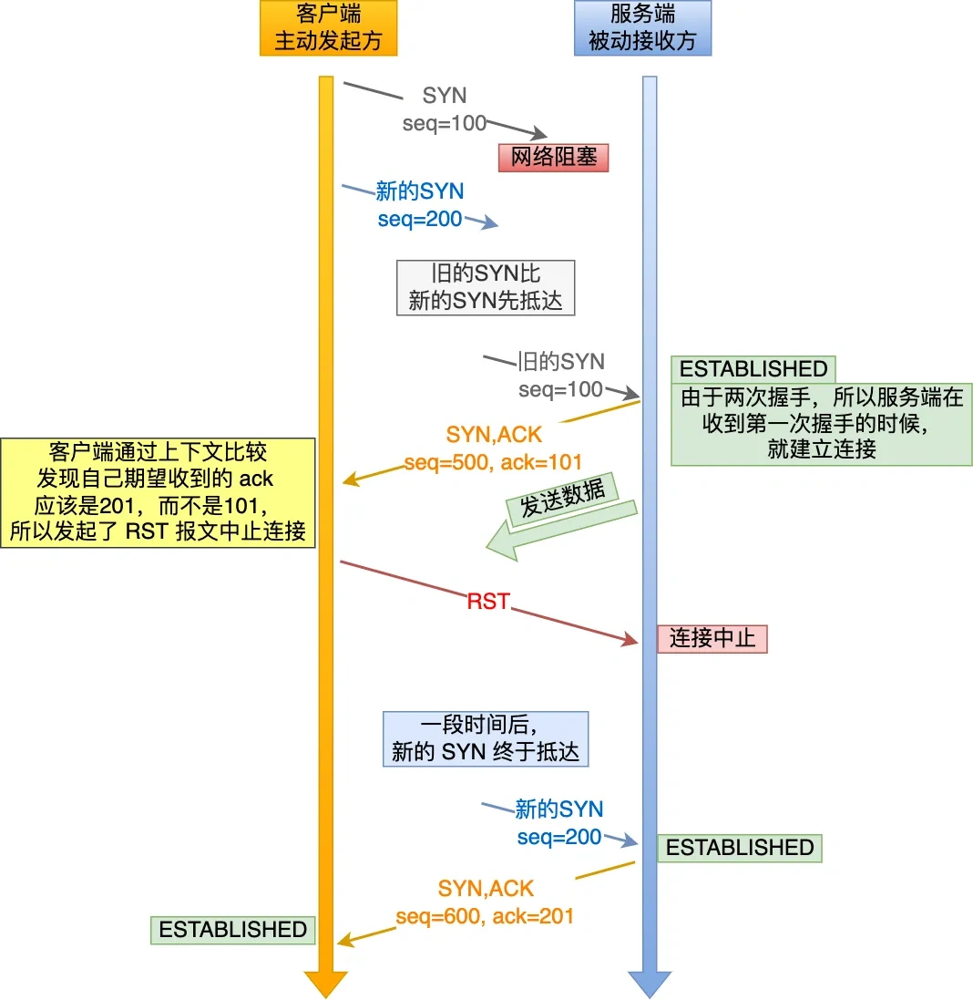
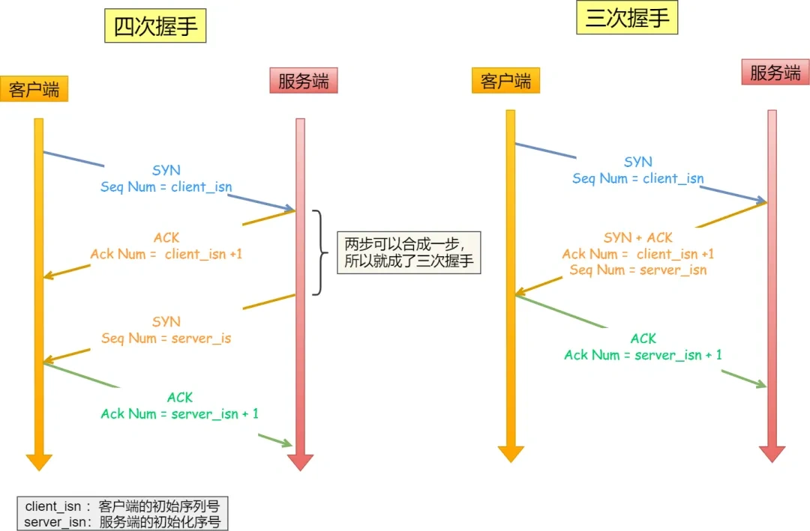
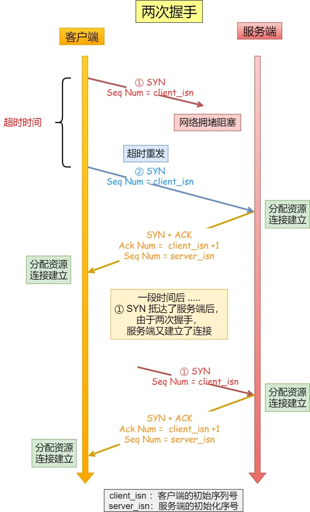

#### 三次握手可以防止旧的重复连接初始化

​	

- 即使是两次握手，客户端也会有期望ack，也会在收到非期望ack的时候发送RST，==区别在于服务端的态度==

​	如果是两次握手，服务端在收到旧连接后会立刻进入ESTABLISHED，并且可能会迫不及待的开始发数据，但是此时客户端发现ACK号不对，正在发RST让服务端断开连接，而在这期间，服务端发的数据就被浪费掉了

​	如果是三次握手，服务端会等客户端确认ACK之后再开始发数据，这样就不会导致数据浪费了

------

#### 三次握手可以同步双方的初始序列号

​	如果只有两次握手的话，服务端获得了客户端的初始序列号并返回ACK和自己的序列号，但是不确定客户端是否真的收到了自己的序列号

------

#### 三次握手可以避免资源浪费

