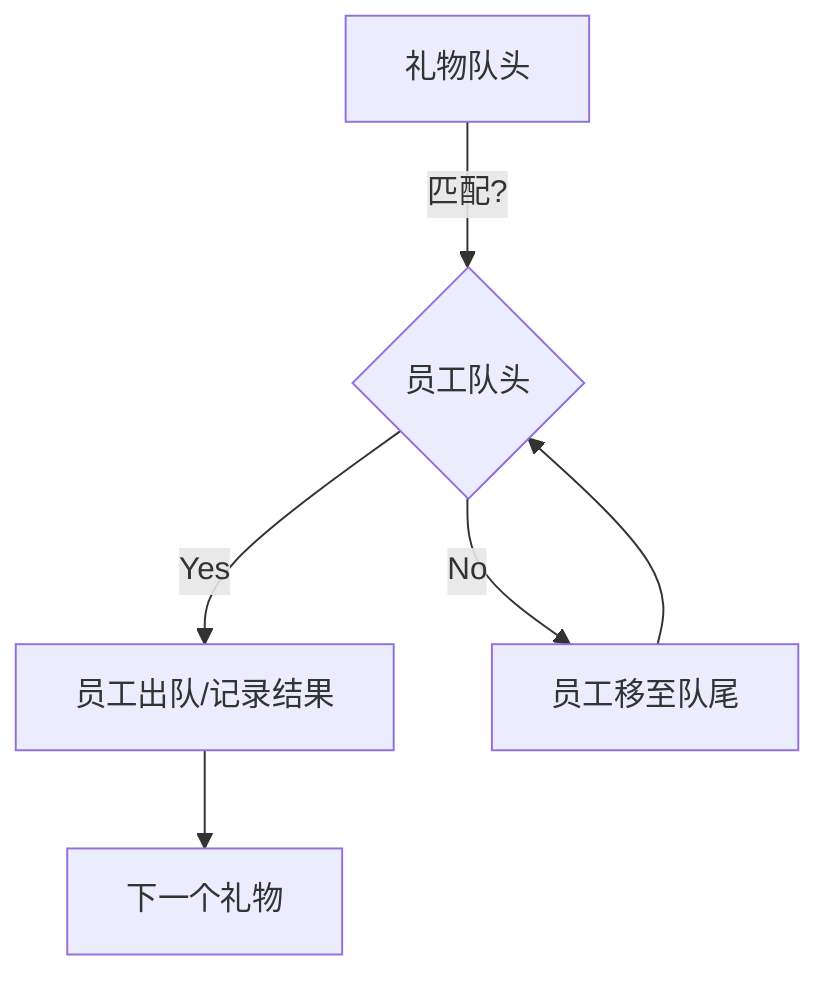

#### 冰淇淋球--组合计数问题

有n个冰淇淋球，他们的编号为1到n，每个冰淇淋球有自己的大小weight_i，从中选三个球，编号为{x,y,z}，必须满足weight_x < weight_y < weight_z，有多少种不同的选择方案

球的大小可能重复，x,y,z无任何大小要求

------

那么问题的性质就发生了变化。如果 **$\{x, y, z\}$ 的选择顺序（即编号顺序）没有要求**，这意味着你只需要从这 $n$ 个球中挑出三个，只要它们的大小能排成 $weight_x < weight_y < weight_z$ 即可。

在这种情况下，**原本的“编号顺序”约束消失了**，问题变成了一个纯粹的**组合计数问题**。

------

**1. 核心逻辑：离散化+频率统计**

由于不限制编号的先后，只要三个球的大小互不相同，它们就一定能组成且仅能组成一种满足 $w_1 < w_2 < w_3$ 的方案。

1. **统计频率**：统计数组中每个不同大小的球出现的次数。
2. **组合计算**：
   - 如果所有球的大小都**互不相同**：直接计算组合数 $C_n^3 = \frac{n(n-1)(n-2)}{6}$。
   - 如果存在**相同大小**的球：由于要求是严格小于（$<$），相同大小的球不能被选入同一个三元组。

------

**2. 数学方案：枚举中间的大小**

假设我们将所有球按大小排序，并得到不同的大小值 $v_1, v_2, \dots, v_m$，以及它们对应的出现次数 $count_1, count_2, \dots, count_m$。

要选出满足 $weight_x < weight_y < weight_z$ 的三个球，本质上是选出三个不同的等级 $i, j, k$（满足 $i < j < k$），方案数为：

$$\sum_{i < j < k} (count_i \times count_j \times count_k)$$

------

**3. 高效算法实现：前缀和优化**

为了避免三层循环枚举 $i, j, k$，我们可以再次利用**“枚举中间元素”**的思想，但在大小的维度上进行。

1. 统计每个权重的数量，存入数组。
2. 维护两个变量：
   - `left_sum`：当前大小左边所有球的总数。
   - `right_sum`：当前大小右边所有球的总数。

对于每一个大小等级 $v_j$，以它作为中间大小的方案数为：

$$(count_j) \times (\text{左边所有球的总数}) \times (\text{右边所有球的总数})$$

**C++ 代码示例**

C++

```c++
long long countStrictTriplets(vector<int>& weights) {
    int n = weights.size();
    if (n < 3) return 0;

    // 1. 统计频率
    // 如果权重范围很大，建议使用 std::map<int, int> 或先进行排序
    map<int, int> freq;
    for (int w : weights) {
        freq[w]++;
    }

    // 将频率提炼到 vector 中，此时它是按权重从小到大排列的
    vector<long long> counts;
    for (auto const& [val, count] : freq) {
        counts.push_back(count);
    }

    int m = counts.size();
    if (m < 3) return 0;

    // 2. 前缀和优化计算
    // 总球数
    long long total_balls = n;
    long long left_sum = 0;
    long long total_ans = 0;

    for (int j = 0; j < m; ++j) {
        long long current_count = counts[j];
        // 右边的球数 = 总数 - 左边数 - 当前数
        long long right_sum = total_balls - left_sum - current_count;

        // 以当前大小作为中间项 y 的方案数
        total_ans += current_count * left_sum * right_sum;

        // 更新左边球数，供下一个大小使用
        left_sum += current_count;
    }

    return total_ans;
}
```

------

**4. 复杂度对比**

- **时间复杂度**：$O(n \log n)$。主要耗时在统计频率时的排序（或使用 `std::map`）。后续的线性扫描只需 $O(m)$，其中 $m \le n$。
- **空间复杂度**：$O(n)$。用于存储频率表。

------

#### 员工拿礼物--队列模拟问题

有两个长度为n的队列，一个队列的是员工队列，编号从1到n，每个员工有自己喜欢的礼物种类；第二个队列是礼物队列，编号从1到n，每个礼物有自己的种类。

从员工队列的队头开始拿礼物，如果队头的员工喜欢队头的礼物，则拿走礼物；如果不喜欢，就排到队尾，换下一个员工



```c++
#include <iostream>
#include <vector>
#include <queue>
#include <map>

using namespace std;

void distributeGifts() {
    int n;
    cout << "请输入员工/礼物数量 n: ";
    cin >> n;

    // 员工喜欢的礼物种类
    //用一个vector来制作员工编号和礼物种类的映射
    vector<int> employeePref(n + 1);
    for (int i = 1; i <= n; ++i) cin >> employeePref[i];

    // 礼物的种类
    vector<int> giftType(n + 1);
    for (int i = 1; i <= n; ++i) cin >> giftType[i];

    // 初始化员工队列（存储员工编号）
    //用queue来模拟队列，内容是员工的编号
    queue<int> q;
    for (int i = 1; i <= n; ++i) q.push(i);

    // 存储结果：礼物编号 -> 员工编号
    vector<int> result(n + 1);

    // 遍历每一个礼物
    for (int g = 1; g <= n; ++g) {
        int currentGiftType = giftType[g];
        
        //礼物是一个个遍历的，但是在每一个礼物的循环内，可能会出现员工的遍历循环
        // 模拟员工在队头查看礼物
        while (true) {
            int currentEmp = q.front();
            
            if (employeePref[currentEmp] == currentGiftType) {
                // 喜欢，拿走礼物
                result[g] = currentEmp;
                q.pop();
                break; // 处理下一个礼物
            } else {
                // 不喜欢，排到队尾
                q.pop();
                q.push(currentEmp);
            }
        }
    }

    // 输出结果
    for (int i = 1; i <= n; ++i) {
        cout << "编号为 " << i << " 的礼物被编号为 " << result[i] << " 的员工拿走了" << endl;
    }
}
```

------

#### 特别的数--最大公约数与质因数

有数A和数B，如果一个数和A的最大公约数不是1或者与B的最大公约数不是1，那么这个数被视为特别的数；有一个区间1到n，判断里面哪些数是特别的数

------

这个问题本质上是在考察**最大公约数（GCD）的性质以及数论中的互质概念**。

一个数 $x$ 与 $A$ 的最大公约数 $gcd(x, A) \neq 1$，意味着 $x$ 和 $A$ 有**共同的质因数**。同理，$x$ 与 $B$ 的情况也是如此。

------

**1. 逻辑分析**

根据你的描述，一个数 $x$ 被视为“特别的数”需要满足以下条件：

$$gcd(x, A) > 1 \quad \text{或者} \quad gcd(x, B) > 1$$

换句话说，只要 $x$ 包含 $A$ 的任意一个质因数，**或者**包含 $B$ 的任意一个质因数，它就是特别的。

------

**2. 高效算法思路**

如果 $n$ 很大，我们不能对每个数都去调用 `std::gcd`（复杂度 $O(n \log(\min(A,x)))$），那样效率较低。更专业的方法是**利用质因数进行标记**。

1. **找出 A 和 B 的所有质因数**：
   - 比如 $A=12, B=10$。
   - $A$ 的质因数是 $\{2, 3\}$，$B$ 的质因数是 $\{2, 5\}$。
   - 它们的并集是 $\{2, 3, 5\}$。
2. **利用“筛法”思想**：
   - 只要一个数是 2、3 或 5 的倍数，它就是特别的。
   - 我们可以像“埃氏筛（Sieve of Eratosthenes）”一样，在 $1$ 到 $n$ 的布尔数组里，把这些质因数的倍数全部勾选出来。

------

**3. C++ 代码实现**

C++

```c++
#include <iostream>
#include <vector>
#include <set>
#include <numeric>

using namespace std;

// 辅助函数：获取一个数的所有质因数
void getPrimeFactors(int n, set<int>& factors) {
    //质因数算法，需要记住
    for (int i = 2; i * i <= n; ++i) {
        if (n % i == 0) {
            factors.insert(i);
            while (n % i == 0) n /= i;
        }
    }
    if (n > 1) factors.insert(n);
}

int main() {
    int A, B, n;
    cin >> A >> B >> n;

    set<int> primeFactors;
    getPrimeFactors(A, primeFactors);
    getPrimeFactors(B, primeFactors);

    // isSpecial[i] 表示数字 i 是否是特别的数
    vector<bool> isSpecial(n + 1, false);

    // 标记所有质因数的倍数
    for (int p : primeFactors) {
        for (int j = p; j <= n; j += p) {
            isSpecial[j] = true;
        }
    }

    // 输出结果
    cout << "特别的数有: ";
    for (int i = 1; i <= n; ++i) {
        if (isSpecial[i]) cout << i << " ";
    }
    cout << endl;

    return 0;
}
```

------

**4. 复杂度对比**

- **暴力法**：对 $n$ 个数逐个求 GCD，复杂度 $O(n \cdot \log(\max(A, B)))$。
- **筛法（上述代码）**：复杂度约为 $O(n \cdot \log(\log n))$。在 $n$ 达到 $10^6$ 以上时，筛法的优势会非常明显。

