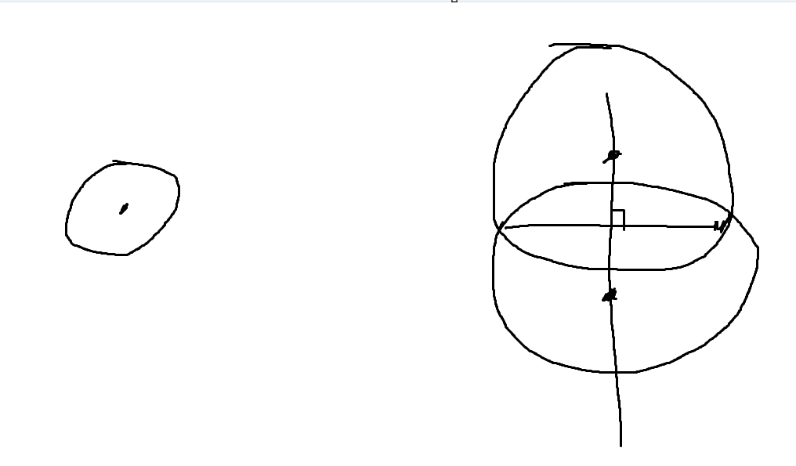
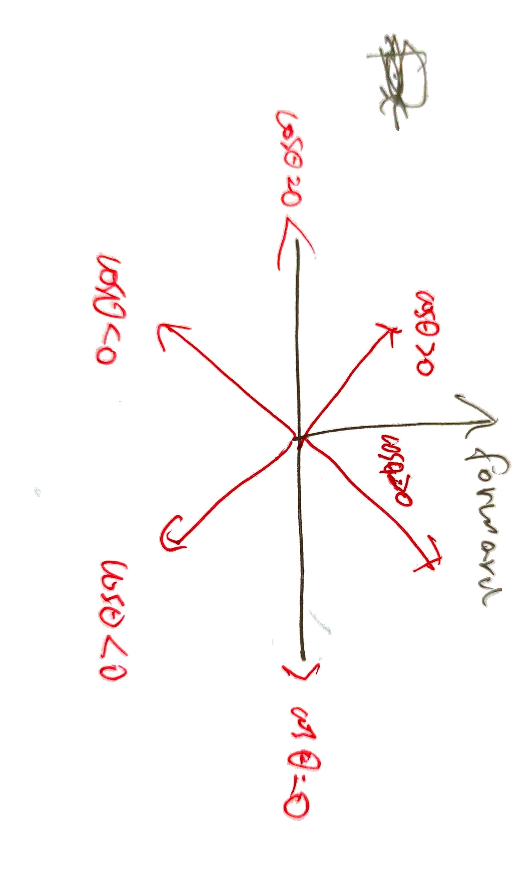

#### 第一题

**如果我们知道场景中多个敌人的位置，扔出一颗爆炸范围为圆形的炸弹，想一种方法，得出这个炸弹可以炸到最多敌人的位置**

答案：

枚举两种情况：

1. 以所有的敌人作为圆心，判断他们覆盖了多少敌人
2. 以任意两个敌人连成的线段作为基准，他们的垂直平分线的两个极限点（也就是两点刚刚好卡在圆形边界的情况）；以这两个极限点作为圆心，判断他们覆盖了多少敌人



所有情况中覆盖最多敌人的情况就是答案

------

#### 第二题

**已知自己的位置，敌人的位置，自己的朝向，如何判断敌人在自己的前面还是后面**

1. 先做一个从自己到敌人的向量
2. 当敌人在自己的前方时，forward点乘n得到的角度一定在(0, 90)范围内，即一定为正
3. 当敌人在自己的正左和正右时，forward点乘n得到的角度为90，一定为0
4. 当敌人在自己的后方时，forward点乘n得到的角度一定在(90, 180)范围内，即一定为负

------

#### 需要补充的知识点

对象池，引擎的底层设计（与引擎开发相关的书）

------

#### 第三题

**怎么判断二维场景两个AABB（即与坐标轴平行）矩形是否有重合部分**

判断条件

两个矩形不重合的情况只有四种：

```
A 在 B 左边
A 在 B 右边
A 在 B 上边
A 在 B 下边
```

也就是：

```
A.right < B.left
A.left > B.right
A.bottom < B.top
A.top > B.bottom
```

所以重合条件可以写成：

```
!(A.right < B.left ||
  A.left > B.right ||
  A.bottom < B.top ||
  A.top > B.bottom)
```

------

#### 第四题

**在堆区申请的内存，在进程结束后会怎么样？**

如果在 `main` 函数中申请了堆区内存，但程序结束前没有手动释放，比如：

```
int main() {
    int* p = new int[100];

    return 0;
}
```

那么在**进程结束后**，操作系统会回收这个进程占用的大部分资源，包括：

```
堆内存
栈内存
全局/静态数据区
打开的虚拟地址空间
```

所以这块堆内存最终会被系统回收，不会一直占着物理内存。

> [!TIP]
>
> 进程结束时会回收资源，但是在进程还没结束，即程序还在运行时，已经无用的堆区内容一定要手动释放，因为如果积压的内存过多，就会导致内存泄漏

------

#### 第五题

**malloc申请的内存最大为多少**

malloc 的理论最大值：
由 size_t 决定，32 位约 4GB（2^32^比特），64 位极大（2^64^比特）。

malloc 的实际最大值：
由操作系统、进程地址空间、可用内存、虚拟内存限制、内存碎片决定。

申请失败时：
malloc 返回 nullptr。

malloc 成功：
不一定代表物理内存已经真正分配。